## Lec 1基本概念

### 1.State
描述agent相对于环境的一个状态。以grid-world 为例，一个state指的是agent（智能体）的一个location（x,y），更复杂情况下可能包括速度加速度等状态(x,y,v,a)

所有的state的集合构成State space:$S=\{s_i\}        i=1...9$

### 2.Action 
 每个state可采取的行动。

 在grid-world的例子中，一个state对应了5个action，从1-5对应上右下左中，如下图所示
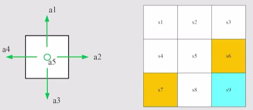

#### Action space:一个状态所有可能的action集合。$A(s_i)=\{a_i\},i=1...5$

### 3.State transition(状态转换) $p(s'|s,a)$
采取action时，从一个状态移动到另一个状态的过程。
$$s_1 \stackrel{a_2}{\rightarrow} s_2 \qquad  s_1 \stackrel{a_1}{\rightarrow} s_1$$

state transition defines interaction with the environment(定义了与环境的交互)

对于与forbidden area的transaction，有不同的定义，但我们一般考虑第一种
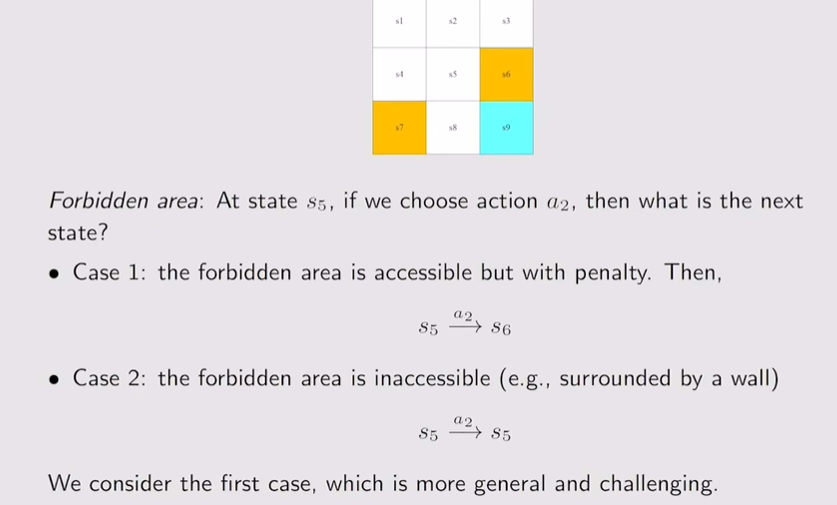
有的时候可能冒一定风险经过forbidden area的路径更优，第二种会使得状态空间变小。

状态转换可以有tabular representation，通过table来表示各个状态的状态转换。
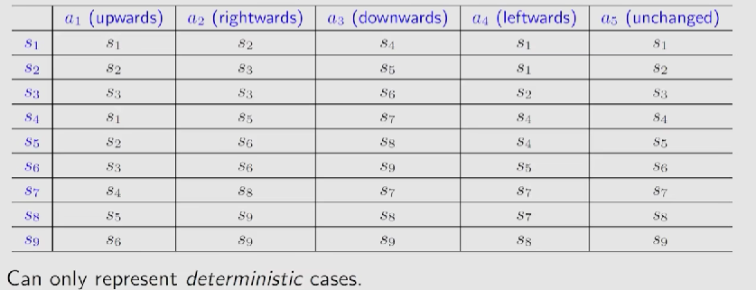

需要注意的是这里只能表示deterministic的情况，需要stochastic（随机）的表示方法，这里就引入下面的内容
#### State transition probability:使用条件概率来表示。

### 3.Policy $\pi(a|s)$
 policy告诉agent在某个状态应该take什么样的action。

 仍然可以使用条件概率（conditional probablity）去描述，即对于一个state，我们可以知道其采取不同action的条件概率，这个就代表着policy

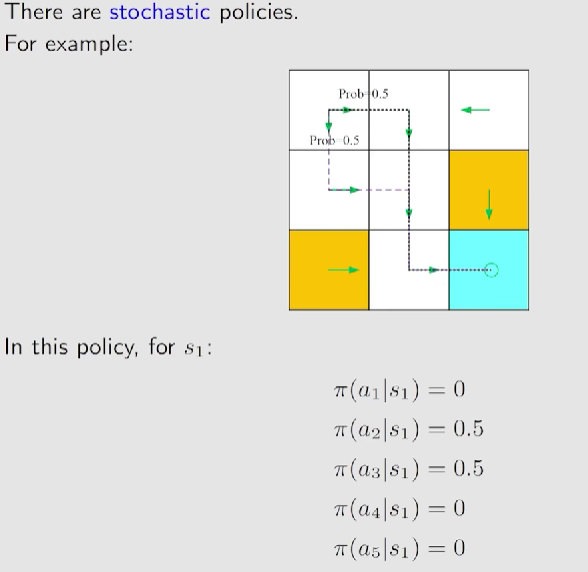

Policy也有tabular representation,下面这个table对应上图的policy，与前面action的table形式不同，policy的table形式既可以描述确定性也可以描述stochastic的情况。
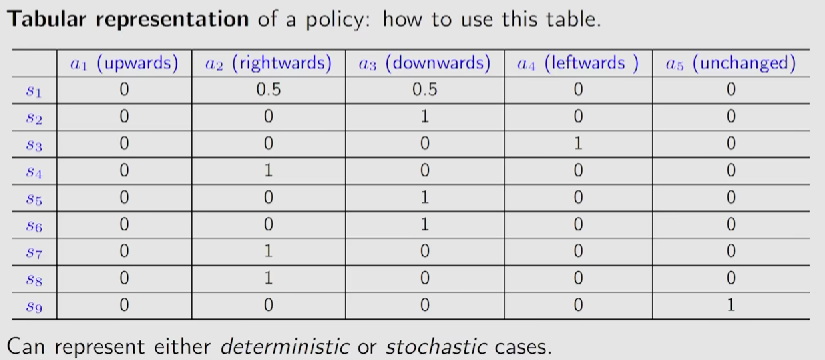
具体如何去判断选择哪个action呢，一般会在0-1均匀分布中随机采样，然后得到的数分布在哪个区域就采取相应的action

### 4.Reward(most unique) $p(r|s,a)$
在每个action后获得的数，一般正数代表encouragement，负数代表penalty。通过reward是我们和agent的一种交互手段，通过对于reward的设置，可以引导agent达到我们想要的效果。

也通过条件概率来表示：
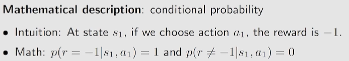

### 5.Trajectory and Return(轨迹和反馈)
 Trajectory是一个state-action-reward的链，能反映整个状态变化的过程。
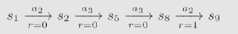

一个trajectory的Return是沿着这个轨迹所有rewards的和。
$$return=0+0+0+1=1$$

### 6.Discounted return
一个轨迹的return可能是无穷的，例如上面的trajectory如果后续一直停留在$s_9$时，每一个action，return都会+1，最终趋于无穷。

为了解决这个问题，我们引入discounted rate，每一次的reward的会乘上其对应的衰减率（$\gamma$）的幂次；引入后可以解决发散的问题，同时可以根据其值的大小去调控对于当前和未来的reward的关注度。
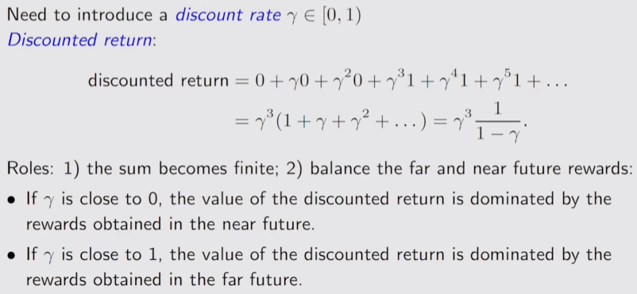

### 7.Episode
 agent与环境交互时，可能停在某个terminal states，这样的trajectory就被叫做一个episode（或trial）。一般episode都是一个finite的trajectory，这样的任务被称为episodic tasks。

 有些任务没有terminal state，会一直持续下去，即成为了一个continuing tasks。

 实际上我们可以把二者统一，即把episodic tasks转换为continuing tasks。
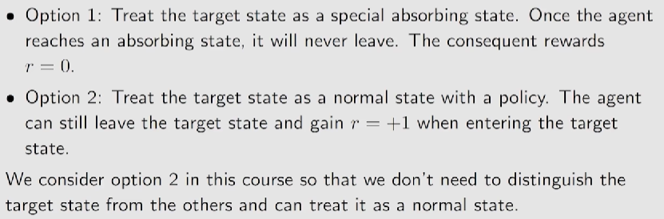
我们一般都按照**第二种方式**，将target state看作一个普通的state，可以进入可以跳出，这样学习时可能耗费更多的搜索，但是其一般性更强。

### 8.Markov decision process(MDP)
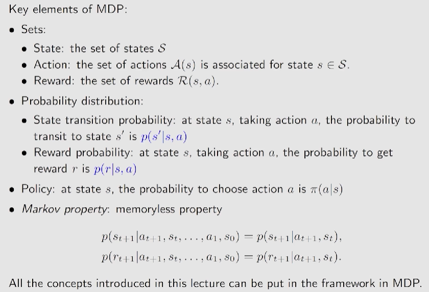

* $p(s'|s,a)$:状态转移
* $p(r|s,a)$：奖励
* $\pi(a|s)$：策略
 其中关键性质是Markov property，即在MDP架构下的条件概率是与历史状态无关的（memoryless property）
##### 可以这样理解MDP
1. M对应Markov property；
2. D对应Policy(决策)
3. P代表的process中包含了一系列的元素集合和概率分布

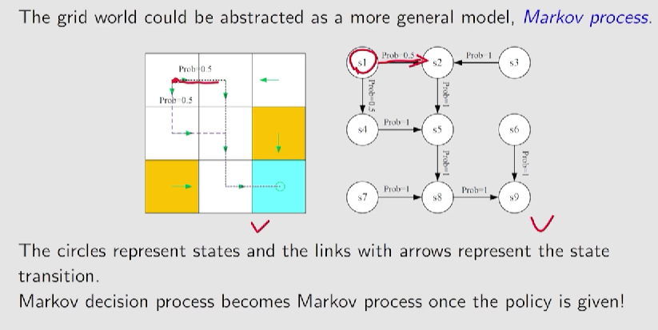

## Lec2 Bellman Equation
### 1.State value
我们在前边使用return去evaluate一个policy,但是前面针对的都是deterministic的情况，对于stochastic的情况，从一个状态出发可能会有不同的return，我们就需要引入State value(状态值)去解决这个问题。state value其实就是从这个state出发，所有**return的均值**。

我们可以构造一个通用的trajectory:
$$S_t \stackrel{A_t}{\rightarrow} S_{t+1},R_{t+1} \stackrel{A_{t+1}}{\rightarrow} S_{t+2},R_{t+2}\stackrel{A_{t+3}}{\rightarrow} S_{t+3},R_{t+3}...$$
其中：
* $S_t$:当前时间t下的状态
* $S_{t+1}$:下一个状态
* $A_{t}$:在t时刻（$S_{t}$）时的策略$\pi$
* $R_{t+1}$:从$S_t$到$S_{t+1}$立即获得的reward

注意这里的大写的字母均代表一个随机变量（random variables）

可以写出沿着这个trajectory的discounted return：
$$G_t=R_{t+1}+\gamma R_{t+2}+ \gamma^2 R_{t+3}+...$$

我们接下来定义state value即为$G_t$的期望（均值）
$$v_{\pi}(s)=E[G_t|S_t=s]$$

$v_{\pi}(s)$即被称为**状态值函数/状态值**，下面有一些重要的特点
* $v_{\pi}(s)$是关于**s的函数**，状态值跟当前的状态有关
* $v_{\pi}(s)$是关于$\pi$**（policy）的函数**，不同的policy会有不同的state value
* $v_{\pi}(s)$**不依赖时间t**，当agent在state spacec移动时，这时t值代表时序顺序。当policy给定，state value 就是确定的

##### state value和return的关系： 
* 当policy和system都是确定的，此时二者等价
* 当policy和system都是**随机**的，此时从同一个state开始可能得到不同的轨迹，不同trajectory的returns会不一样，而state value就是这些**不同returns的均值**。

所以一般都使用state value来评价一个策略。

### 2.Bellman Equation(需要手写推导)
我们有了状态值的定义，接下来就要去求解这个值，我们引入贝尔曼方程，多个方程列写成方程组/矩阵形式，则可求解得到所有的state value。

回顾前面的discounted return定义，我们写出t和t+1时刻的:
$$G_t=R_{t+1}+\gamma R_{t+2}+ \gamma^2 R_{t+3}+...\\
G_{t+1}=R_{t+2}+\gamma R_{t+3}+ \gamma^2 R_{t+4}+...$$
我们观察到:
$$
\begin{align*}
G_t &= R_{t+1} + \gamma R_{t+2} + \gamma^2 R_{t+3} + \dots \\
    &= R_{t+1} + \gamma \left(R_{t+2} + \gamma R_{t+3} + \dots\right) \\
    &= R_{t+1} + \gamma G_{t+1},
\end{align*}
$$
这个方程建立了两个相邻状态之间的关系
再写出state value:
$$
\begin{align*}
v_\pi(s) &= \mathbb{E}\left[G_t \mid S_t = s\right] \\
         &= \mathbb{E}\left[R_{t+1} + \gamma G_{t+1} \mid S_t = s\right] \\
         &= \mathbb{E}\left[R_{t+1} \mid S_t = s\right] + \gamma \mathbb{E}\left[G_{t+1} \mid S_t = s\right].
\end{align*}
$$
分别计算两个期望就能得到最后的**贝尔曼方程**，我们注意，我们推导得目的是希望基于已有的条件概率（$p(s'|s,a)$、$p(r|s,a)$、$\pi(a|s)$）去表达上述两个期望：
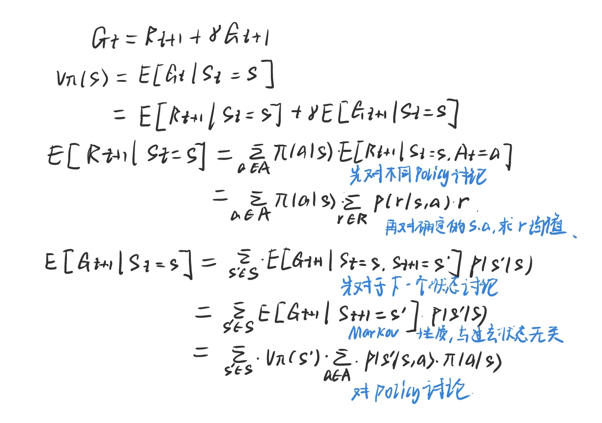
综合上述计算结果得到**贝尔曼方程：**
$$
\begin{align*}
v_\pi(s) &= \mathbb{E}\left[R_{t+1} \mid S_t = s\right] + \gamma \mathbb{E}\left[G_{t+1} \mid S_t = s\right], \\
&= \underbrace{\sum_{a \in \mathcal{A}} \pi(a|s) \sum_{r \in \mathcal{R}} p(r|s,a) r}_{\text{mean of immediate rewards}} + \underbrace{\gamma \sum_{a \in \mathcal{A}} \pi(a|s) \sum_{s' \in \mathcal{S}} p(s'|s,a) v_\pi(s')}_{\text{mean of future rewards}} \\
&= \sum_{a \in \mathcal{A}} \pi(a|s) \left[ \sum_{r \in \mathcal{R}} p(r|s,a) r + \gamma \sum_{s' \in \mathcal{S}} p(s'|s,a) v_\pi(s') \right], \quad \text{for all } s \in \mathcal{S}.
\end{align*}
$$
实际计算时不要死记公式，通过两项的实际意义去理解，即immediate reward的均值和$\gamma$倍的未来状态的状态值的均值（实际上就是未来奖励的均值）
##### 关于Bellman equation的几个要点：
* 贝尔曼方程不是一个，而是对于不同状态的**一组方程**，可以求解这些方程组得到每个状态的状态值
* $\pi(a|s)$是给定的policy，state value是评估一个policy的重要指标，通过贝尔曼方程求解state value就是一个**策略评估过程**（policy evaluate process）
* $p(s'|s,a)$、$p(r|s,a)$代表了**系统模型**，前面讲的求解都是基于有模型情况，后续会有model free求解state value的算法。

### 3.Examples to illustrate bellman equation
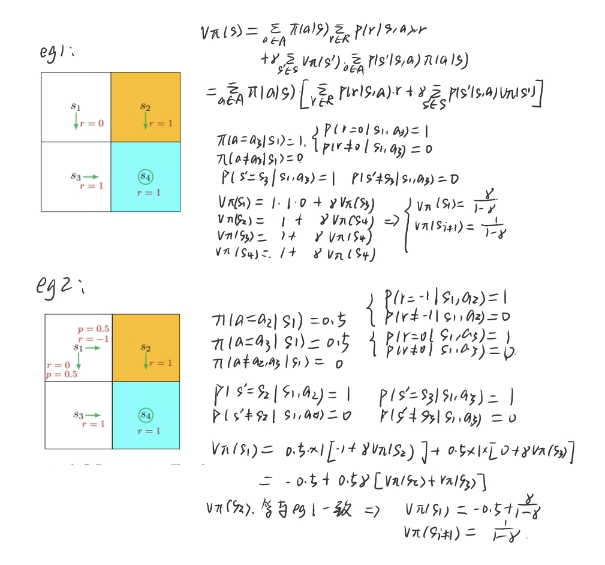

### 4.Matrix-vector form of the Bellman equation
将原始的bellman公式改写成如下形式：
$$
\begin{align*}
v_\pi(s) 
&= \sum_{a \in \mathcal{A}} \pi(a|s) \sum_{r \in \mathcal{R}} p(r|s,a) r + \gamma \sum_{a \in \mathcal{A}} \pi(a|s) \sum_{s' \in \mathcal{S}} p(s'|s,a) v_\pi(s') \\
&= r_\pi(s)+\gamma \sum_{s' \in \mathcal{S}} p_\pi(s'|s) v_\pi(s')\tag{2.8}
\end{align*}
$$
其中:
\[
\begin{align*}
r_\pi(s)=\sum_{a \in \mathcal{A}} \pi(a|s) \sum_{r \in \mathcal{R}} p(r|s,a) r\\
p_\pi(s'|s)=\sum_{a \in \mathcal{A}} \pi(a|s) p(s'|s,a)
\end{align*}
\]
$r_\pi(s)$代表immediate rewards的均值;$p_\pi(s'|s)$代表在策略$\pi$下从s到s'的状态转移概率。

对于所有的state进行标号： $s_i$ ， $i = 1, \dots, n$, 其中 $n = |\mathcal{S}|$.  对于任意一个$s_i$，式2.8可以写成： 

$$
v_{\pi}(s_i) = r_{\pi}(s_i) + \gamma \sum_{s_j \in \mathcal{S}} p_{\pi}(s_j | s_i) v_{\pi}(s_j). \tag{2.9}
$$

令 \( v_{\pi} = \left[ v_{\pi}(s_1), \dots, v_{\pi}(s_n) \right]^T \in \mathbb{R}^n \), \( r_{\pi} = \left[ r_{\pi}(s_1), \dots, r_{\pi}(s_n) \right]^T \in \mathbb{R}^n \), and \( P_{\pi} \in \mathbb{R}^{n \times n} \) with \( [P_{\pi}]_{ij} = p_{\pi}(s_j | s_i) \). 
然后上面的公式2.9就能写成**矩阵形式**：
\[v_{\pi} = r_{\pi} + \gamma P_{\pi} v_{\pi}, \tag{2.10}\]

##### 其中矩阵$P_\pi$有一些有趣的特性：
* $P_\pi$是一个非负矩阵（$P_\pi\geq0$），其每一个元素都大于等于0，从概率的角度很好理解。书中，所有的对于矩阵的$\geq$或$\leq$代表按元素逐一比较的操作。
* $P_\pi$是一个随机矩阵，意味着每一行的和要为1

以四个状态为例可以列写矩阵表达形式：
$$\left[ \begin{matrix}
v_{\pi}(s_1) \\
v_{\pi}(s_2) \\
v_{\pi}(s_3) \\
v_{\pi}(s_4)
\end{matrix}\right]
=\left[
\begin{matrix}
r_{\pi}(s_1) \\
r_{\pi}(s_2) \\
r_{\pi}(s_3) \\
r_{\pi}(s_4)
\end{matrix}
\right]
+\gamma \left[
\begin{matrix}
p_{\pi}(s_1|s_1) & p_{\pi}(s_2|s_1) & p_{\pi}(s_3|s_1) & p_{\pi}(s_4|s_1) \\
p_{\pi}(s_1|s_2) & p_{\pi}(s_2|s_2) & p_{\pi}(s_3|s_2) & p_{\pi}(s_4|s_2) \\
p_{\pi}(s_1|s_3) & p_{\pi}(s_2|s_3) & p_{\pi}(s_3|s_3) & p_{\pi}(s_4|s_3) \\
p_{\pi}(s_1|s_4) & p_{\pi}(s_2|s_4) & p_{\pi}(s_3|s_4) & p_{\pi}(s_4|s_4)
\end{matrix}
\right]\left[
\begin{matrix}
v_{\pi}(s_1) \\
v_{\pi}(s_2) \\
v_{\pi}(s_3) \\
v_{\pi}(s_4)
\end{matrix}
\right]$$

### 5.Solving Bellman equation
有了完整的方程组自然要去求解这个方程，对于方程\(v_{\pi} = r_{\pi} + \gamma P_{\pi} v_{\pi}, \)有两种求解方法：

* 第一种（**闭式解**/Closed-form Solution）直接根据矩阵运算去求逆求解：
  $$v_{\pi} = (I-\gamma P_\pi)^{-1}r_{\pi} $$
  在理论上这种解是十分优美的，但是因为含有求逆运算，实际应用比较困难，一般不采用这种。

* 第二种（**迭代解**/Iterative solution）使用迭代算法运算
  $$v_{k+1} = r_{\pi} + \gamma P_{\pi} v_{k},\quad k=0,1,2,\dots$$
  当给一个随机初值$v_0$时，算法会产生一系列的迭代序列值$\{v_0,v_1,v_2,\dots\}$
  我们可以证明当$k{\rightarrow} \infty $时：
  $$v_k\rightarrow v_\pi=(I-\gamma P_\pi)^{-1}r_{\pi}$$
  由此通过迭代求出解。

### 6.Action value
action value被定义为采取一个action所能获得的return的均值，即：
$$ q_\pi(s,a) = \mathbb{E}\left[G_t \mid S_t = s,A_t=a\right] $$
action value与当前状态和采取的action都有关，严谨考虑应该称为state-action value，不过一般简化为action value。
action value与state value有高度的联系：
* state value可以写成action values的均值
 $$\begin{align*}v_\pi(s) &= \mathbb{E}\left[G_t \mid S_t = s\right]\\
&=\sum_{a \in \mathcal{A}} \pi(a|s) \mathbb{E}\left[G_t \mid S_t = s,A_t=a\right]\\
&=\sum_{a \in \mathcal{A}} \pi(a|s) q_\pi(s,a)
\end{align*}$$

* 由之前关于state value的表达式：
  $$v_\pi=\sum_{a \in \mathcal{A}} \pi(a|s) \left[ \sum_{r \in \mathcal{R}} p(r|s,a) r + \gamma \sum_{s' \in \mathcal{S}} p(s'|s,a) v_\pi(s') \right], \quad \text{for all } s \in \mathcal{S}$$
  结合上面得到的结论：
  $$q_\pi(s,a) = \sum_{r \in \mathcal{R}} p(r|s,a) r + \gamma \sum_{s' \in \mathcal{S}} p(s'|s,a) v_\pi(s') $$
  上式中action value由两个部分组成，第一个部分是基于确定的s,a下的当前的reward，后一项是未来的rewards。state value的表达式中a是不确定的，故要对所有的action去求均值，即action value的均值。

##### 需要注意的是:
当我们基于一个policy去计算action value 时，我们一般只会关注policy采取的action，那对于没有take的action的action value 呢？有的人会想当然认为没用到那就是0，其实不然，action value其实跟policy是无关的。一个state下，不论policy如何，其所有的action value都是可以计算的.
知道所有的action value，我们才能去evaluate每个policy，即可以由action value计算state value。

## Lec3 Optimal State Values and Bellman Optimality Equation
强化学习的终极目标就是为了找到一个最优策略，这就很有必要去定义什么是最优策略，这里会介绍一个核心概念：最优状态值以及一个重要工具：贝尔曼最优公式。通过这个工具我们可以求解最优状态值和最优策略。
### 1.如何优化/提升策略
通过一个2x2grid world 的例子，不难知道，当我们更新策略使得在一个state取得最大的action value时，这就是一个更优的策略。理论上，对于一个初始策略，我们可以找到每一个state的最大的action value（根据其表达式，这个值与目前的state value有关！），按照最大的方向更新一次策略，再循环，最终一定能找到一个最优策略。

但是关于最优策略的存在性、唯一性我们是不确定的，在下一节会从数学角度解决这些问题。

### 2.Optimal state and optimal policies
**定义：** 若对于状态空间S中的所有状态 s，以及任意其他策略 π，均满足$v_{{\pi}^*} (s)\geq v_π(s)$。则策略 $π^∗$ 为最优策略。$π^∗$对应的状态价值即为最优状态价值

简单来说就是有一个策略使得对于任意一个状态的state value都不小于其他策略下的state value，这个策略就是optimal policy。

上述定义引出了一些问题：
* Existence:最优策略是否存在？
* Uniqueness:最优策略是否唯一？
* Stochasticity:最优策略是随机还是确定的？
* Algorithm:如何去获取最优策略和最优状态值？
下面的**贝尔曼最优公式**给出了上述问题的解答。

### 3.Bellman optimality equation（BOE）
贝尔曼最优公式是用来求取最优策略和最优状态值的工具。其数学形式如下，对比一般的BE，多了一个求max的步骤。
$$
\begin{aligned}
v(s) &= \max_{\pi(s) \in \Pi(s)} \sum_{a \in \mathcal{A}} \pi(a|s) \left( \sum_{r \in \mathcal{R}} p(r|s,a)r + \gamma \sum_{s' \in \mathcal{S}} p(s'|s,a)v(s') \right) \\
&= \max_{\pi(s) \in \Pi(s)} \sum_{a \in \mathcal{A}} \pi(a|s) q(s,a),
\end{aligned}
$$
其中$v(s),v(s')$是未知变量，同时
$$
q(s,a) = \sum_{r \in \mathcal{R}} p(r|s,a)r + \gamma \sum_{s' \in \mathcal{S}} p(s'|s,a)v(s').
$$
#### 3.1 BOE右侧max求解
我们来研究BOE，会发现其只有一个方程但有两个未知量：$v(s),\pi(a|s)$,如何去求解呢？这其实不难理解，可以先固定$v(s)$，先对于$\pi(a|s)$求max。

下面有一个很形象的例子：
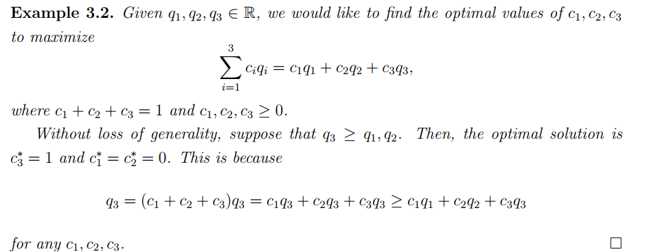
上述例子的系数$c_i$刚好对应BOE中的$\pi(a|s)$,每个概率值均大于等于0，同时总和为1。我们需要找到下列式子的最大值：
$$
\sum_{a \in \mathcal{A}} \pi(a|s)q(s,a) \leq \sum_{a \in \mathcal{A}} \pi(a|s)\max_{a \in \mathcal{A}} q(s,a) = \max_{a \in \mathcal{A}} q(s,a),
$$
上述式子等号成立的条件为：
$$\pi(a|s) = 
\begin{cases} 
1, & a = a^*, \\
0, & a \neq a^*.
\end{cases}
$$
此时$a^*=\argmax _aq(s,a) $

对于上述式子进行解释：为了找到式子的最大值，参照例子的方法，我们只需先找到一个使得$q(s,a)$最大的a*，然后使其系数$\pi(a*|s)$为1即可。总而言之，最优策略就是选择有着最大action value的action的策略！

但要注意的是，$q(s,a^*)$的式子是与v有关的，故我们本质上只要聚焦于求解一个v,得到这个v之后，最优动作价值、最优策略以及最优状态价值就都依次得到了。

#### 3.3 Vector Form
上述内容从数学角度解决了右侧max的求值，即已经确定了最优策略。此时右侧的值只与v有关，而v的求解要通过矩阵形式求解：
矩阵形式的BOE如下：
\[v_{\pi} =\max_{\pi \in \Pi} (r_{\pi} + \gamma P_{\pi} v_{\pi})\]
右侧式子可以写成v的函数：
$$f(v)=\max_{\pi \in \Pi} (r_{\pi} + \gamma P_{\pi} v_{\pi})$$
BOE此时写为：
$$v=f(v)$$
接下来就要去求解这个式子。

#### 3.4 Contraction mapping theorem（压缩映射定理）
为了求解上述方程$v=f(v)$，我们需要引入一个数学工具，即本节标题Contraction mapping theorem，又叫做fixed-point theorem(不动点定理)。

##### Definition 3.4.1
* Fixed point:对于$x\in \mathbb{R}^d$，考虑一个映射$f:\mathbb{R}^d\rightarrow\mathbb{R}^d$，如果存在一个点$x^*$使得$f(x^*)=x^*$，则$x^*$就被称为不动点。
* Contraction mapping：若存在$\gamma\in(0,1)$,使得对于任意的$x_1,x_2\in \mathbb{R^d}$,都有
  $$\|f(x_1) - f(x_2)\| \leq \gamma \|x_1 - x_2\|$$
  则$f$为压缩映射

##### Theorem 3.4.1
对于形如 $x = f (x)$（其中 $x$ 和 $f (x)$ 均为实向量）的方程，若 $f$ 是压缩映射，则满足以下性质：
* 存在性：存在不动点 $x^*$满足 $f (x) = x^*$。
* 唯一性：该不动点 $x^*$ 是唯一的。
* 算法性：考虑迭代过程：$x_{k+1} = f (x_k)$;
其中 $k = 0, 1, 2, …$则对任意初始猜测 $x₀$，当 $k→∞$时，$xₖ→x^*$。此外，收敛速度是指数级的。

这个定理说明了解的存在和唯一性，同时给出了迭代求解的方法。

我们可以证明，对于BOE而言其右侧的映射就是一个压缩映射。
##### Theorem 3.4.2(Contraction property of f(v))
贝尔曼最优方程右侧的函数 $f(v)$为一个压缩映射。具体来说，对于任意$v_1,v_2\in \mathbb{R^{|s|}}$均满足
$$\|f(v_1)-f(v_2)\|_\infty \le \gamma\|v_1-v_2\|_\infty$$
其中 $\gamma \in (0,1)$为discounted rate,$\|\cdot\|_\infty$为无穷范数，定义为向量中所有元素绝对值的最大值。

#### 3.5 Sovling an optimal policy from BOE
使用上述压缩映射工具可以对于BOE进行分析求解最优状态$v^*$和最优策略$\pi^*$。
##### $v^*$的求解
如果$v^*$是BOE的解，那么其满足
$$v^*=f(v^*)=\max_{\pi \in \Pi} (r_{\pi} + \gamma P_{\pi} v^*)\tag{3.5}$$
显然$v^*$就是一个不动点，故BOE的解一定存在同时还是唯一的。由压缩映射定理的性质，我们可以通过递推算法求解这个$v^*$
$$v_{k+1} = f(v_k) = \max_{\pi \in \Pi} \left( r_\pi + \gamma P_\pi v_k \right),\quad k = 0,1,2,\dots$$
对于任意初始猜测 $v_0$,当 $k→∞$时，$v_k$会以指数级速度收敛到最优状态价值$v^*$

这个迭代算法即被称为值迭代（value iteration）

##### $\pi^*$的求解
当$v^*$已经求得，我们很容易通过求解下面这个方程得到$\pi^*$：
$$\pi^*=\arg \max_{\pi \in \Pi}(r_\pi+\gamma P_\pi v^*) \tag{3.6}$$
将得到的$\pi^*$代入上述(3.6)式，得到：
$$v^*= r_{\pi^*} + \gamma P_{\pi^*} v^*$$
故$v^*=v_{\pi^*}$就是$\pi^*$策略下的state value，而在这个策略下BOE可以看作一个特殊的贝尔曼方程。

我们在上面求解得到了$v^*$与$\pi^*$，但不确定这个解是不是最优的，下面的定理给出了结论：
##### Theorem 3.5.1（ $v^*$与$\pi^*$的最优性）
通过BOE求得的解$v^*$是最优状态价值,$\pi^*$是最优策略。也就是说，对于任意策略 $π$，均满足：
$$v^*=v_{\pi^*}\geq v_\pi$$
其中$v_\pi$是策略$\pi$的状态值，$\geq$代表逐元素比较。
证明如下：
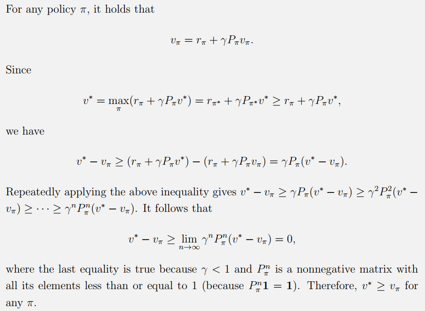

接下来，我们更深入地分析式 (3.6) 中的$π^∗$。具体而言，下述定理表明：始终存在一个确定性贪心策略是最优的。
##### Theorem 3.5.2（Greedy optimal policy）
对于任意的状态$s\in S$，确定性贪心策略：
$$\pi^*(a|s) = 
\begin{cases} 
1, & a = a^*(s), \\
0, & a \neq a^*(s)
\end{cases} \tag{3.7}$$
是一个BOE所求解的最优策略，其中：
$$a^*(s) = \arg\max_{a} q^*(a,s)$$
而
$$q^*(s,a) \triangleq \sum_{r \in \mathcal{R}} p(r|s,a)r + \gamma \sum_{s' \in \mathcal{S}} p(s'|s,a)v^*(s').$$
(3.7)的策略被称为贪心策略，因为其寻找的是一个有着最大的$q^*(s,a)$的策略。最后我们讨论一下$\pi^*$的性质：
* **最优策略的唯一性**：
  尽管最优状态价值 $v^*$是唯一的，但对应于$v^*$的最优策略却未必唯一。这一点可以通过反例轻松验证，例如图 3.3 中所示的两个策略就均为最优策略。
* **最优策略的随机性**：
  正如图 3.3 所呈现的那样，最优策略既可以是随机策略，也可以是确定性策略。不过根据定理 3.5.2 可以确定，必定存在至少一个确定性的最优策略。
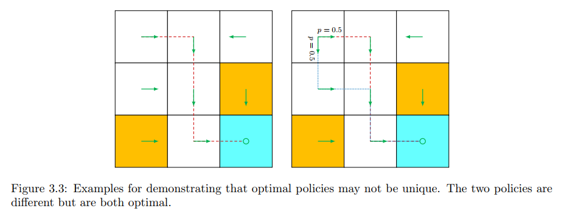

**整个过程个人理解：**
递推公式是由压缩映射定理给出，而我只要给定一个任意的状态初值，然后动作价值是与状态值有关的，一次迭代就是基于这个状态值去计算找到每一个state此时的最大的action value,再去计算新的state value(在greedy optimal policy下，state value就是最大的action value)基于新的状态值重复上述过程，多次迭代就能得到满足BOE的解即最优状态值

#### 3.6 Factors that influence optimal policy
$$
\begin{aligned}
v(s) &= \max_{\pi(s) \in \Pi(s)} \sum_{a \in \mathcal{A}} \pi(a|s) \left( \sum_{r \in \mathcal{R}} p(r|s,a)r + \gamma \sum_{s' \in \mathcal{S}} p(s'|s,a)v(s') \right) \\
&= \max_{\pi(s) \in \Pi(s)} \sum_{a \in \mathcal{A}} \pi(a|s) q(s,a),
\end{aligned}
$$
基于BOE，我们可以发现最优状态值和最优策略是由
1. immediate reward $r$
2. discounted rate $\gamma$
3. system model $p(s'|s,a),p(r|s,a)$
而系统模型一般很复杂，我们这里研究一下reward和discounted rate 对于最优状态值和最优策略的影响。
##### impact of discount rate $\gamma$
* 较大的$\gamma$下，agent会更加远视，可能冒着风险做一些决策
* 较小的$\gamma$下，agent会更加短视，策略保守；极端情况当$\gamma$=0时，会极度短视，只选择最大的immediate reward情况，而不关注最大的总reward
  
##### impact of reward values 
* 可以通过对于不同情况reward的设置 来引导agent决策，比如给进入forbidden area 的奖励一个较大的负值，那么最优决策就会尽量避免进入forbidden area。
* reward对于决策的影响主要取决于不同情况下rewards的相对值，如果同比例放缩所有的rewards，那么最优策略不会变化。
* 初学者可能会对下述情况存在疑惑：
  当reward为0时，那是否会出现绕路（detour）的情况呢？
  但其实去看一下return的计算公式就明白了，多走一步r=0的action，在计算时相当于后边的reward都要多乘一个discounted rate，这就使得绕路的return减小。
  故return=0不会使最优策略绕路，我们不必给r赋负值，因为discounted rate $\gamma$本身就能避免detour的作用。

## Lec4 Value Iteration & Policy Iteration(值迭代&策略迭代算法)
### 4.1 Value iteration algorithm
前面学习的BOE的求解，其实就是这节要讲的值迭代算法，其迭代公式如下：
$$v_{k+1} =  \max_{\pi \in \Pi} \left( r_\pi + \gamma P_\pi v_k \right),\quad k = 0,1,2,\dots$$
当$k→∞$时，就能迭代得到最优状态值和最优策略。
对于上述公式进行拆解，实际上每一次迭代包含了两个部分：**策略更新（policy update）和值更新（state update）**
* Policy update:从数学的角度，这一步的目的是找到一个能解决下列最优化问题的策略：其中$v_k$是上一步迭代已经得到的值。
  $$\pi_{k+1}=\arg \max_{\pi }(r_\pi+\gamma P_\pi v_k) $$
* Value update:数学上，这一步是基于policy update得到的$\pi_{k+1}$去更新新的value：
  $$v_{k+1} =  r_{\pi+1} + \gamma P_{\pi+1} v_k $$
  $v_{k+1}$会用于下一步迭代。注意这里的公式仅仅是一个值的迭代公式，求出的值并不是state value，只有通过BE求解的才是state value。
上述情况围绕vector form从原理上进行解释，实际计算需要理解elementwise form（每个元素独立操作形式）的实现。

#### 4.1.1 Elementwise form and implementation
考虑第k次迭代，状态s下：
* Policy update的元素形式为：
  $$\pi_{k+1}(s) = \arg\max_{\pi} \sum_{a} \pi(a|s) \underbrace{\left( \sum_{r} p(r|s,a)r + \gamma \sum_{s'} p(s'|s,a)v_k(s') \right)}_{q_k(s,a)}, \quad s \in \mathcal{S}.$$
  对于上述最优化问题，我们之前已经给出了其对应的最优策略，即贪婪最优策略（greedy optimal policy），公式如下：
  $$\pi_{k+1}(a|s) = \begin{cases} 
  1, & a = a_k^{*}(s), \\
  0, & a \neq a_k^{*}(s),
  \end{cases} 
  $$
  其中$a_k^{*}(s) = \arg\max_{a} q_k(s,a)$，如果这个式子有多个解（有两种或以上的$q_k(s,a)$值相等），我们任意选取一个action即可，都不会影响算法的收敛性。
  这里策略更新得到的新策略$\pi_{k+1}$，实际上就是贪心策略：对于每一个state选择有着最大的$q_k(s,a)$的action。

* Value update的元素形式如下：
  $$v_{k+1}(s) = \sum_{a} \pi_{k+1}(a|s) \underbrace{\left( \sum_{r} p(r|s,a)r + \gamma \sum_{s'} p(s'|s,a)v_k(s') \right)}_{q_k(s,a)}, \quad s \in \mathcal{S}.$$
  其实就是基于现有的$v_k$和上一步得到的$\pi_{k+1}$去更新$v_{k+1}$
  代入上述的贪心策略得到：
  $$v_{k+1}(s)=\max_a q_k(s,a)$$
  就是这个状态下的最大"action value"。这里需要注意的是我们的state value 和action value 的定义都是基于贝尔曼方程，所以在值迭代过程的$v_k$和$q_k$都不能称作state/action value，但直观上可以这样认为方便理解。

总而言之，上述过程可以总结为下列过程：
$$v_k(s) \to q_k(s,a) \to \text{new greedy policy } \pi_{k+1}(s) \to \text{new value } v_{k+1}(s) = \max_{a} q_k(s,a)$$
详细的算法流程在下图详细解释：
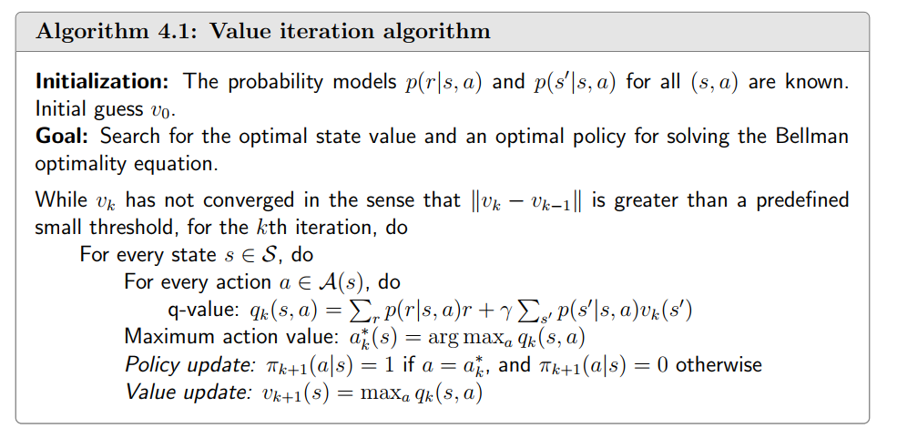

#### 4.1.2 Illustrative examples
以下面一个简单的grid world作为例子研究上述过程：
目标区域是$s_4$，奖励设置为$r_{boundary}=r_{forbidden}=-1$，$r_{target}=1$,$\gamma$=0.9。
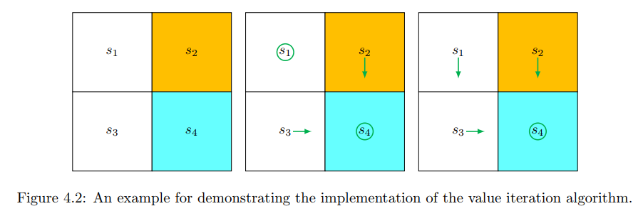
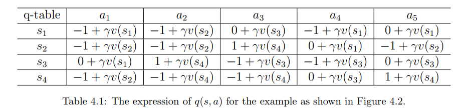
##### 当k=0时：
* Policy update
  我们先选取$v_0(s_i)$的初值，均设置为0；
  接着代入进表格4.1得到k=0时的q(s,a)
  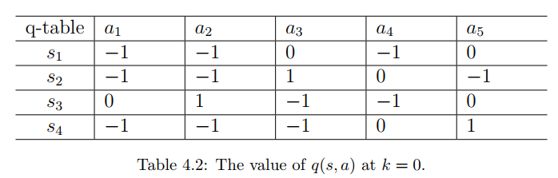
  而我们的策略$\pi_1$基于贪心策略，选取每个state最大的$q-values$:
  $$\pi_1(a_5|s_1) = 1, \quad \pi_1(a_3|s_2) = 1, \quad \pi_1(a_2|s_3) = 1, \quad \pi_1(a_5|s_4) = 1.$$
  其中对于$s_1$，$a_3$和$a_5$的q值是一样的我们随机选取一个就行。
* Value update
  更新的值就等于最大的q-values
  $$v_1(s_1) = 0, \quad v_1(s_2) = 1, \quad v_1(s_3) = 1, \quad v_1(s_4) = 1.$$
##### 当k=1时： 
后续过程即按照上述的顺序，把新的v代入表格4.1得到新的q-values，依次重复即可，上述情形在k=1次迭代后就已经找到了最优策略$\pi_2$和最优状态值$v_2(s)$。

### 4.2 Policy iteration algorithm
Policy iteration包括了两个步骤：
* Policy evaluation:这一步是基于给定的policy（$\pi_k$），通过贝尔曼公式去计算对应的state value（$v_{\pi_k}$）
  $$v_{\pi_k}=r_{\pi_k}+\gamma P_{\pi_k}v_{\pi_k}$$
  其中$\pi_k$是上一个迭代得到的策略，$v_{\pi_k}$是需要计算的state value；$r_{\pi_k}$和$P_{\pi_k}$是从系统模型中获取的值。
* Policy improvement:这一步是去改进策略。基于上一步的$v_{\pi_k}$，通过下列公式去得到新的策略$\pi_{k+1}$
  $$\pi_{k+1}=\arg \max_{\pi }(r_\pi+\gamma P_\pi v_k) $$
  这跟value iteration 中的policy update 一致的，都是使用greedy的策略，选取最大的action value(这里是**严格定义上的action value**，由于$v_{\pi_k}$是满足贝尔曼公式的state value)

在上述算法中有几个关键问题：
1. 如何求解policy evaluation 中的$v_{\pi_k}$，这其实就是求解贝尔曼公式，理论上有闭式解，但涉及求逆，一般会**使用迭代算法**，具体过程参考第二讲贝尔曼方程部分。
   有趣的是，当我们使用迭代算法去求解贝尔曼方程，此时policy iteration变成了**一个迭代中嵌套了另一个迭代算法**。求解贝尔曼方程的迭代理论上要算无穷次，但实际不可能，会设置一个误差界限，当相邻两次迭代结果的差$||v_{\pi_k}^{(j+1)}-v_{\pi_k}^{(j)}||$小于这个界限时，就停止迭代。但这也会有疑问，这样取到的不准确的值会对于最终结果有影响吗，在4.3中给了详细解答。
2. 在policy improvement中，$\pi_{k+1}$为什么比$\pi_k$更优？这里有一个引理说明：
   ##### Lemma 4.1(Policy improvement)
   如果$\pi_{k+1}=\arg \max_{\pi }(r_\pi+\gamma P_\pi v_k) $，那么$v_{\pi_{k+1}}\geq v_{\pi_k}$
   详细证明参考书P63
3. 上述算法会得到一系列策略$\{\pi_0,\pi_1,\dots,\pi_k,\dots\}$和state value$\{v_{\pi_0},v_{\pi_1},\dots,v_{\pi_k},\dots\}$，这些序列是否收敛于最优策略和最优状态值呢?这里给出了一个定理：
   ##### Theorem 4.1(Convergence of policy iteration)
   通过policy iteration algorithm得到的state value序列会收敛于最优状态值$v^*$;policy 序列会收敛于最优策略。
   详细证明参考书P65

笼统的说，由于迭代中嵌套的迭代，策略迭代收敛的步数要比值迭代少。

#### 4.2.1 Elementwise form and implementation
详细的计算过程如下图所示:
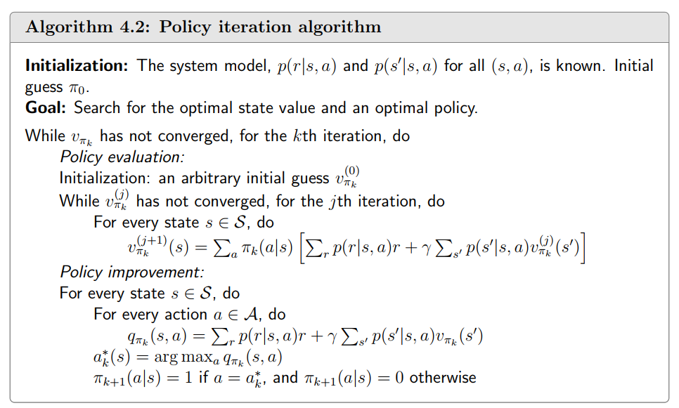

#### 4.2.2 Illustrative examples
以一个简单的grid world进行说明：
在下图的grid world中，有两个state，存在3个actions:$\mathbf{A}=\{ a_l,a_0,a_r \}$；奖励设置为$r_{boundary}=-1,r_{target}=1$；$\gamma=0.9$
初始的策略如图4.3（a）所示：
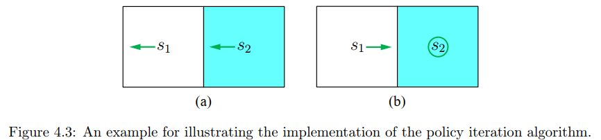
接下来计算迭代算法的两个step:
* Policy evaluation
  可以根据已知策略列写贝尔曼方程：
  $$
  \begin{align*}
  v_{\pi_0}(s_1) &= -1 + \gamma v_{\pi_0}(s_1), \\
  v_{\pi_0}(s_2) &= 0 + \gamma v_{\pi_0}(s_1).
  \end{align*}
  $$
  1. 该方程组很简单可以直接求解得到：
  $$v_{\pi_0}(s_1) = -10,\quad v_{\pi_0}(s_2) = -9.$$
  2. 也可以通过迭代算法去求解：
   我们设定初值$ v_{\pi_0}^{(0)}(s_1) = v_{\pi_0}^{(0)}(s_2) = 0.$
   根据迭代算法得到：
   $$
   \begin{cases}
    v_{\pi_0}^{(1)}(s_1) = -1 + \gamma v_{\pi_0}^{(0)}(s_1) = -1, \\
    v_{\pi_0}^{(1)}(s_2) = 0 + \gamma v_{\pi_0}^{(0)}(s_1) = 0,
    \end{cases}
    \\
    \begin{cases}
    v_{\pi_0}^{(2)}(s_1) = -1 + \gamma v_{\pi_0}^{(1)}(s_1) = -1.9, \\
    v_{\pi_0}^{(2)}(s_2) = 0 + \gamma v_{\pi_0}^{(1)}(s_1) = -0.9,
    \end{cases}
    \\
    \begin{cases}
    v_{\pi_0}^{(3)}(s_1) = -1 + \gamma v_{\pi_0}^{(2)}(s_1) = -2.71, \\
    v_{\pi_0}^{(3)}(s_2) = 0 + \gamma v_{\pi_0}^{(2)}(s_1) = -1.71,
    \end{cases}
   $$
   我们可以预见上述迭代结果最终会收敛于i中的结果。
* Policy improvement
  这一步的关键是计算状态的所有action value，然后找到最大的对应的action，作为新的策略。
  动作值的计算可以参考下表：
 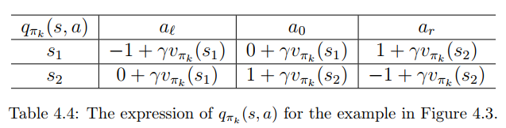
  代入第一步得到的state value可以得到k=0时的action value：
   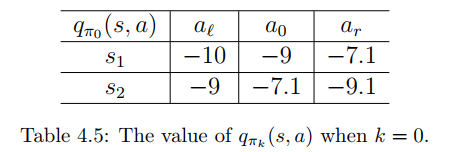
  根据greedy策略，改进的策略$\pi_1$应该为：
  $$\pi_1(a_r|s_1)=1\quad \pi_1(a_0|s_2)=1$$
  这对应图4.3（b），此时已经是最优策略。

针对于更加复杂的情形，在给的一个例子中会出现有趣的现象，即最优的policy是从target area开始由近及远进行更新的。

### 4.3 Truncated policy iteration algorithm
#### 4.3.1 Comparing value iteration and policy iteration
* Policy iteration:选择任意初始策略$\pi_0$。在第k次迭代中，执行以下两步：
  1. Policy evaluation(PE):给定$\pi_k$，通过公式求解$v_{\pi_k}$:
   $$v_{\pi_k} = r_{\pi_k} + \gamma \mathcal{P}_{\pi_k} v_{\pi_k}$$
  2. Policy improvement(PI):基于上一步的$v_{\pi_k}$求解$\pi_{k+1}$:
   $$\pi_{k+1} = \arg\max_{\pi}\big(r_{\pi} + \gamma \mathcal{P}_{\pi} v_{\pi_k}\big)$$ 
* Value iteration：选择任意初始值$v_0$,在第k次迭代中，执行以下两步：
  1. Policy update(PU):给定$v_k$,通过下式求解$\pi_{k+1}$
   $$\pi_{k+1} = \arg\max_{\pi}\big(r_{\pi} + \gamma \mathcal{P}_{\pi} v_k\big)$$
  2. Value update(VU):基于上一步的$\pi_{k+1}$，求解$v_{k+1}$:
   $$v_{k+1} = r_{\pi_{k+1}} + \gamma \mathcal{P}_{\pi_{k+1}} v_k$$ 

总结上述两种算法的流程图：
$$\text{策略迭代：}\ \pi_0 \xrightarrow{PE} v_{\pi_0} \xrightarrow{PI} \pi_1 \xrightarrow{PE} v_{\pi_1} \xrightarrow{PI} \pi_2 \xrightarrow{PE} v_{\pi_2} \xrightarrow{PI} \dots
\\
\text{价值迭代：}\ \quad\quad\quad\ v_0 \xrightarrow{PU} \pi_1' \xrightarrow{VU} v_1 \xrightarrow{PU} \pi_2' \xrightarrow{VU} v_2 \xrightarrow{PU} \dots$$

不难发现上述两种算法的迭代过程很相似，我们可以令两种算法的初值$v_0=v_{\pi_0}$相同来对比：
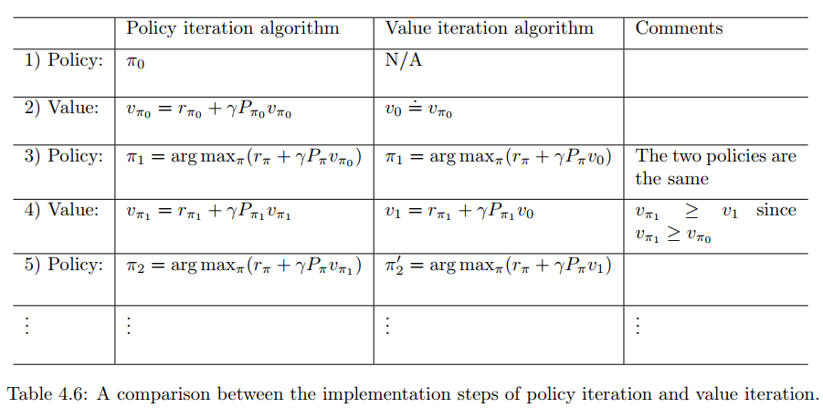
对于policy iteration中的第四步，$v_{\pi_1}$的求解省略了通过迭代算法求解状态值的过程，我们可以展开来形象对比：
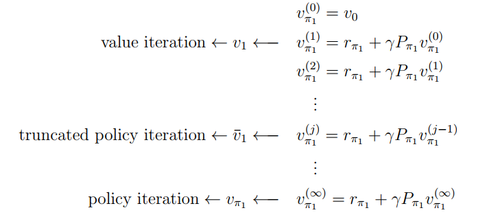
我们可以发现，通过迭代去求解贝尔曼方程时，第一次迭代的结果就是value iteration的$v_1$；而无穷次就是policy iteration。但实际无法迭代无穷次，故有限次迭代次数对应的就是我们这节的**truncated policy iteration（截断策略迭代）**。

故我们可以得到三者的关系，对于初值相同的情况下：
##### 值迭代对应是**j=1**的截断策略迭代；
##### 策略迭代对应的是**j趋于**$\infty$ 的截断策略迭代。
下图是truncated policy iteration的详细算法流程.
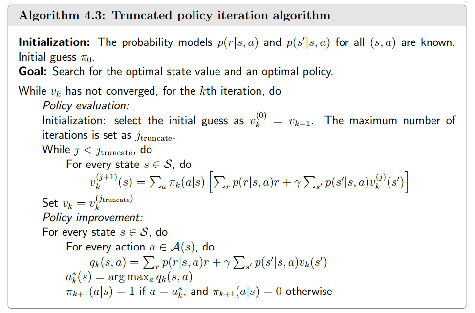
值迭代和策略迭代可以宽泛看作$j_{truncated}$取不同值的两个极端情况。（$j_{truncated}= 1$和$j_{truncated}=\infty$）

#### 4.3.2 Truncated policy iteration algorithm
总的来说，truncated policy iteration可以看作是在policy evaluation 部分只迭代有限次的policy iteration，从名字上也可以看出。这会导致一个问题，我们前面也提到过：实际得到的迭代值不是真正的状态值，这是否会影响我们对于最优策略和最优状态值得寻找呢？显然是不会影响的，这里不做证明。
如果对于三种算法的收敛随迭代次数的变化进行比较，显然policy>truncated>value:
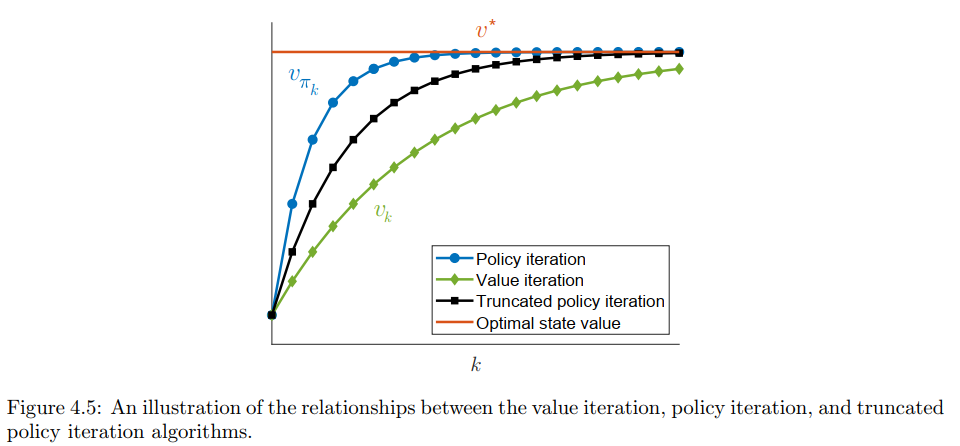

## Lec5 Monte Carlo Learning
在前面的章节中，我们学习到了基于系统模型的最优策略算法，在这一章，我们首次接触model-free的强化学习算法。
关于learning，我们需要有这样一种想法，如果没有模型那我们需要数据；没有数据我们就需要模型。当模型未知时，我们就需要依赖数据去估算一些参数，而这里又涉及到了概率论中的**期望**（expectation/mean estimation）

### 5.1 Motivating example: Mean estimation
期望的计算是算法的重要部分，我们回顾一下贝尔曼方程，其中action value和state value均可以看作某个随机变量的均值。

对于一个随机变量其期望求解有两种方法，假设为$X$,其值在集合$\mathcal{X}$中取得：
* 前面有模型的时候，即我们已知概率分布，可以通过概率分布求解：
  $$\mathbb{E}[X]=\sum_{x\in \mathcal{X}}p(x)x$$
* 没有模型时，我们通过对于随机变量$X$进行采样，用得到的一系列采样值$\{x_1,x_2,\dots,x_n\}\in X$的平均值去估计期望：
  $$\mathbb{E}[X] \approx \bar{x} = \frac{1}{n} \sum_{j=1}^{n} x_j$$

上述样本估计整体的方法由**大数定理**给出其估计的无偏和有效性：
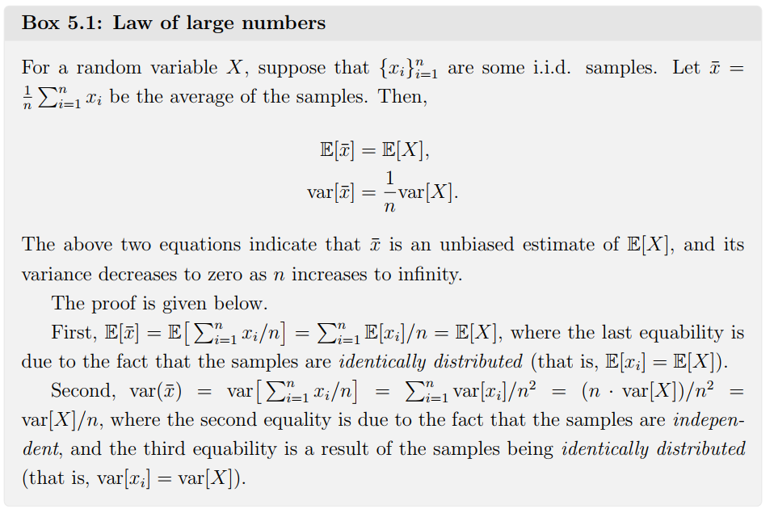

### 5.2 Monte Carlo Basic algorithm 
#### 5.2.1 Coverting policy iteration to be model-free
我们回顾一下上一节的policy iteration algorithm，其分为两步：policy evaluation 和policy improvement。而在PE中，我们需要求解action value，在PI中根据求解的action value去改进策略，其核心就在这个$q_{\pi_k}(s,a)$的求解上。

回顾action value最原始的定义，本质上就是一个期望：
$$q_{\pi_k}(s, a) = \mathbb{E}[G_t|S_t = s, A_t = a]$$
而前面5.1提到期望求解按照有无模型分为两种方法，我们前面使用的是第一种有模型算法：
* model-based 方法：
  $$
  \begin{aligned}
  q_{\pi_k}(s, a) 
  &= \mathbb{E}[G_t|S_t = s, A_t = a]\\
  &=\sum_{r} p(r|s,a)r + \gamma \sum_{s'} p(s'|s,a) v_{\pi_k}(s')
  \end{aligned}
  $$
  其中$\{p(r|s,a),p(s'|s,a)\}$是系统模型相关参数。
* model-free 方法：
  action value的定义为：
  $$
  \begin{split}
  q_{\pi_k}(s, a) 
  &= \mathbb{E}[G_t|S_t = s, A_t = a] \\
  &= \mathbb{E}[R_{t+1} + \gamma R_{t+2} + \gamma^2 R_{t+3} + \dots |S_t = s, A_t = a],
  \end{split}
  $$
  这其实是从$(s,a)$出发得到的return的均值。我们可以通过Monte Carlo方法去估计这个均值/期望。那么我们需要先对于这个随机变量采样：即从$(s,a)$出发，按照策略$\pi_k$，获得一定数目的episode（跟前边的trajectory类似）。假设获得了n个episodes，第i个对应的return为$g_{\pi_k}^{(i)}(s,a)$，那么可以用下述式子估计：
  $$q_{\pi_k}(s, a) = \mathbb{E}[G_t|S_t = s, A_t = a] \approx \frac{1}{n} \sum_{i=1}^n g_{\pi_k}^{(i)}(s, a)$$

MC-based learning的核心思想就是使用**model-free**的方法替代model-based去**估计action values**。

#### 5.2.2 The MC Basic algorithm
类似于policy iteration，我们可以分两步去描述MC basic algorithm。假设初始策略为$\pi_0$，对于第k次迭代：
* Policy evaluation
  对于每一个$(s,a)$，收集足够多的episodes，计算他们return的平均得到对应的action value($q_{\pi_k}(s,a)$)估计值$q_k(s,a)$。
   $$q_{\pi_k}(s, a) = \mathbb{E}[G_t|S_t = s, A_t = a] \approx \frac{1}{n} \sum_{i=1}^n g_{\pi_k}^{(i)}(s, a)$$
* Policy improvement
  同样求解一个最优化问题得到greedy policy：
   $$\pi_{k+1}(s) = \arg\max_{\pi} \sum_{a} \pi(a|s) q_k(s,a), \quad s \in \mathcal{S}.$$
  greedy policy为：
  $$\pi_{k+1}(a|s) = \begin{cases} 
  1, & a = a_k^{*}(s), \\
  0, & a \neq a_k^{*}(s),
  \end{cases} 
  $$
  其中$a_k^{*}(s) = \arg\max_{a} q_k(s,a)$
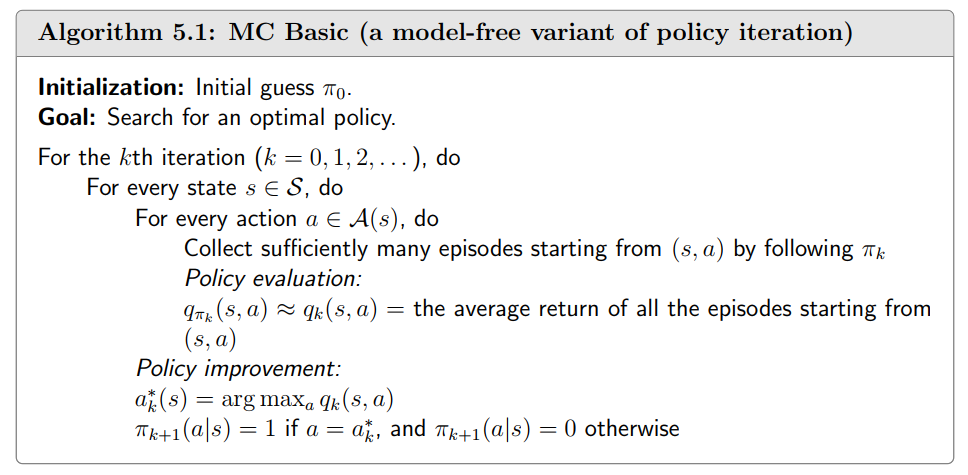

需要注意的是，在policy iteration中我们实际上**求的是state value**，再由state value去计算action value，根据greedy policy改进策略；而MC basic是**直接估计了action value**，其实是简化了过程，省略了从状态值求动作值的过程，并不会影响整个过程。

MC Basic algorithm更多是帮助我们从model-based过度到model-free的算法，实际上其过于基础，对于sample和数据的利用效率非常低，后续则会介绍基于MC Basic,更加complex和sample-efficient的算法。

#### 5.2.3 Illustrative examples
具体内容详见P83
这里简要概括一下核心思想：
1. 关于**需计算的数目**：
   所有的action values都需要被计算，这里就有state数目$\times$一个state有的action数个action values 需要求解。而每一个action value的估计值是需要对足够多的episodes求平均得到的。无疑这样计算量是很大的。
   但是对于策略和模型都是deterministic的情形，我们就只需要计算一个episode，因为轨迹是固定的。
2. **Episode length**的影响：
   对于一个稍微复杂的grid world例子，当episode的长度由小增大时，我们发现策略是逐渐从target area开始最优，逐渐向远处拓展；而且当长度较短时，会出现离target area较远的state value为0的情况，直观理解就是从state出发在当前长度根本到不了目标区域，所以得不到正reward。
   故我们需要**足够长**的episode length才能得到最优策略和状态值。
3. Sparse reward(稀疏奖励)
  上述情况就引出了一个奖励设置的重要问题，即稀疏奖励，只对于达到目标区域设置正奖励就是一种稀疏奖励，这样会造成学习的效率较低，可以采取非稀疏奖励，即鼓励去探索周边区域，给一个小的正reward，可能会让agent更容易去找到target area。

### 5.3 MC Exploring Starts
基于MC basic algorithm，我们需要更加使得新的算法更加sample-efficient，这里就拓展到这节的MC Expolring Starts。

#### 5.3.1 Utilizing samples more effeciently
首先我们列写出一个episode来进行分析：
$$s_1 \xrightarrow{a_2} s_2 \xrightarrow{a_4} s_1 \xrightarrow{a_2} s_2 \xrightarrow{a_3} s_5 \xrightarrow{a_1} \dots$$
每一次一个state-action组合出现在一个episode中，我们称这是对于这个state-action的一次**visit**，而提升效率的方式就是去充分利用visits。

* **initial visit：**
  最简单的策略是initial visit，即一个episode只用来估计这个轨迹起始的state-action pair的action value，例如上面的episode只用来估计$（s_1,a_2）$，这就是MC Basic使用的方法，显然效率很低。

实际上，一个episode可以按下图方式分解，在过程中visit的state-action pair的后边的轨迹就可以看作一个从这个pair开始的新的episode，由此就可以估计这个pair，实现一个episode的visits的高效利用：
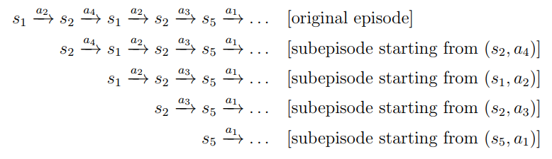
对于visit利用方式不同又可以分为$first-visit$和$every-visit$：
* **first visit:**
  只使用一个state-action pair第一次出现的visit进行估计，例如上面的episode中，$（s_1,a_2）$出现了两次，我们只使用首次出现后的episode进行估计。
* **every visit:**
  使用一个state-action pair每一次出现的visit进行估计，上面的episode中，$（s_1,a_2）$出现了两次，我们两次都用来估计。

从样本利用效率来看，$every-visit$策略是最优的。如果一个交互序列（episode）足够长，能多次覆盖所有状态 - 动作对，那么仅靠这一个序列，用每次访问策略就可能完成所有动作价值的估计。
不过，每次访问策略得到的样本是存在相关性的 —— 因为从第二次访问开始的轨迹，其实只是第一次访问轨迹的子集。但如果这两次访问在轨迹中相距较远，这种相关性就不会太强。

#### 5.3.2 Updating polices more efficiently
前面我们关于利用visit提出了新的方法，而现在对于策略更新的时机也进行讨论。
* first strategy:前面我们在policy evaluation中，是在计算一个state-action pair所有episodes对应的return后，对其求均值得到action value的估计。
  其缺陷在于agent需要等到所有序列都收集完毕，才能去更新估计值。
* second stratery:第二种方法克服了上述缺陷————仅利用单个episode的return来近似对应的action value。如此一来，只要获取到一个序列，就能立即得到一个粗略的估计值；进而可以以**逐序列（episode-by-episode**的方式对策略进行改进。

#### 5.3.3 MC Exploring Starts Algorithm
综合上述的两种改进方法，得到了本节内容：MC Exploring Starts
这个算法使用了**every visit**和**逐序列（episode-by-episode**改进策略，详细的算法细节如下图：
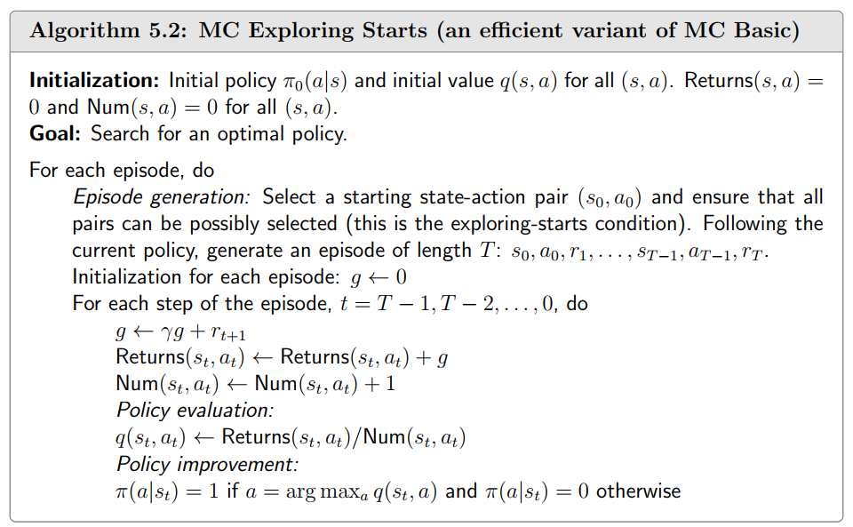
值得注意的是，在计算各状态 - 动作对出发的折扣回报时，算法会从序列的终止状态开始，反向遍历至起始状态。这类技术能提升算法效率。

下面通过ai转写总结了本人对于上述算法的理解：
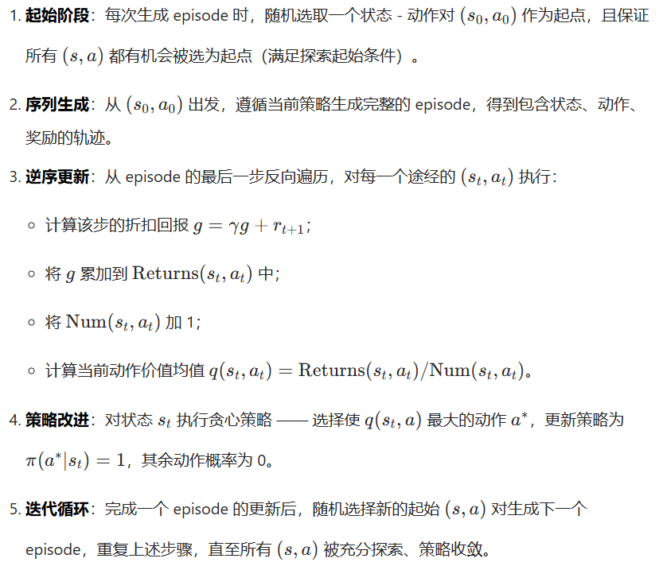

探索起始条件（exploring starts condition） 要求：从**每一个状态 - 动作对出发，都能生成足够多的交互序列**。只有当所有状态 - 动作对都被充分探索后，我们才能基于大数定律，准确估计它们的动作价值，进而成功寻得最优策略。反之，如果某个动作的探索不充分，其动作价值的估计值就会存在偏差；即便该动作是最优动作，最终也可能不会被策略选中。蒙特卡罗基础算法与带探索起始的蒙特卡罗算法均需满足这一条件。

但在诸多实际场景中，尤其是需要与物理环境交互的场景，这一条件往往难以满足，例如我们没办法实际中将机器人搬到每一个网格去，下面就来解决这个exploring starts带来的问题：

### 5.4 MC $\epsilon$-Greedy:Learning without expolring starts
这种算法通过soft policy(柔性策略)来实现对于每个state-action pair的充分visit。

#### 5.4.1 $\epsilon$-greedy policies
先来介绍soft policy：即一个在任意状态下采取任意action的概率都为正的策略。

这就**区别于前边的greedy策略**，前面的要求随机起始，才能保证不漏访问某一个pair；而这种策略最极端的情况下，只需要一个足够长的episode就能访问所有的state-action pairs。

一个最常见的soft policy就是$\epsilon$-greedy policies。这是一个随机策略，有更大的概率选择greedy action(有着最大action value的action)，同时对于其他的action有着相同的不为0的正概率，通过参数$\epsilon \in [0,1]$来调控概率。具体的**策略数学表达**如下：
\[
\pi(a|s) =
\begin{cases}
1 - \dfrac{\epsilon}{|\mathcal{A}(s)|}\bigl(|\mathcal{A}(s)| - 1\bigr), & \text{for the greedy action}, \\[6pt]
\dfrac{\epsilon}{|\mathcal{A}(s)|}, & \text{for the other } |\mathcal{A}(s)| - 1 \text{ actions},
\end{cases}
\]
其中$|\mathcal{A}(s)|$代表s下action的数目。非常容易证明，greedy action的概率大于其他选择的概率。

当$\epsilon=0$时就是greedy policy
当$\epsilon=1$时就是完全stochastic的策略，所有action 有相同的概率选择。

$\epsilon$-greedy policies是一种stochastic的策略，实际中我们如何去执行这个策略呢？
首先，生成一个服从均匀分布的随机数 $x\in[0,1]$
* 若$x\geq \epsilon$，选择贪心动作
* 若$x<\epsilon$,则在动作集合$\mathcal{A}(s)$中随机选择一个动作（可能会再次选到贪心动作）

通过这种方式，选择贪心动作的总概率为$1-\epsilon+\frac{\epsilon}{\mathcal{A}(s)}$；选择其他动作的概率均为$\frac{\epsilon}{\mathcal{A}(s)}$

#### 5.4.2 Algorithm description
为了将$\epsilon$-greedy policies融入到MC learning中,我们只需将policy improvement中的策略从greedy改到$\epsilon$-greedy就行。

但需要注意的是，此时策略迭代的策略域不再是原本的
全体策略集合$\Pi$，而是变成了其子集$\Pi_{\epsilon}$。

那么自然有个问题，策略代替之后，我们能否保证还能得到最优策略？答案既肯定又否定：
* 肯定的理由是在给定充足样本时，算法可以收敛到集合$\Pi_{\epsilon}$中的optimal $\epsilon$-greedy 策略
* 否定的理由是该策略仅在$\Pi_{\epsilon}$最优，不一定在全体策略集合$\Pi$中最优
不过当$\epsilon$较小时，两个集合的最优策略会很接近。

**详细的算法过程如下图所示：**
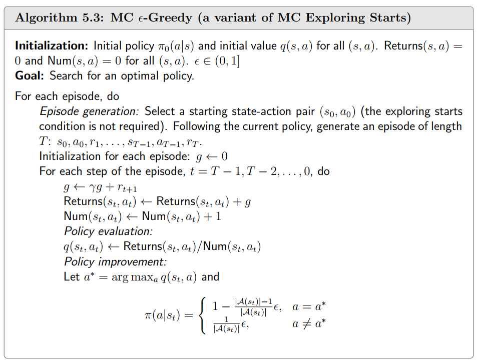

### 5.5 Exploration and expolitation of $\epsilon$-greedy policies
探索（Exploration）与利用（Exploitation）构成了强化学习中的一个基本权衡问题。
* **探索**指的是策略应尽可能尝试更多的动作，从而保证所有动作都能被充分访问与评估；
* **利用**则指改进后的策略应当选择动作价值最大的贪心动作。

但需要注意的是，若探索不充分，当前得到的动作价值可能并不准确。因此，我们需要在利用的过程中持续进行探索，以避免错失最优动作。

$\epsilon$-greedy policies提供了一种平衡探索与利用的有效方法。一方面，这个策略会以较高的概率选择贪心动作，充分利用估计的价值；另一方面保留了选择其他动作的可能，来保证探索能力。

而$\epsilon$-greedy policies的核心思想，就是通过**牺牲部分最优性/利用性来增强探索能力**。

若要提升利用效率与策略最优性，我们需要减小 ε 的取值；反之，若要增强探索能力，则需要增大 ε 的取值

书本P93中给出了对于不同ε下迭代结果对比。

首先介绍一个概念，策略的**一致性/consistence**
    针对两个 ε- 贪心策略$π_1$和$π_2$，它们被判定为一致的充要条件是：
    对于所有状态 s，策略 $π_1$在 s下概率最大的动作，与策略 $π_2$在 s下概率最大的动作完全相同。

* Optimality
  * 当 ε=0时，该策略退化为贪心策略，且在全体策略中均为最优；
  * 当 ε取值较小（如 0.1）时，最优 ε- 贪心策略与最优贪心策略保持一致。
  * 当 ε增大至某个值（例如 0.2）时，得到的 ε- 贪心策略就不再与最优贪心策略一致。
  
  因此，若要使 ε- 贪心策略与最优贪心策略保持一致，**ε的取值必须足够小**。

  以目标区域来分析，很容易理解，当ε较小时，最优策略是保持静止在原地，当ε增大时，有更大的概率进入forbidden area，获得负奖励，这时最优策略就不再是停留原地了，与最优贪心策略不一致。

* Exploration
  ε- 贪心策略的探索能力与 ε 取值呈正相关：ε 越大，探索能力越强；ε 越小，探索能力越弱。
  * ε=1 时：策略探索能力极强。任意状态下所有动作的选择概率均等，当轨迹长度足够长时，单次轨迹即可多次访问所有状态 - 动作对，且各状态 - 动作对的访问次数分布几乎均匀。
  * ε=0.5 时：策略探索能力弱于 ε=1 的情况。尽管轨迹足够长时仍能覆盖所有动作，但访问次数分布极不均衡—— 部分动作被高频访问，多数动作仅被少量访问。

实际训练过程，可以类似于机器学习中的余弦退火，动态调整ε，**先大后小**，初始设置较大的 ε 以充分探索状态空间，后续逐步减小 ε，在保证探索充分性的同时，最终收敛到性能较优的策略。

## Lec6 Stochastic Approximation

