- [Lec1 基本概念](#lec1-基本概念)
  - [1.State](#1state)
  - [2.Action](#2action)
    - [Action space:一个状态所有可能的action集合。$A(s_i)={a_i},i=1...5$](#action-space一个状态所有可能的action集合as_ia_ii15)
  - [3.State transition(状态转换) $p(s'|s,a)$](#3state-transition状态转换-pssa)
    - [State transition probability:使用条件概率来表示。](#state-transition-probability使用条件概率来表示)
  - [3.Policy $\pi(a|s)$](#3policy-pias)
  - [4.Reward(most unique) $p(r|s,a)$](#4rewardmost-unique-prsa)
  - [5.Trajectory and Return(轨迹和反馈)](#5trajectory-and-return轨迹和反馈)
  - [6.Discounted return](#6discounted-return)
  - [7.Episode](#7episode)
  - [8.Markov decision process(MDP)](#8markov-decision-processmdp)
      - [可以这样理解MDP](#可以这样理解mdp)
- [Lec2 Bellman Equation](#lec2-bellman-equation)
  - [1.State value](#1state-value)
      - [state value和return的关系：](#state-value和return的关系)
  - [2.Bellman Equation(需要手写推导)](#2bellman-equation需要手写推导)
      - [关于Bellman equation的几个要点：](#关于bellman-equation的几个要点)
  - [3.Examples to illustrate bellman equation](#3examples-to-illustrate-bellman-equation)
  - [4.Matrix-vector form of the Bellman equation](#4matrix-vector-form-of-the-bellman-equation)
      - [其中矩阵$P_\pi$有一些有趣的特性：](#其中矩阵p_pi有一些有趣的特性)
  - [5.Solving Bellman equation](#5solving-bellman-equation)
  - [6.Action value](#6action-value)
      - [需要注意的是:](#需要注意的是)
- [Lec3 Optimal State Values and Bellman Optimality Equation](#lec3-optimal-state-values-and-bellman-optimality-equation)
  - [1.如何优化/提升策略](#1如何优化提升策略)
  - [2.Optimal state and optimal policies](#2optimal-state-and-optimal-policies)
  - [3.Bellman optimality equation（BOE）](#3bellman-optimality-equationboe)
    - [3.1 BOE右侧max求解](#31-boe右侧max求解)
    - [3.3 Vector Form](#33-vector-form)
    - [3.4 Contraction mapping theorem（压缩映射定理）](#34-contraction-mapping-theorem压缩映射定理)
      - [Definition 3.4.1](#definition-341)
      - [Theorem 3.4.1](#theorem-341)
      - [Theorem 3.4.2(Contraction property of f(v))](#theorem-342contraction-property-of-fv)
    - [3.5 Sovling an optimal policy from BOE](#35-sovling-an-optimal-policy-from-boe)
      - [$v^*$的求解](#v的求解)
      - [$\pi^*$的求解](#pi的求解)
      - [Theorem 3.5.1（ $v^*$与$\pi^*$的最优性）](#theorem-351-v与pi的最优性)
      - [Theorem 3.5.2（Greedy optimal policy）](#theorem-352greedy-optimal-policy)
    - [3.6 Factors that influence optimal policy](#36-factors-that-influence-optimal-policy)
      - [impact of discount rate $\gamma$](#impact-of-discount-rate-gamma)
      - [impact of reward values](#impact-of-reward-values)
- [Lec4 Value Iteration \& Policy Iteration(值迭代\&策略迭代算法)](#lec4-value-iteration--policy-iteration值迭代策略迭代算法)
  - [4.1 Value iteration algorithm](#41-value-iteration-algorithm)
    - [4.1.1 Elementwise form and implementation](#411-elementwise-form-and-implementation)
    - [4.1.2 Illustrative examples](#412-illustrative-examples)
      - [当k=0时：](#当k0时)
      - [当k=1时：](#当k1时)
  - [4.2 Policy iteration algorithm](#42-policy-iteration-algorithm)
      - [Lemma 4.1(Policy improvement)](#lemma-41policy-improvement)
      - [Theorem 4.1(Convergence of policy iteration)](#theorem-41convergence-of-policy-iteration)
    - [4.2.1 Elementwise form and implementation](#421-elementwise-form-and-implementation)
    - [4.2.2 Illustrative examples](#422-illustrative-examples)
  - [4.3 Truncated policy iteration algorithm](#43-truncated-policy-iteration-algorithm)
    - [4.3.1 Comparing value iteration and policy iteration](#431-comparing-value-iteration-and-policy-iteration)
      - [值迭代对应是j=1的截断策略迭代；](#值迭代对应是j1的截断策略迭代)
      - [策略迭代对应的是j趋于$\infty$ 的截断策略迭代。](#策略迭代对应的是j趋于infty-的截断策略迭代)
    - [4.3.2 Truncated policy iteration algorithm](#432-truncated-policy-iteration-algorithm)
- [Lec5 Monte Carlo Learning](#lec5-monte-carlo-learning)
  - [5.1 Motivating example: Mean estimation](#51-motivating-example-mean-estimation)
  - [5.2 Monte Carlo Basic algorithm](#52-monte-carlo-basic-algorithm)
    - [5.2.1 Coverting policy iteration to be model-free](#521-coverting-policy-iteration-to-be-model-free)
    - [5.2.2 The MC Basic algorithm](#522-the-mc-basic-algorithm)
    - [5.2.3 Illustrative examples](#523-illustrative-examples)
  - [5.3 MC Exploring Starts](#53-mc-exploring-starts)
    - [5.3.1 Utilizing samples more effeciently](#531-utilizing-samples-more-effeciently)
    - [5.3.2 Updating polices more efficiently](#532-updating-polices-more-efficiently)
    - [5.3.3 MC Exploring Starts Algorithm](#533-mc-exploring-starts-algorithm)
  - [5.4 MC $\epsilon$-Greedy:Learning without expolring starts](#54-mc-epsilon-greedylearning-without-expolring-starts)
    - [5.4.1 $\epsilon$-greedy policies](#541-epsilon-greedy-policies)
    - [5.4.2 Algorithm description](#542-algorithm-description)
  - [5.5 Exploration and expolitation of $\epsilon$-greedy policies](#55-exploration-and-expolitation-of-epsilon-greedy-policies)
- [Lec6 Stochastic Approximation](#lec6-stochastic-approximation)
  - [6.1 Motivating example:Mean estimation](#61-motivating-examplemean-estimation)
  - [6.2 Robbins-Monro algorithm](#62-robbins-monro-algorithm)
    - [6.2.1 Convergencce](#621-convergencce)
      - [Therorem 6.1 (Robbins-Monro theorem)](#therorem-61-robbins-monro-theorem)
    - [6.2.2 Application to mean estimation](#622-application-to-mean-estimation)
  - [6.3 Dvoretzky's convergence theorem](#63-dvoretzkys-convergence-theorem)
  - [6.4 Stochastic gradient descent（SGD）](#64-stochastic-gradient-descentsgd)
    - [6.4.1 Application to mean estimation](#641-application-to-mean-estimation)
    - [6.4.2 Convergence pattern of SGD](#642-convergence-pattern-of-sgd)
    - [6.4.3 A determinstic formulation of SGD](#643-a-determinstic-formulation-of-sgd)
    - [6.4.4 BGD、SGD和mini-batch GD](#644-bgdsgd和mini-batch-gd)
    - [6.4.5 Convergence of SGD](#645-convergence-of-sgd)
      - [Theorem 6.4(Convergence of SGD)](#theorem-64convergence-of-sgd)
- [Lec7 Temporal-Difference Methods](#lec7-temporal-difference-methods)
  - [7.1 TD learning of state values](#71-td-learning-of-state-values)
    - [7.1.1 Algorithm description](#711-algorithm-description)
    - [7.1.2 Property analysis](#712-property-analysis)
      - [TD learning V.S Monto Carlo](#td-learning-vs-monto-carlo)
    - [7.1.3 Convergence analysis](#713-convergence-analysis)
  - [7.2 Sarsa:TD learning of action values](#72-sarsatd-learning-of-action-values)
    - [7.2.1 Algorithm description](#721-algorithm-description)
    - [7.2.2 Optimal policy learning via Sarsa](#722-optimal-policy-learning-via-sarsa)
      - [Expected Sarsa](#expected-sarsa)
  - [7.3 n-step Sarsa](#73-n-step-sarsa)
  - [7.4 Q-learning：D learning of optimal action values](#74-q-learningd-learning-of-optimal-action-values)
    - [7.4.1 Algorithm description](#741-algorithm-description)
    - [7.4.2 Off-policy v.s. on-policy](#742-off-policy-vs-on-policy)
    - [7.4.3 Implementation](#743-implementation)
  - [7.5 A unified viewpoint](#75-a-unified-viewpoint)
- [Lec8 Value Function Methods](#lec8-value-function-methods)
  - [8.1 Value representation: From table to function](#81-value-representation-from-table-to-function)
  - [8.2 TD learning of state values based on function](#82-td-learning-of-state-values-based-on-function)
    - [8.2.1 Objective function（目标函数）](#821-objective-function目标函数)
    - [8.2.2 Optimization algorithms](#822-optimization-algorithms)
    - [8.2.3 Selection of function approximators](#823-selection-of-function-approximators)
    - [8.2.4 Illustrative examples](#824-illustrative-examples)
    - [8.2.5 Theoretical analysis](#825-theoretical-analysis)
  - [8.3 TD learning of action values based on function approximation](#83-td-learning-of-action-values-based-on-function-approximation)
    - [8.3.1 Sarsa with function approximation](#831-sarsa-with-function-approximation)
    - [8.3.2 Q-learning with function approximation](#832-q-learning-with-function-approximation)
  - [8.4 Deep Q-learning](#84-deep-q-learning)
    - [8.4.1 Algorithm description](#841-algorithm-description)
    - [8.4.2 Illustrative examples](#842-illustrative-examples)
  - [8.5 Summary](#85-summary)
- [Lec9 Policy Gradient Methods](#lec9-policy-gradient-methods)
  - [9.1 Policy representation: From table to function](#91-policy-representation-from-table-to-function)
  - [9.2 Metrics for defining optimal policies](#92-metrics-for-defining-optimal-policies)
    - [Metric 1:Average state value](#metric-1average-state-value)
    - [Metric 2: Average reward](#metric-2-average-reward)
    - [Some remarks](#some-remarks)
  - [9.3 Gradients of the metrics](#93-gradients-of-the-metrics)
      - [Theorem 9.1 (Policy gradient theorem)](#theorem-91-policy-gradient-theorem)
    - [9.3.1 Derivation of the gradients in the discounted case](#931-derivation-of-the-gradients-in-the-discounted-case)
      - [Lemma 9.1 $\bar{v}_{\pi}(\theta)$和$\bar{r}_\pi(\theta)$等价性](#lemma-91-barvpitheta和barrpitheta等价性)
      - [Lemma 9.2 $v_\pi$的梯度](#lemma-92-v_pi的梯度)
      - [Theorem 9.2 折扣下$\bar{v}_\pi^0$的梯度](#theorem-92-折扣下barv_pi0的梯度)
      - [Theorem 9.3 折扣下$\bar{r}_\pi$和$\bar{v}_\pi$的梯度](#theorem-93-折扣下barrpi和barvpi的梯度)
    - [9.3.2 Derivation of the gradients in the undiscounted case](#932-derivation-of-the-gradients-in-the-undiscounted-case)
  - [9.4 Monte Carlo policy gradient (REINFORCE)](#94-monte-carlo-policy-gradient-reinforce)
  - [9.5 Summary](#95-summary)
- [Lec10 Actor-Critic Methods](#lec10-actor-critic-methods)
  - [10.1 The simplest actor-critic algorithm (QAC)](#101-the-simplest-actor-critic-algorithm-qac)
  - [10.2 Advantage actor-critic (A2C)](#102-advantage-actor-critic-a2c)
    - [10.2.1 Baseline invariance](#1021-baseline-invariance)
    - [10.2.2 Algorithm description](#1022-algorithm-description)
  - [10.3 Off-policy actor-critic](#103-off-policy-actor-critic)
    - [10.3.1 Importance sampling](#1031-importance-sampling)
    - [10.3.2 The off-policy policy gradient theorem](#1032-the-off-policy-policy-gradient-theorem)
      - [Theorem 10.1 Off-policy policy gradient theorem(off-policy策略梯度定理)](#theorem-101-off-policy-policy-gradient-theoremoff-policy策略梯度定理)
    - [10.3.3 Algorithm description](#1033-algorithm-description)
  - [10.4 Deterministic actor-critic](#104-deterministic-actor-critic)
    - [10.4.1 The deterministic policy gradient theorem](#1041-the-deterministic-policy-gradient-theorem)
      - [Theorem 10.2 Deterministic policy gradient theorem（确定性策略梯度定理）](#theorem-102-deterministic-policy-gradient-theorem确定性策略梯度定理)
    - [10.4.2 Algorithm description](#1042-algorithm-description)
  - [10.5 Summary](#105-summary)

## Lec1 基本概念

### 1.State
描述agent相对于环境的一个状态。以grid-world 为例，一个state指的是agent（智能体）的一个location（x,y），更复杂情况下可能包括速度加速度等状态(x,y,v,a)

所有的state的集合构成State space:$S=\{s_i\}        i=1...9$

### 2.Action 
 每个state可采取的行动。

 在grid-world的例子中，一个state对应了5个action，从1-5对应上右下左中，如下图所示
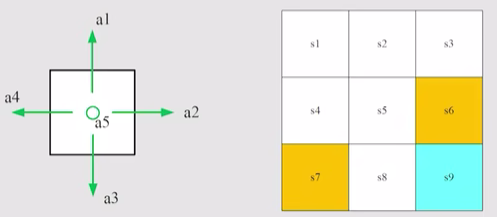

#### Action space:一个状态所有可能的action集合。$A(s_i)=\{a_i\},i=1...5$

### 3.State transition(状态转换) $p(s'|s,a)$
采取action时，从一个状态移动到另一个状态的过程。
$$s_1 \stackrel{a_2}{\rightarrow} s_2 \qquad  s_1 \stackrel{a_1}{\rightarrow} s_1$$

state transition defines interaction with the environment(定义了与环境的交互)

对于与forbidden area的transaction，有不同的定义，但我们一般考虑第一种
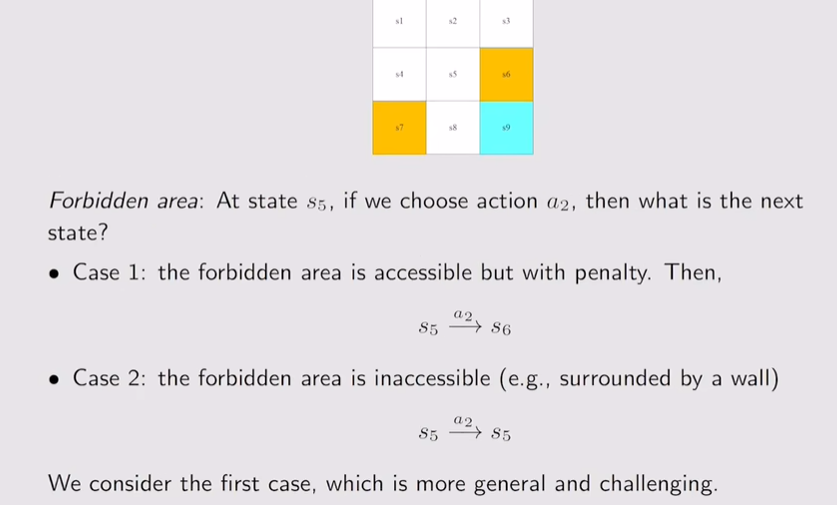
有的时候可能冒一定风险经过forbidden area的路径更优，第二种会使得状态空间变小。

状态转换可以有tabular representation，通过table来表示各个状态的状态转换。
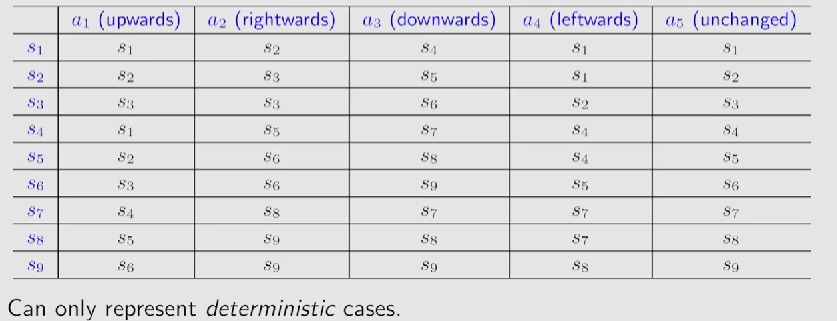

需要注意的是这里只能表示deterministic的情况，需要stochastic（随机）的表示方法，这里就引入下面的内容
#### State transition probability:使用条件概率来表示。

### 3.Policy $\pi(a|s)$
 policy告诉agent在某个状态应该take什么样的action。

 仍然可以使用条件概率（conditional probablity）去描述，即对于一个state，我们可以知道其采取不同action的条件概率，这个就代表着policy

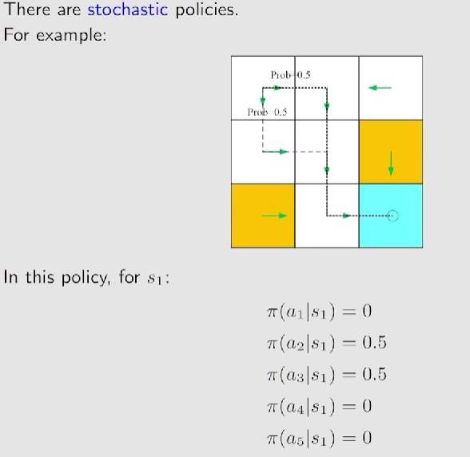

Policy也有tabular representation,下面这个table对应上图的policy，与前面action的table形式不同，policy的table形式既可以描述确定性也可以描述stochastic的情况。
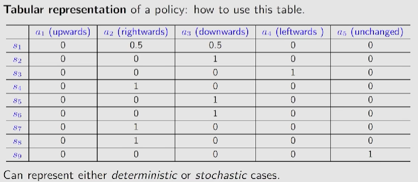
具体如何去判断选择哪个action呢，一般会在0-1均匀分布中随机采样，然后得到的数分布在哪个区域就采取相应的action

### 4.Reward(most unique) $p(r|s,a)$
在每个action后获得的数，一般正数代表encouragement，负数代表penalty。通过reward是我们和agent的一种交互手段，通过对于reward的设置，可以引导agent达到我们想要的效果。

也通过条件概率来表示：
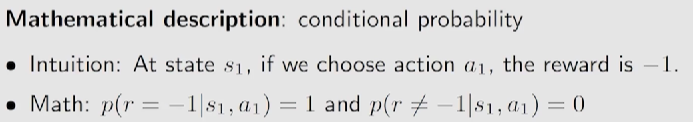

### 5.Trajectory and Return(轨迹和反馈)
 Trajectory是一个state-action-reward的链，能反映整个状态变化的过程。
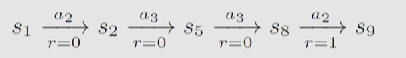

一个trajectory的Return是沿着这个轨迹所有rewards的和。
$$return=0+0+0+1=1$$

### 6.Discounted return
一个轨迹的return可能是无穷的，例如上面的trajectory如果后续一直停留在$s_9$时，每一个action，return都会+1，最终趋于无穷。

为了解决这个问题，我们引入discounted rate，每一次的reward的会乘上其对应的衰减率（$\gamma$）的幂次；引入后可以解决发散的问题，同时可以根据其值的大小去调控对于当前和未来的reward的关注度。
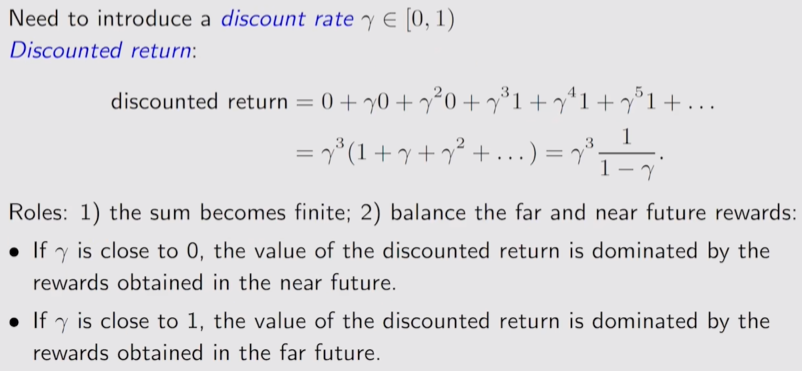

### 7.Episode
 agent与环境交互时，可能停在某个terminal states，这样的trajectory就被叫做一个episode（或trial）。一般episode都是一个finite的trajectory，这样的任务被称为episodic tasks。

 有些任务没有terminal state，会一直持续下去，即成为了一个continuing tasks。

 实际上我们可以把二者统一，即把episodic tasks转换为continuing tasks。
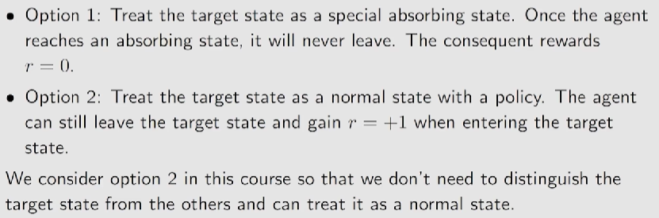
我们一般都按照**第二种方式**，将target state看作一个普通的state，可以进入可以跳出，这样学习时可能耗费更多的搜索，但是其一般性更强。

### 8.Markov decision process(MDP)
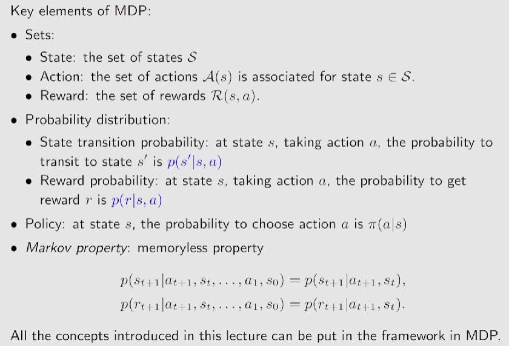

* $p(s'|s,a)$:状态转移
* $p(r|s,a)$：奖励
* $\pi(a|s)$：策略
 其中关键性质是Markov property，即在MDP架构下的条件概率是与历史状态无关的（memoryless property）
##### 可以这样理解MDP
1. M对应Markov property；
2. D对应Policy(决策)
3. P代表的process中包含了一系列的元素集合和概率分布

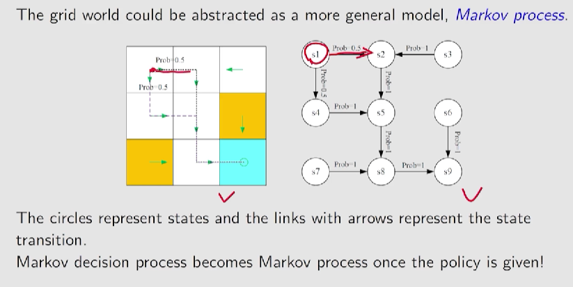

## Lec2 Bellman Equation
### 1.State value
我们在前边使用return去evaluate一个policy,但是前面针对的都是deterministic的情况，对于stochastic的情况，从一个状态出发可能会有不同的return，我们就需要引入State value(状态值)去解决这个问题。state value其实就是从这个state出发，所有**return的均值**。

我们可以构造一个通用的trajectory:
$$S_t \stackrel{A_t}{\rightarrow} S_{t+1},R_{t+1} \stackrel{A_{t+1}}{\rightarrow} S_{t+2},R_{t+2}\stackrel{A_{t+3}}{\rightarrow} S_{t+3},R_{t+3}...$$
其中：
* $S_t$:当前时间t下的状态
* $S_{t+1}$:下一个状态
* $A_{t}$:在t时刻（$S_{t}$）时的策略$\pi$
* $R_{t+1}$:从$S_t$到$S_{t+1}$立即获得的reward

注意这里的大写的字母均代表一个随机变量（random variables）

可以写出沿着这个trajectory的discounted return：
$$G_t=R_{t+1}+\gamma R_{t+2}+ \gamma^2 R_{t+3}+...$$

我们接下来定义state value即为$G_t$的期望（均值）
$$v_{\pi}(s)=E[G_t|S_t=s]$$

$v_{\pi}(s)$即被称为**状态值函数/状态值**，下面有一些重要的特点
* $v_{\pi}(s)$是关于**s的函数**，状态值跟当前的状态有关
* $v_{\pi}(s)$是关于$\pi$**（policy）的函数**，不同的policy会有不同的state value
* $v_{\pi}(s)$**不依赖时间t**，当agent在state spacec移动时，这时t值代表时序顺序。当policy给定，state value 就是确定的

##### state value和return的关系： 
* 当policy和system都是确定的，此时二者等价
* 当policy和system都是**随机**的，此时从同一个state开始可能得到不同的轨迹，不同trajectory的returns会不一样，而state value就是这些**不同returns的均值**。

所以一般都使用state value来评价一个策略。

### 2.Bellman Equation(需要手写推导)
我们有了状态值的定义，接下来就要去求解这个值，我们引入贝尔曼方程，多个方程列写成方程组/矩阵形式，则可求解得到所有的state value。

回顾前面的discounted return定义，我们写出t和t+1时刻的:
$$G_t=R_{t+1}+\gamma R_{t+2}+ \gamma^2 R_{t+3}+...\\
G_{t+1}=R_{t+2}+\gamma R_{t+3}+ \gamma^2 R_{t+4}+...$$
我们观察到:
$$
\begin{align*}
G_t &= R_{t+1} + \gamma R_{t+2} + \gamma^2 R_{t+3} + \dots \\
    &= R_{t+1} + \gamma \left(R_{t+2} + \gamma R_{t+3} + \dots\right) \\
    &= R_{t+1} + \gamma G_{t+1},
\end{align*}
$$
这个方程建立了两个相邻状态之间的关系
再写出state value:
$$
\begin{align*}
v_\pi(s) &= \mathbb{E}\left[G_t \mid S_t = s\right] \\
         &= \mathbb{E}\left[R_{t+1} + \gamma G_{t+1} \mid S_t = s\right] \\
         &= \mathbb{E}\left[R_{t+1} \mid S_t = s\right] + \gamma \mathbb{E}\left[G_{t+1} \mid S_t = s\right].
\end{align*}
$$
分别计算两个期望就能得到最后的**贝尔曼方程**，我们注意，我们推导得目的是希望基于已有的条件概率（$p(s'|s,a)$、$p(r|s,a)$、$\pi(a|s)$）去表达上述两个期望：
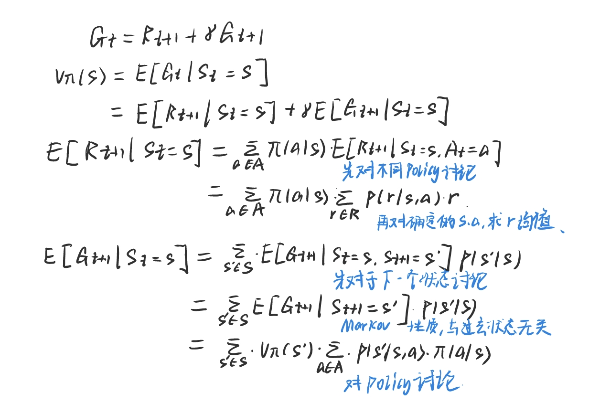
综合上述计算结果得到**贝尔曼方程：**
$$
\begin{align*}
v_\pi(s) &= \mathbb{E}\left[R_{t+1} \mid S_t = s\right] + \gamma \mathbb{E}\left[G_{t+1} \mid S_t = s\right], \\
&= \underbrace{\sum_{a \in \mathcal{A}} \pi(a|s) \sum_{r \in \mathcal{R}} p(r|s,a) r}_{\text{mean of immediate rewards}} + \underbrace{\gamma \sum_{a \in \mathcal{A}} \pi(a|s) \sum_{s' \in \mathcal{S}} p(s'|s,a) v_\pi(s')}_{\text{mean of future rewards}} \\
&= \sum_{a \in \mathcal{A}} \pi(a|s) \left[ \sum_{r \in \mathcal{R}} p(r|s,a) r + \gamma \sum_{s' \in \mathcal{S}} p(s'|s,a) v_\pi(s') \right], \quad \text{for all } s \in \mathcal{S}.
\end{align*}
$$
实际计算时不要死记公式，通过两项的实际意义去理解，即immediate reward的均值和$\gamma$倍的未来状态的状态值的均值（实际上就是未来奖励的均值）
##### 关于Bellman equation的几个要点：
* 贝尔曼方程不是一个，而是对于不同状态的**一组方程**，可以求解这些方程组得到每个状态的状态值
* $\pi(a|s)$是给定的policy，state value是评估一个policy的重要指标，通过贝尔曼方程求解state value就是一个**策略评估过程**（policy evaluate process）
* $p(s'|s,a)$、$p(r|s,a)$代表了**系统模型**，前面讲的求解都是基于有模型情况，后续会有model free求解state value的算法。

### 3.Examples to illustrate bellman equation
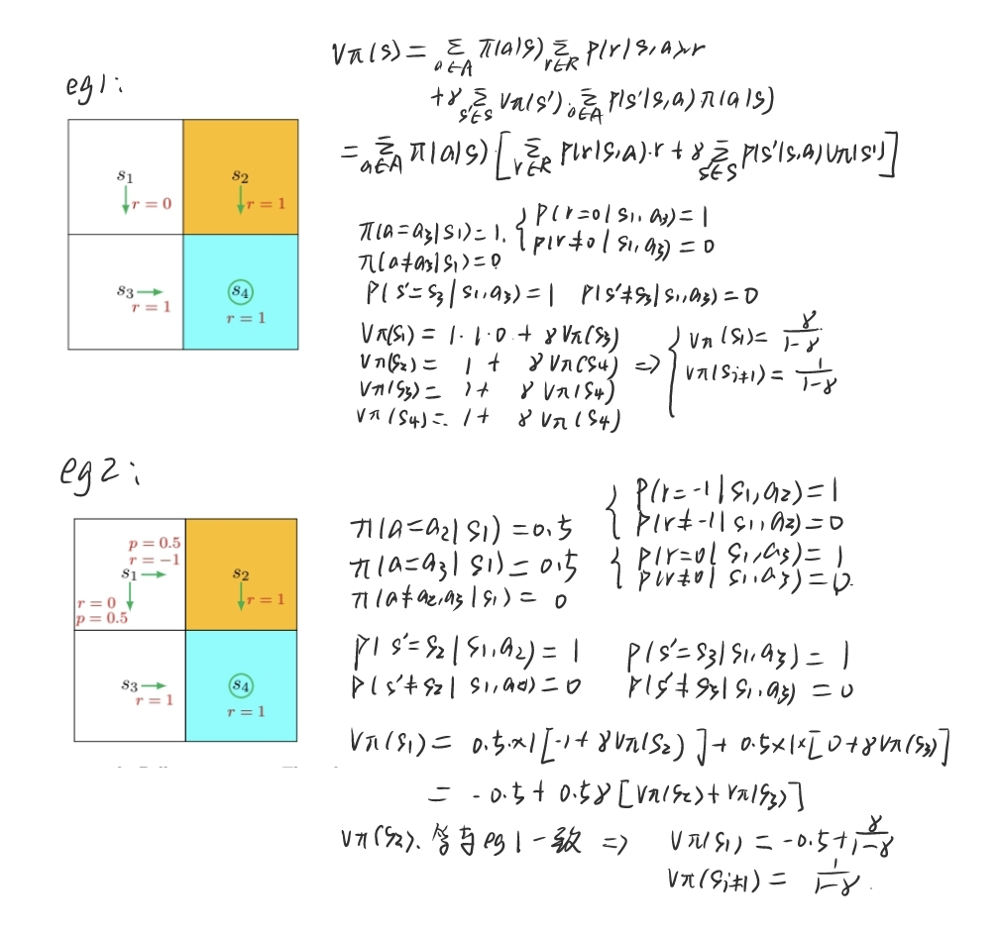

### 4.Matrix-vector form of the Bellman equation
将原始的bellman公式改写成如下形式：
$$
\begin{align*}
v_\pi(s) 
&= \sum_{a \in \mathcal{A}} \pi(a|s) \sum_{r \in \mathcal{R}} p(r|s,a) r + \gamma \sum_{a \in \mathcal{A}} \pi(a|s) \sum_{s' \in \mathcal{S}} p(s'|s,a) v_\pi(s') \\
&= r_\pi(s)+\gamma \sum_{s' \in \mathcal{S}} p_\pi(s'|s) v_\pi(s')\tag{2.8}
\end{align*}
$$
其中:
\[
\begin{align*}
r_\pi(s)=\sum_{a \in \mathcal{A}} \pi(a|s) \sum_{r \in \mathcal{R}} p(r|s,a) r\\
p_\pi(s'|s)=\sum_{a \in \mathcal{A}} \pi(a|s) p(s'|s,a)
\end{align*}
\]
$r_\pi(s)$代表**immediate rewards的均值**;$p_\pi(s'|s)$代表**在策略**$\pi$**下从s到s'的状态转移概率**。

对于所有的state进行标号： $s_i$ ， $i = 1, \dots, n$, 其中 $n = |\mathcal{S}|$.  对于任意一个$s_i$，式2.8可以写成： 

$$
v_{\pi}(s_i) = r_{\pi}(s_i) + \gamma \sum_{s_j \in \mathcal{S}} p_{\pi}(s_j | s_i) v_{\pi}(s_j). \tag{2.9}
$$

令 \( v_{\pi} = \left[ v_{\pi}(s_1), \dots, v_{\pi}(s_n) \right]^T \in \mathbb{R}^n \), \( r_{\pi} = \left[ r_{\pi}(s_1), \dots, r_{\pi}(s_n) \right]^T \in \mathbb{R}^n \), and \( P_{\pi} \in \mathbb{R}^{n \times n} \) with \( [P_{\pi}]_{ij} = p_{\pi}(s_j | s_i) \). 
然后上面的公式2.9就能写成**矩阵形式**：
\[v_{\pi} = r_{\pi} + \gamma P_{\pi} v_{\pi}, \tag{2.10}\]

##### 其中矩阵$P_\pi$有一些有趣的特性：
* $P_\pi$是一个非负矩阵（$P_\pi\geq0$），其每一个元素都大于等于0，从概率的角度很好理解。书中，所有的对于矩阵的$\geq$或$\leq$代表按元素逐一比较的操作。
* $P_\pi$是一个随机矩阵，意味着每一行的和要为1

以四个状态为例可以列写矩阵表达形式：
$$\left[ \begin{matrix}
v_{\pi}(s_1) \\
v_{\pi}(s_2) \\
v_{\pi}(s_3) \\
v_{\pi}(s_4)
\end{matrix}\right]
=\left[
\begin{matrix}
r_{\pi}(s_1) \\
r_{\pi}(s_2) \\
r_{\pi}(s_3) \\
r_{\pi}(s_4)
\end{matrix}
\right]
+\gamma \left[
\begin{matrix}
p_{\pi}(s_1|s_1) & p_{\pi}(s_2|s_1) & p_{\pi}(s_3|s_1) & p_{\pi}(s_4|s_1) \\
p_{\pi}(s_1|s_2) & p_{\pi}(s_2|s_2) & p_{\pi}(s_3|s_2) & p_{\pi}(s_4|s_2) \\
p_{\pi}(s_1|s_3) & p_{\pi}(s_2|s_3) & p_{\pi}(s_3|s_3) & p_{\pi}(s_4|s_3) \\
p_{\pi}(s_1|s_4) & p_{\pi}(s_2|s_4) & p_{\pi}(s_3|s_4) & p_{\pi}(s_4|s_4)
\end{matrix}
\right]\left[
\begin{matrix}
v_{\pi}(s_1) \\
v_{\pi}(s_2) \\
v_{\pi}(s_3) \\
v_{\pi}(s_4)
\end{matrix}
\right]$$

### 5.Solving Bellman equation
有了完整的方程组自然要去求解这个方程，对于方程\(v_{\pi} = r_{\pi} + \gamma P_{\pi} v_{\pi}, \)有两种求解方法：

* 第一种（**闭式解**/Closed-form Solution）直接根据矩阵运算去求逆求解：
  $$v_{\pi} = (I-\gamma P_\pi)^{-1}r_{\pi} $$
  在理论上这种解是十分优美的，但是因为含有求逆运算，实际应用比较困难，一般不采用这种。

* 第二种（**迭代解**/Iterative solution）使用迭代算法运算
  $$v_{k+1} = r_{\pi} + \gamma P_{\pi} v_{k},\quad k=0,1,2,\dots$$
  当给一个随机初值$v_0$时，算法会产生一系列的迭代序列值$\{v_0,v_1,v_2,\dots\}$
  我们可以证明当$k{\rightarrow} \infty $时：
  $$v_k\rightarrow v_\pi=(I-\gamma P_\pi)^{-1}r_{\pi}$$
  由此通过迭代求出解。

### 6.Action value
action value被定义为采取一个action所能获得的return的均值，即：
$$ q_\pi(s,a) = \mathbb{E}\left[G_t \mid S_t = s,A_t=a\right] $$
action value与当前状态和采取的action都有关，严谨考虑应该称为state-action value，不过一般简化为action value。
action value与state value有高度的联系：
* state value可以写成action values的均值
 $$\begin{align*}v_\pi(s) &= \mathbb{E}\left[G_t \mid S_t = s\right]\\
&=\sum_{a \in \mathcal{A}} \pi(a|s) \mathbb{E}\left[G_t \mid S_t = s,A_t=a\right]\\
&=\sum_{a \in \mathcal{A}} \pi(a|s) q_\pi(s,a)
\end{align*}$$

* 由之前关于state value的表达式：
  $$v_\pi=\sum_{a \in \mathcal{A}} \pi(a|s) \left[ \sum_{r \in \mathcal{R}} p(r|s,a) r + \gamma \sum_{s' \in \mathcal{S}} p(s'|s,a) v_\pi(s') \right], \quad \text{for all } s \in \mathcal{S}$$
  结合上面得到的结论：
  $$q_\pi(s,a) = \sum_{r \in \mathcal{R}} p(r|s,a) r + \gamma \sum_{s' \in \mathcal{S}} p(s'|s,a) v_\pi(s') $$
  上式中action value由两个部分组成，第一个部分是基于确定的s,a下的当前的reward，后一项是未来的rewards。state value的表达式中a是不确定的，故要对所有的action去求均值，即action value的均值。

##### 需要注意的是:
当我们基于一个policy去计算action value 时，我们一般只会关注policy采取的action，那对于没有take的action的action value 呢？有的人会想当然认为没用到那就是0，其实不然，action value其实跟policy是无关的。一个state下，不论policy如何，其所有的action value都是可以计算的.
知道所有的action value，我们才能去evaluate每个policy，即可以由action value计算state value。

## Lec3 Optimal State Values and Bellman Optimality Equation
强化学习的终极目标就是为了找到一个最优策略，这就很有必要去定义什么是最优策略，这里会介绍一个核心概念：最优状态值以及一个重要工具：贝尔曼最优公式。通过这个工具我们可以求解最优状态值和最优策略。
### 1.如何优化/提升策略
通过一个2x2grid world 的例子，不难知道，当我们更新策略使得在一个state取得最大的action value时，这就是一个更优的策略。理论上，对于一个初始策略，我们可以找到每一个state的最大的action value（根据其表达式，这个值与目前的state value有关！），按照最大的方向更新一次策略，再循环，最终一定能找到一个最优策略。

但是关于最优策略的存在性、唯一性我们是不确定的，在下一节会从数学角度解决这些问题。

### 2.Optimal state and optimal policies
**定义：** 若对于状态空间S中的所有状态 s，以及任意其他策略 π，均满足$v_{{\pi}^*} (s)\geq v_π(s)$。则策略 $π^∗$ 为最优策略。$π^∗$对应的状态价值即为最优状态价值

简单来说就是有一个策略使得对于任意一个状态的state value都不小于其他策略下的state value，这个策略就是optimal policy。

上述定义引出了一些问题：
* Existence:最优策略是否存在？
* Uniqueness:最优策略是否唯一？
* Stochasticity:最优策略是随机还是确定的？
* Algorithm:如何去获取最优策略和最优状态值？
下面的**贝尔曼最优公式**给出了上述问题的解答。

### 3.Bellman optimality equation（BOE）
贝尔曼最优公式是用来求取最优策略和最优状态值的工具。其数学形式如下，对比一般的BE，多了一个求max的步骤。
$$
\begin{aligned}
v(s) &= \max_{\pi(s) \in \Pi(s)} \sum_{a \in \mathcal{A}} \pi(a|s) \left( \sum_{r \in \mathcal{R}} p(r|s,a)r + \gamma \sum_{s' \in \mathcal{S}} p(s'|s,a)v(s') \right) \\
&= \max_{\pi(s) \in \Pi(s)} \sum_{a \in \mathcal{A}} \pi(a|s) q(s,a),
\end{aligned}
$$
其中$v(s),v(s')$是未知变量，同时
$$
q(s,a) = \sum_{r \in \mathcal{R}} p(r|s,a)r + \gamma \sum_{s' \in \mathcal{S}} p(s'|s,a)v(s').
$$
#### 3.1 BOE右侧max求解
我们来研究BOE，会发现其只有一个方程但有两个未知量：$v(s),\pi(a|s)$,如何去求解呢？这其实不难理解，可以先固定$v(s)$，先对于$\pi(a|s)$求max。

下面有一个很形象的例子：
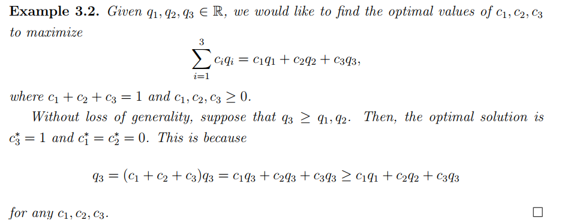
上述例子的系数$c_i$刚好对应BOE中的$\pi(a|s)$,每个概率值均大于等于0，同时总和为1。我们需要找到下列式子的最大值：
$$
\sum_{a \in \mathcal{A}} \pi(a|s)q(s,a) \leq \sum_{a \in \mathcal{A}} \pi(a|s)\max_{a \in \mathcal{A}} q(s,a) = \max_{a \in \mathcal{A}} q(s,a),
$$
上述式子等号成立的条件为：
$$\pi(a|s) = 
\begin{cases} 
1, & a = a^*, \\
0, & a \neq a^*.
\end{cases}
$$
此时$a^*=\argmax _aq(s,a) $

对于上述式子进行解释：为了找到式子的最大值，参照例子的方法，我们只需先找到一个使得$q(s,a)$最大的a*，然后使其系数$\pi(a^*|s)$为1即可。总而言之，最优策略就是选择有着最大action value的action的策略！

但要注意的是，$q(s,a^*)$的式子是与v有关的，故我们本质上只要聚焦于求解一个v,得到这个v之后，最优动作价值、最优策略以及最优状态价值就都依次得到了。

#### 3.3 Vector Form
上述内容从数学角度解决了右侧max的求值，即已经确定了最优策略。此时右侧的值只与v有关，而v的求解要通过矩阵形式求解：
矩阵形式的BOE如下：
\[v_{\pi} =\max_{\pi \in \Pi} (r_{\pi} + \gamma P_{\pi} v_{\pi})\]
右侧式子可以写成v的函数：
$$f(v)=\max_{\pi \in \Pi} (r_{\pi} + \gamma P_{\pi} v_{\pi})$$
BOE此时写为：
$$v=f(v)$$
接下来就要去求解这个式子。

#### 3.4 Contraction mapping theorem（压缩映射定理）
为了求解上述方程$v=f(v)$，我们需要引入一个数学工具，即本节标题Contraction mapping theorem，又叫做fixed-point theorem(不动点定理)。

##### Definition 3.4.1
* Fixed point:对于$x\in \mathbb{R}^d$，考虑一个映射$f:\mathbb{R}^d\rightarrow\mathbb{R}^d$，如果存在一个点$x^*$使得$f(x^*)=x^*$，则$x^*$就被称为不动点。
* Contraction mapping：若存在$\gamma\in(0,1)$,使得对于任意的$x_1,x_2\in \mathbb{R^d}$,都有
  $$\|f(x_1) - f(x_2)\| \leq \gamma \|x_1 - x_2\|$$
  则$f$为压缩映射

##### Theorem 3.4.1
对于形如 $x = f (x)$（其中 $x$ 和 $f (x)$ 均为实向量）的方程，若 $f$ 是压缩映射，则满足以下性质：
* 存在性：存在不动点 $x^*$满足 $f (x^*) = x^*$。
* 唯一性：该不动点 $x^*$ 是唯一的。
* 算法性：考虑迭代过程：$x_{k+1} = f (x_k)$;
其中 $k = 0, 1, 2, …$则对任意初始猜测 $x₀$，当 $k→∞$时，$xₖ→x^*$。此外，收敛速度是指数级的。

这个定理说明了解的存在和唯一性，同时给出了迭代求解的方法。

我们可以证明，对于BOE而言其右侧的映射就是一个压缩映射。
##### Theorem 3.4.2(Contraction property of f(v))
贝尔曼最优方程右侧的函数 $f(v)$为一个压缩映射。具体来说，对于任意$v_1,v_2\in \mathbb{R^{|s|}}$均满足
$$\|f(v_1)-f(v_2)\|_\infty \le \gamma\|v_1-v_2\|_\infty$$
其中 $\gamma \in (0,1)$为discounted rate,$\|\cdot\|_\infty$为无穷范数，定义为向量中所有元素绝对值的最大值。

#### 3.5 Sovling an optimal policy from BOE
使用上述压缩映射工具可以对于BOE进行分析求解最优状态$v^*$和最优策略$\pi^*$。
##### $v^*$的求解
如果$v^*$是BOE的解，那么其满足
$$v^*=f(v^*)=\max_{\pi \in \Pi} (r_{\pi} + \gamma P_{\pi} v^*)\tag{3.5}$$
显然$v^*$就是一个不动点，故BOE的解一定存在同时还是唯一的。由压缩映射定理的性质，我们可以通过递推算法求解这个$v^*$
$$v_{k+1} = f(v_k) = \max_{\pi \in \Pi} \left( r_\pi + \gamma P_\pi v_k \right),\quad k = 0,1,2,\dots$$
对于任意初始猜测 $v_0$,当 $k→∞$时，$v_k$会以指数级速度收敛到最优状态价值$v^*$

这个迭代算法即被称为值迭代（value iteration）

##### $\pi^*$的求解
当$v^*$已经求得，我们很容易通过求解下面这个方程得到$\pi^*$：
$$\pi^*=\arg \max_{\pi \in \Pi}(r_\pi+\gamma P_\pi v^*) \tag{3.6}$$
将得到的$\pi^*$代入上述(3.6)式，得到：
$$v^*= r_{\pi^*} + \gamma P_{\pi^*} v^*$$
故$v^*=v_{\pi^*}$就是$\pi^*$策略下的state value，而在这个策略下BOE可以看作一个特殊的贝尔曼方程。

我们在上面求解得到了$v^*$与$\pi^*$，但不确定这个解是不是最优的，下面的定理给出了结论：
##### Theorem 3.5.1（ $v^*$与$\pi^*$的最优性）
通过BOE求得的解$v^*$是最优状态价值,$\pi^*$是最优策略。也就是说，对于任意策略 $π$，均满足：
$$v^*=v_{\pi^*}\geq v_\pi$$
其中$v_\pi$是策略$\pi$的状态值，$\geq$代表逐元素比较。
证明如下：
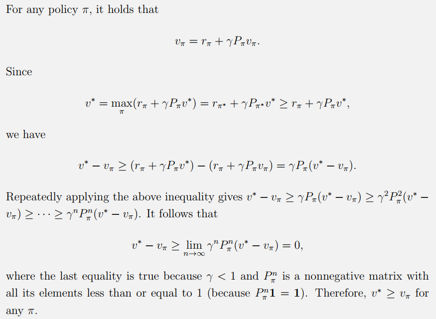

接下来，我们更深入地分析式 (3.6) 中的$π^∗$。具体而言，下述定理表明：始终存在一个确定性贪心策略是最优的。
##### Theorem 3.5.2（Greedy optimal policy）
对于任意的状态$s\in S$，确定性贪心策略：
$$\pi^*(a|s) = 
\begin{cases} 
1, & a = a^*(s), \\
0, & a \neq a^*(s)
\end{cases} \tag{3.7}$$
是一个BOE所求解的最优策略，其中：
$$a^*(s) = \arg\max_{a} q^*(a,s)$$
而
$$q^*(s,a) \triangleq \sum_{r \in \mathcal{R}} p(r|s,a)r + \gamma \sum_{s' \in \mathcal{S}} p(s'|s,a)v^*(s').$$
(3.7)的策略被称为贪心策略，因为其寻找的是一个有着最大的$q^*(s,a)$的策略。最后我们讨论一下$\pi^*$的性质：
* **最优策略的唯一性**：
  尽管最优状态价值 $v^*$是唯一的，但对应于$v^*$的**最优策略却未必唯一**。这一点可以通过反例轻松验证，例如图 3.3 中所示的两个策略就均为最优策略。
* **最优策略的随机性**：
  正如图 3.3 所呈现的那样，最优策略既可以是随机策略，也可以是确定性策略。不过根据定理 3.5.2 可以确定，**必定存在至少一个确定性的最优策略**。
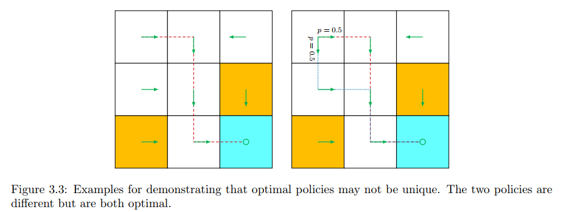

**整个过程个人理解：**
递推公式是由压缩映射定理给出，而我只要给定一个任意的状态初值，然后动作价值是与状态值有关的，一次迭代就是基于这个状态值去计算找到每一个state此时的最大的action value,再去计算新的state value(在greedy optimal policy下，state value就是最大的action value)基于新的状态值重复上述过程，多次迭代就能得到满足BOE的解即最优状态值

#### 3.6 Factors that influence optimal policy
$$
\begin{aligned}
v(s) &= \max_{\pi(s) \in \Pi(s)} \sum_{a \in \mathcal{A}} \pi(a|s) \left( \sum_{r \in \mathcal{R}} p(r|s,a)r + \gamma \sum_{s' \in \mathcal{S}} p(s'|s,a)v(s') \right) \\
&= \max_{\pi(s) \in \Pi(s)} \sum_{a \in \mathcal{A}} \pi(a|s) q(s,a),
\end{aligned}
$$
基于BOE，我们可以发现最优状态值和最优策略是由
1. immediate reward $r$
2. discounted rate $\gamma$
3. system model $p(s'|s,a),p(r|s,a)$
而系统模型一般很复杂，我们这里研究一下reward和discounted rate 对于最优状态值和最优策略的影响。
##### impact of discount rate $\gamma$
* 较大的$\gamma$下，agent会更加远视，可能冒着风险做一些决策
* 较小的$\gamma$下，agent会更加短视，策略保守；极端情况当$\gamma$=0时，会极度短视，只选择最大的immediate reward情况，而不关注最大的总reward
  
##### impact of reward values 
* 可以通过对于不同情况reward的设置 来引导agent决策，比如给进入forbidden area 的奖励一个较大的负值，那么最优决策就会尽量避免进入forbidden area。
* reward对于决策的影响主要取决于不同情况下rewards的相对值，如果同比例放缩所有的rewards，那么最优策略不会变化。
* 初学者可能会对下述情况存在疑惑：
  当reward为0时，那是否会出现绕路（detour）的情况呢？
  但其实去看一下return的计算公式就明白了，多走一步r=0的action，在计算时相当于后边的reward都要多乘一个discounted rate，这就使得绕路的return减小。
  故return=0不会使最优策略绕路，我们不必给r赋负值，因为discounted rate $\gamma$本身就能避免detour的作用。

## Lec4 Value Iteration & Policy Iteration(值迭代&策略迭代算法)
### 4.1 Value iteration algorithm
前面学习的BOE的求解，其实就是这节要讲的值迭代算法，其迭代公式如下：
$$v_{k+1} =  \max_{\pi \in \Pi} \left( r_\pi + \gamma P_\pi v_k \right),\quad k = 0,1,2,\dots$$
当$k→∞$时，就能迭代得到最优状态值和最优策略。
对于上述公式进行拆解，实际上每一次迭代包含了两个部分：**策略更新（policy update）和值更新（state update）**
* Policy update:从数学的角度，这一步的目的是找到一个能解决下列最优化问题的策略：其中$v_k$是上一步迭代已经得到的值。
  $$\pi_{k+1}=\arg \max_{\pi }(r_\pi+\gamma P_\pi v_k) $$
* Value update:数学上，这一步是基于policy update得到的$\pi_{k+1}$去更新新的value：
  $$v_{k+1} =  r_{\pi_{k+1}} + \gamma P_{\pi_{k+1}} v_k $$
  $v_{k+1}$会用于下一步迭代。注意这里的公式仅仅是一个值的迭代公式，求出的值并不是state value，只有通过BE求解的才是state value。
上述情况围绕vector form从原理上进行解释，实际计算需要理解elementwise form（每个元素独立操作形式）的实现。

#### 4.1.1 Elementwise form and implementation
考虑第k次迭代，状态s下：
* Policy update的元素形式为：
  $$\pi_{k+1}(s) = \arg\max_{\pi} \sum_{a} \pi(a|s) \underbrace{\left( \sum_{r} p(r|s,a)r + \gamma \sum_{s'} p(s'|s,a)v_k(s') \right)}_{q_k(s,a)}, \quad s \in \mathcal{S}.$$
  对于上述最优化问题，我们之前已经给出了其对应的最优策略，即贪婪最优策略（greedy optimal policy），公式如下：
  $$\pi_{k+1}(a|s) = \begin{cases} 
  1, & a = a_k^{*}(s), \\
  0, & a \neq a_k^{*}(s),
  \end{cases} 
  $$
  其中$a_k^{*}(s) = \arg\max_{a} q_k(s,a)$，如果这个式子有多个解（有两种或以上的$q_k(s,a)$值相等），我们任意选取一个action即可，都不会影响算法的收敛性。
  这里策略更新得到的新策略$\pi_{k+1}$，实际上就是贪心策略：对于每一个state选择有着最大的$q_k(s,a)$的action。

* Value update的元素形式如下：
  $$v_{k+1}(s) = \sum_{a} \pi_{k+1}(a|s) \underbrace{\left( \sum_{r} p(r|s,a)r + \gamma \sum_{s'} p(s'|s,a)v_k(s') \right)}_{q_k(s,a)}, \quad s \in \mathcal{S}.$$
  其实就是基于现有的$v_k$和上一步得到的$\pi_{k+1}$去更新$v_{k+1}$
  代入上述的贪心策略得到：
  $$v_{k+1}(s)=\max_a q_k(s,a)$$
  就是这个状态下的最大"action value"。这里需要注意的是我们的state value 和action value 的定义都是基于贝尔曼方程，所以在值迭代过程的$v_k$和$q_k$都不能称作state/action value，但直观上可以这样认为方便理解。

总而言之，上述过程可以总结为下列过程：
$$v_k(s) \to q_k(s,a) \to \text{new greedy policy } \pi_{k+1}(s) \to \text{new value } v_{k+1}(s) = \max_{a} q_k(s,a)$$
详细的算法流程在下图详细解释：
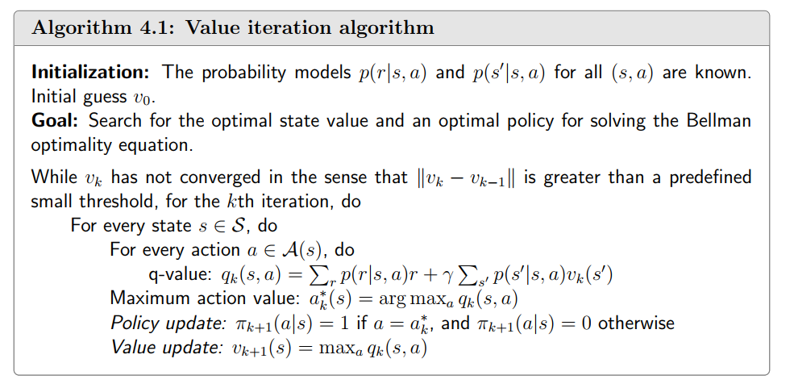

#### 4.1.2 Illustrative examples
以下面一个简单的grid world作为例子研究上述过程：
目标区域是$s_4$，奖励设置为$r_{boundary}=r_{forbidden}=-1$，$r_{target}=1$,$\gamma$=0.9。
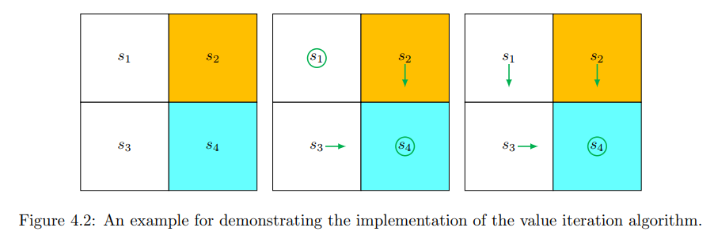
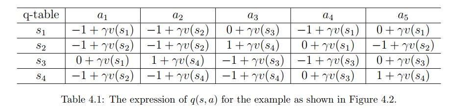
##### 当k=0时：
* Policy update
  我们先选取$v_0(s_i)$的初值，均设置为0；
  接着代入进表格4.1得到k=0时的q(s,a)
  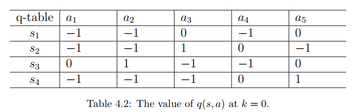
  而我们的策略$\pi_1$基于贪心策略，选取每个state最大的$q-values$:
  $$\pi_1(a_5|s_1) = 1, \quad \pi_1(a_3|s_2) = 1, \quad \pi_1(a_2|s_3) = 1, \quad \pi_1(a_5|s_4) = 1.$$
  其中对于$s_1$，$a_3$和$a_5$的q值是一样的我们随机选取一个就行。
* Value update
  更新的值就等于最大的q-values
  $$v_1(s_1) = 0, \quad v_1(s_2) = 1, \quad v_1(s_3) = 1, \quad v_1(s_4) = 1.$$
##### 当k=1时： 
后续过程即按照上述的顺序，把新的v代入表格4.1得到新的q-values，依次重复即可，上述情形在k=1次迭代后就已经找到了最优策略$\pi_2$和最优状态值$v_2(s)$。

### 4.2 Policy iteration algorithm
Policy iteration包括了两个步骤：
* Policy evaluation:这一步是基于给定的policy（$\pi_k$），通过贝尔曼公式去计算对应的state value（$v_{\pi_k}$）
  $$v_{\pi_k}=r_{\pi_k}+\gamma P_{\pi_k}v_{\pi_k}$$
  其中$\pi_k$是上一个迭代得到的策略，$v_{\pi_k}$是需要计算的state value；$r_{\pi_k}$和$P_{\pi_k}$是从系统模型中获取的值。
* Policy improvement:这一步是去改进策略。基于上一步的$v_{\pi_k}$，通过下列公式去得到新的策略$\pi_{k+1}$
  $$\pi_{k+1}=\arg \max_{\pi }(r_\pi+\gamma P_\pi v_k) $$
  这跟value iteration 中的policy update 一致的，都是使用greedy的策略，选取最大的action value(这里是**严格定义上的action value**，由于$v_{\pi_k}$是满足贝尔曼公式的state value)

在上述算法中有几个关键问题：
1. 如何求解policy evaluation 中的$v_{\pi_k}$，这其实就是求解贝尔曼公式，理论上有闭式解，但涉及求逆，一般会**使用迭代算法**，具体过程参考第二讲贝尔曼方程部分。
   有趣的是，当我们使用迭代算法去求解贝尔曼方程，此时policy iteration变成了**一个迭代中嵌套了另一个迭代算法**。求解贝尔曼方程的迭代理论上要算无穷次，但实际不可能，会设置一个误差界限，当相邻两次迭代结果的差$||v_{\pi_k}^{(j+1)}-v_{\pi_k}^{(j)}||$小于这个界限时，就停止迭代。但这也会有疑问，这样取到的不准确的值会对于最终结果有影响吗，在4.3中给了详细解答。
2. 在policy improvement中，$\pi_{k+1}$为什么比$\pi_k$更优？这里有一个引理说明：
   ##### Lemma 4.1(Policy improvement)
   如果$\pi_{k+1}=\arg \max_{\pi }(r_\pi+\gamma P_\pi v_k) $，那么$v_{\pi_{k+1}}\geq v_{\pi_k}$
   详细证明参考书P63
3. 上述算法会得到一系列策略$\{\pi_0,\pi_1,\dots,\pi_k,\dots\}$和state value$\{v_{\pi_0},v_{\pi_1},\dots,v_{\pi_k},\dots\}$，这些序列是否收敛于最优策略和最优状态值呢?这里给出了一个定理：
   ##### Theorem 4.1(Convergence of policy iteration)
   通过policy iteration algorithm得到的state value序列会收敛于最优状态值$v^*$;policy 序列会收敛于最优策略。
   详细证明参考书P65

笼统的说，由于迭代中嵌套的迭代，策略迭代收敛的步数要比值迭代少。

#### 4.2.1 Elementwise form and implementation
详细的计算过程如下图所示:
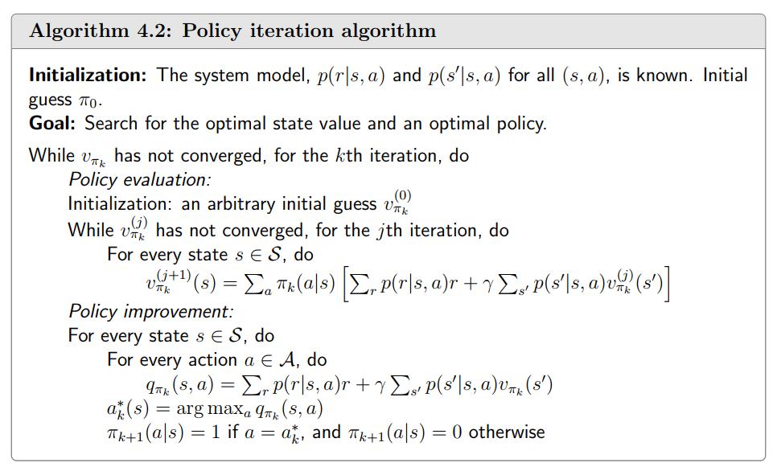

#### 4.2.2 Illustrative examples
以一个简单的grid world进行说明：
在下图的grid world中，有两个state，存在3个actions:$\mathbf{A}=\{ a_l,a_0,a_r \}$；奖励设置为$r_{boundary}=-1,r_{target}=1$；$\gamma=0.9$
初始的策略如图4.3（a）所示：
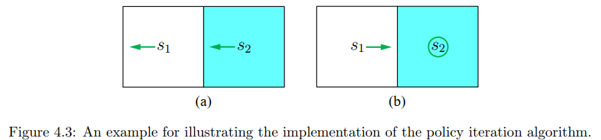
接下来计算迭代算法的两个step:
* Policy evaluation
  可以根据已知策略列写贝尔曼方程：
  $$
  \begin{align*}
  v_{\pi_0}(s_1) &= -1 + \gamma v_{\pi_0}(s_1), \\
  v_{\pi_0}(s_2) &= 0 + \gamma v_{\pi_0}(s_1).
  \end{align*}
  $$
  1. 该方程组很简单可以直接求解得到：
  $$v_{\pi_0}(s_1) = -10,\quad v_{\pi_0}(s_2) = -9.$$
  2. 也可以通过迭代算法去求解：
   我们设定初值$ v_{\pi_0}^{(0)}(s_1) = v_{\pi_0}^{(0)}(s_2) = 0.$
   根据迭代算法得到：
   $$
   \begin{cases}
    v_{\pi_0}^{(1)}(s_1) = -1 + \gamma v_{\pi_0}^{(0)}(s_1) = -1, \\
    v_{\pi_0}^{(1)}(s_2) = 0 + \gamma v_{\pi_0}^{(0)}(s_1) = 0,
    \end{cases}
    \\
    \begin{cases}
    v_{\pi_0}^{(2)}(s_1) = -1 + \gamma v_{\pi_0}^{(1)}(s_1) = -1.9, \\
    v_{\pi_0}^{(2)}(s_2) = 0 + \gamma v_{\pi_0}^{(1)}(s_1) = -0.9,
    \end{cases}
    \\
    \begin{cases}
    v_{\pi_0}^{(3)}(s_1) = -1 + \gamma v_{\pi_0}^{(2)}(s_1) = -2.71, \\
    v_{\pi_0}^{(3)}(s_2) = 0 + \gamma v_{\pi_0}^{(2)}(s_1) = -1.71,
    \end{cases}
   $$
   我们可以预见上述迭代结果最终会收敛于i中的结果。
* Policy improvement
  这一步的关键是计算状态的所有action value，然后找到最大的对应的action，作为新的策略。
  动作值的计算可以参考下表：
 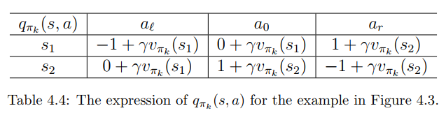
  代入第一步得到的state value可以得到k=0时的action value：
   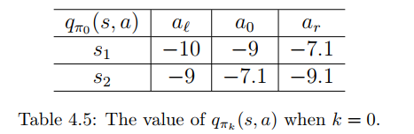
  根据greedy策略，改进的策略$\pi_1$应该为：
  $$\pi_1(a_r|s_1)=1\quad \pi_1(a_0|s_2)=1$$
  这对应图4.3（b），此时已经是最优策略。

针对于更加复杂的情形，在给的一个例子中会出现有趣的现象，即最优的policy是从target area开始由近及远进行更新的。

### 4.3 Truncated policy iteration algorithm
#### 4.3.1 Comparing value iteration and policy iteration
* Policy iteration:选择任意初始策略$\pi_0$。在第k次迭代中，执行以下两步：
  1. Policy evaluation(PE):给定$\pi_k$，通过公式求解$v_{\pi_k}$:
   $$v_{\pi_k} = r_{\pi_k} + \gamma \mathcal{P}_{\pi_k} v_{\pi_k}$$
  2. Policy improvement(PI):基于上一步的$v_{\pi_k}$求解$\pi_{k+1}$:
   $$\pi_{k+1} = \arg\max_{\pi}\big(r_{\pi} + \gamma \mathcal{P}_{\pi} v_{\pi_k}\big)$$ 
* Value iteration：选择任意初始值$v_0$,在第k次迭代中，执行以下两步：
  1. Policy update(PU):给定$v_k$,通过下式求解$\pi_{k+1}$
   $$\pi_{k+1} = \arg\max_{\pi}\big(r_{\pi} + \gamma \mathcal{P}_{\pi} v_k\big)$$
  2. Value update(VU):基于上一步的$\pi_{k+1}$，求解$v_{k+1}$:
   $$v_{k+1} = r_{\pi_{k+1}} + \gamma \mathcal{P}_{\pi_{k+1}} v_k$$ 

总结上述两种算法的流程图：
$$\text{策略迭代：}\ \pi_0 \xrightarrow{PE} v_{\pi_0} \xrightarrow{PI} \pi_1 \xrightarrow{PE} v_{\pi_1} \xrightarrow{PI} \pi_2 \xrightarrow{PE} v_{\pi_2} \xrightarrow{PI} \dots
\\
\text{价值迭代：}\ \quad\quad\quad\ v_0 \xrightarrow{PU} \pi_1' \xrightarrow{VU} v_1 \xrightarrow{PU} \pi_2' \xrightarrow{VU} v_2 \xrightarrow{PU} \dots$$

不难发现上述两种算法的迭代过程很相似，我们可以令两种算法的初值$v_0=v_{\pi_0}$相同来对比：
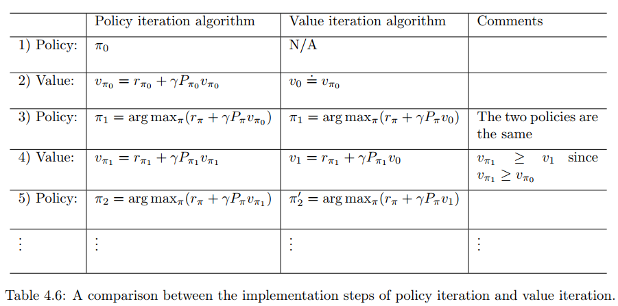
对于policy iteration中的第四步，$v_{\pi_1}$的求解省略了通过迭代算法求解状态值的过程，我们可以展开来形象对比：
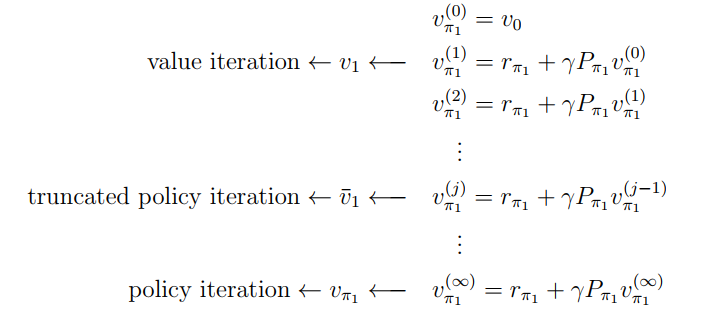
我们可以发现，通过迭代去求解贝尔曼方程时，第一次迭代的结果就是value iteration的$v_1$；而无穷次就是policy iteration。但实际无法迭代无穷次，故有限次迭代次数对应的就是我们这节的**truncated policy iteration（截断策略迭代）**。

故我们可以得到三者的关系，对于初值相同的情况下：
##### 值迭代对应是**j=1**的截断策略迭代；
##### 策略迭代对应的是**j趋于**$\infty$ 的截断策略迭代。
下图是truncated policy iteration的详细算法流程.
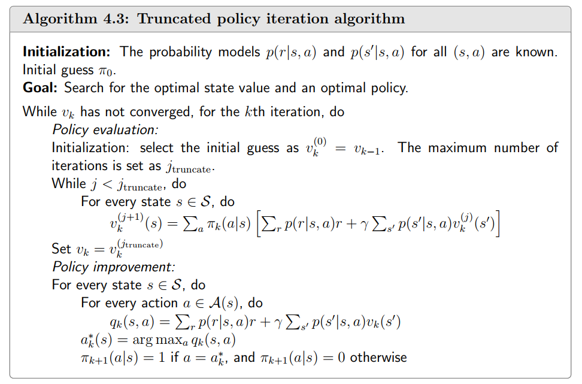
值迭代和策略迭代可以宽泛看作$j_{truncated}$取不同值的两个极端情况。（$j_{truncated}= 1$和$j_{truncated}=\infty$）

#### 4.3.2 Truncated policy iteration algorithm
总的来说，truncated policy iteration可以看作是在policy evaluation 部分只迭代有限次的policy iteration，从名字上也可以看出。这会导致一个问题，我们前面也提到过：实际得到的迭代值不是真正的状态值，这是否会影响我们对于最优策略和最优状态值得寻找呢？显然是不会影响的，这里不做证明。
如果对于三种算法的收敛随迭代次数的变化进行比较，显然policy>truncated>value:
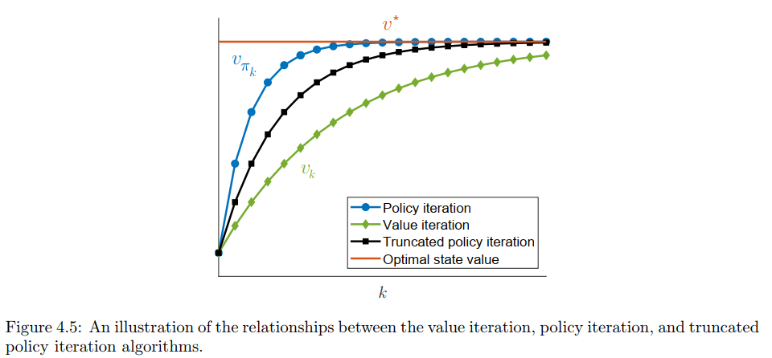

## Lec5 Monte Carlo Learning
在前面的章节中，我们学习到了基于系统模型的最优策略算法，在这一章，我们首次接触model-free的强化学习算法。
关于learning，我们需要有这样一种想法，如果没有模型那我们需要数据；没有数据我们就需要模型。当模型未知时，我们就需要依赖数据去估算一些参数，而这里又涉及到了概率论中的**期望**（expectation/mean estimation）

### 5.1 Motivating example: Mean estimation
期望的计算是算法的重要部分，我们回顾一下贝尔曼方程，其中action value和state value均可以看作某个随机变量的均值。

对于一个随机变量其期望求解有两种方法，假设为$X$,其值在集合$\mathcal{X}$中取得：
* 前面有模型的时候，即我们已知概率分布，可以通过概率分布求解：
  $$\mathbb{E}[X]=\sum_{x\in \mathcal{X}}p(x)x$$
* 没有模型时，我们通过对于随机变量$X$进行采样，用得到的一系列采样值$\{x_1,x_2,\dots,x_n\}\in X$的平均值去估计期望：
  $$\mathbb{E}[X] \approx \bar{x} = \frac{1}{n} \sum_{j=1}^{n} x_j$$

上述样本估计整体的方法由**大数定理**给出其估计的无偏和有效性：
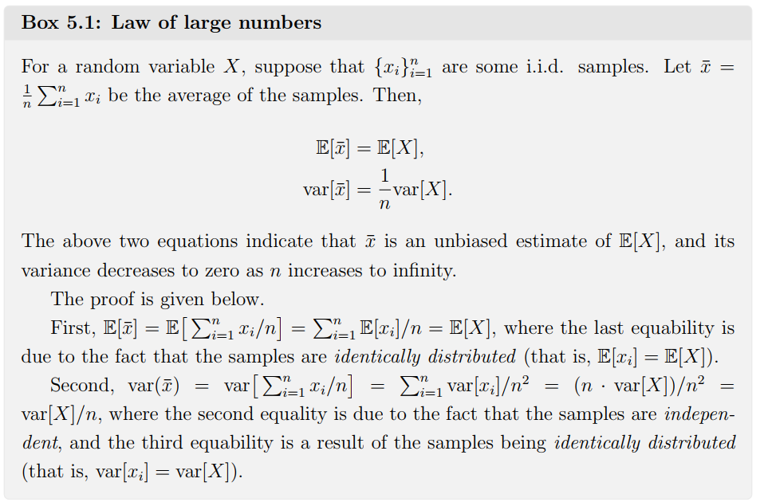

### 5.2 Monte Carlo Basic algorithm 
#### 5.2.1 Coverting policy iteration to be model-free
我们回顾一下上一节的policy iteration algorithm，其分为两步：policy evaluation 和policy improvement。而在PE中，我们需要求解action value，在PI中根据求解的action value去改进策略，其核心就在这个$q_{\pi_k}(s,a)$的求解上。

回顾action value最原始的定义，本质上就是一个期望：
$$q_{\pi_k}(s, a) = \mathbb{E}[G_t|S_t = s, A_t = a]$$
而前面5.1提到期望求解按照有无模型分为两种方法，我们前面使用的是第一种有模型算法：
* model-based 方法：
  $$
  \begin{aligned}
  q_{\pi_k}(s, a) 
  &= \mathbb{E}[G_t|S_t = s, A_t = a]\\
  &=\sum_{r} p(r|s,a)r + \gamma \sum_{s'} p(s'|s,a) v_{\pi_k}(s')
  \end{aligned}
  $$
  其中$\{p(r|s,a),p(s'|s,a)\}$是系统模型相关参数。
* model-free 方法：
  action value的定义为：
  $$
  \begin{split}
  q_{\pi_k}(s, a) 
  &= \mathbb{E}[G_t|S_t = s, A_t = a] \\
  &= \mathbb{E}[R_{t+1} + \gamma R_{t+2} + \gamma^2 R_{t+3} + \dots |S_t = s, A_t = a],
  \end{split}
  $$
  这其实是从$(s,a)$出发得到的return的均值。我们可以通过Monte Carlo方法去估计这个均值/期望。那么我们需要先对于这个随机变量采样：即从$(s,a)$出发，按照策略$\pi_k$，获得一定数目的episode（跟前边的trajectory类似）。假设获得了n个episodes，第i个对应的return为$g_{\pi_k}^{(i)}(s,a)$，那么可以用下述式子估计：
  $$q_{\pi_k}(s, a) = \mathbb{E}[G_t|S_t = s, A_t = a] \approx \frac{1}{n} \sum_{i=1}^n g_{\pi_k}^{(i)}(s, a)$$

MC-based learning的核心思想就是使用**model-free**的方法替代model-based去**估计action values**。

#### 5.2.2 The MC Basic algorithm
类似于policy iteration，我们可以分两步去描述MC basic algorithm。假设初始策略为$\pi_0$，对于第k次迭代：
* Policy evaluation
  对于每一个$(s,a)$，收集足够多的episodes，计算他们return的平均得到对应的action value($q_{\pi_k}(s,a)$)估计值$q_k(s,a)$。
   $$q_{\pi_k}(s, a) = \mathbb{E}[G_t|S_t = s, A_t = a] \approx \frac{1}{n} \sum_{i=1}^n g_{\pi_k}^{(i)}(s, a)$$
* Policy improvement
  同样求解一个最优化问题得到greedy policy：
   $$\pi_{k+1}(s) = \arg\max_{\pi} \sum_{a} \pi(a|s) q_k(s,a), \quad s \in \mathcal{S}.$$
  greedy policy为：
  $$\pi_{k+1}(a|s) = \begin{cases} 
  1, & a = a_k^{*}(s), \\
  0, & a \neq a_k^{*}(s),
  \end{cases} 
  $$
  其中$a_k^{*}(s) = \arg\max_{a} q_k(s,a)$
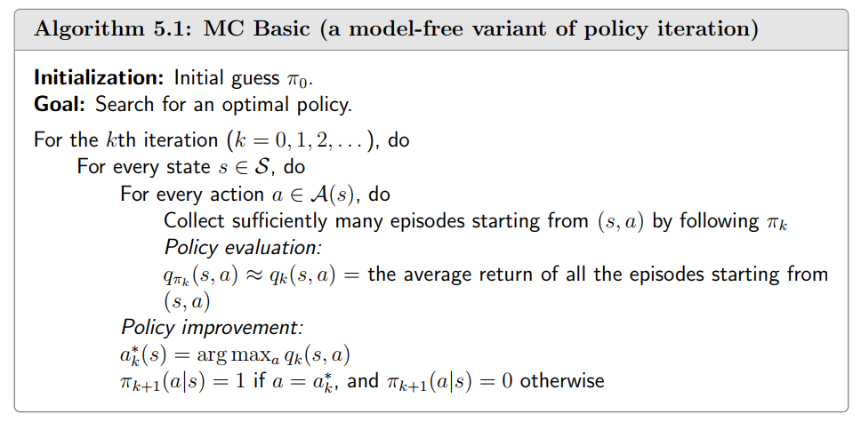

需要注意的是，在policy iteration中我们实际上**求的是state value**，再由state value去计算action value，根据greedy policy改进策略；而MC basic是**直接估计了action value**，其实是简化了过程，省略了从状态值求动作值的过程，并不会影响整个过程。

MC Basic algorithm更多是帮助我们从model-based过度到model-free的算法，实际上其过于基础，对于sample和数据的利用效率非常低，后续则会介绍基于MC Basic,更加complex和sample-efficient的算法。

#### 5.2.3 Illustrative examples
具体内容详见P83
这里简要概括一下核心思想：
1. 关于**需计算的数目**：
   所有的action values都需要被计算，这里就有state数目$\times$一个state有的action数个action values 需要求解。而每一个action value的估计值是需要对足够多的episodes求平均得到的。无疑这样计算量是很大的。
   但是对于策略和模型都是deterministic的情形，我们就只需要计算一个episode，因为轨迹是固定的。
2. **Episode length**的影响：
   对于一个稍微复杂的grid world例子，当episode的长度由小增大时，我们发现策略是逐渐从target area开始最优，逐渐向远处拓展；而且当长度较短时，会出现离target area较远的state value为0的情况，直观理解就是从state出发在当前长度根本到不了目标区域，所以得不到正reward。
   故我们需要**足够长**的episode length才能得到最优策略和状态值。
3. Sparse reward(稀疏奖励)
  上述情况就引出了一个奖励设置的重要问题，即稀疏奖励，只对于达到目标区域设置正奖励就是一种稀疏奖励，这样会造成学习的效率较低，可以采取非稀疏奖励，即鼓励去探索周边区域，给一个小的正reward，可能会让agent更容易去找到target area。

### 5.3 MC Exploring Starts
基于MC basic algorithm，我们需要更加使得新的算法更加sample-efficient，这里就拓展到这节的MC Expolring Starts。

#### 5.3.1 Utilizing samples more effeciently
首先我们列写出一个episode来进行分析：
$$s_1 \xrightarrow{a_2} s_2 \xrightarrow{a_4} s_1 \xrightarrow{a_2} s_2 \xrightarrow{a_3} s_5 \xrightarrow{a_1} \dots$$
每一次一个state-action组合出现在一个episode中，我们称这是对于这个state-action的一次**visit**，而提升效率的方式就是去充分利用visits。

* **initial visit：**
  最简单的策略是initial visit，即一个episode只用来估计这个轨迹起始的state-action pair的action value，例如上面的episode只用来估计$（s_1,a_2）$，这就是MC Basic使用的方法，显然效率很低。

实际上，一个episode可以按下图方式分解，在过程中visit的state-action pair的后边的轨迹就可以看作一个从这个pair开始的新的episode，由此就可以估计这个pair，实现一个episode的visits的高效利用：
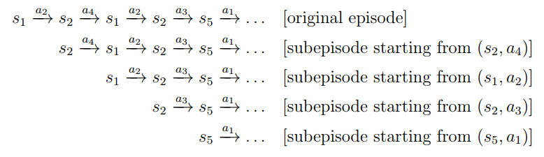
对于visit利用方式不同又可以分为$first-visit$和$every-visit$：
* **first visit:**
  只使用一个state-action pair第一次出现的visit进行估计，例如上面的episode中，$（s_1,a_2）$出现了两次，我们只使用首次出现后的episode进行估计。
* **every visit:**
  使用一个state-action pair每一次出现的visit进行估计，上面的episode中，$（s_1,a_2）$出现了两次，我们两次都用来估计。

从样本利用效率来看，$every-visit$策略是最优的。如果一个交互序列（episode）足够长，能多次覆盖所有状态 - 动作对，那么仅靠这一个序列，用每次访问策略就可能完成所有动作价值的估计。
不过，每次访问策略得到的样本是存在相关性的 —— 因为从第二次访问开始的轨迹，其实只是第一次访问轨迹的子集。但如果这两次访问在轨迹中相距较远，这种相关性就不会太强。

#### 5.3.2 Updating polices more efficiently
前面我们关于利用visit提出了新的方法，而现在对于策略更新的时机也进行讨论。
* first strategy:前面我们在policy evaluation中，是在计算一个state-action pair所有episodes对应的return后，对其求均值得到action value的估计。
  其缺陷在于agent需要等到所有序列都收集完毕，才能去更新估计值。
* second stratery:第二种方法克服了上述缺陷————仅利用单个episode的return来近似对应的action value。如此一来，只要获取到一个序列，就能立即得到一个粗略的估计值；进而可以以**逐序列（episode-by-episode**的方式对策略进行改进。

#### 5.3.3 MC Exploring Starts Algorithm
综合上述的两种改进方法，得到了本节内容：MC Exploring Starts
这个算法使用了**every visit**和**逐序列（episode-by-episode**改进策略，详细的算法细节如下图：
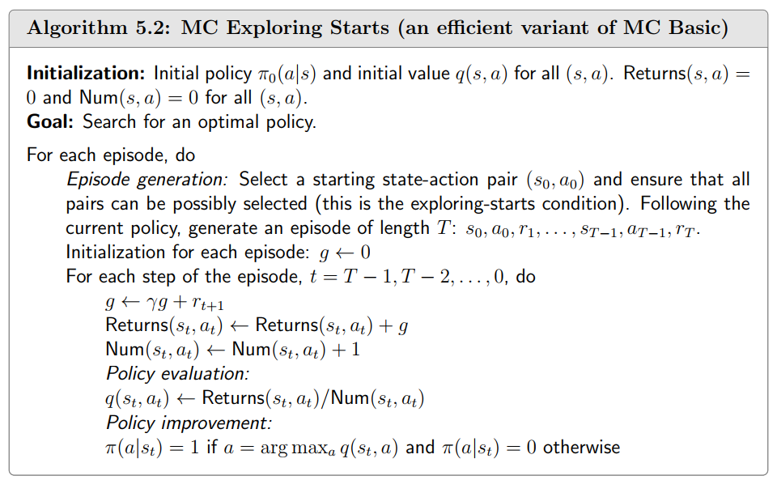
值得注意的是，在计算各状态 - 动作对出发的折扣回报时，算法会从序列的终止状态开始，反向遍历至起始状态。这类技术能提升算法效率。

下面通过ai转写总结了本人对于上述算法的理解：
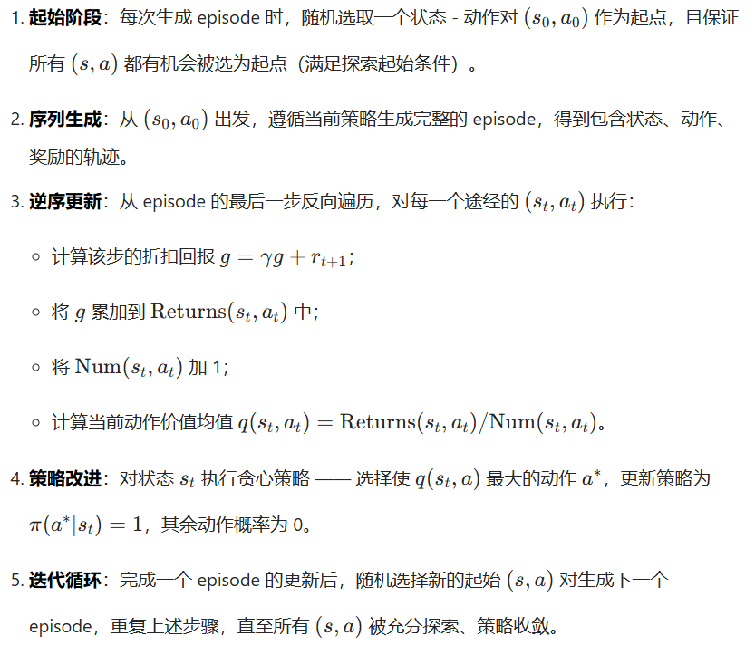

探索起始条件（exploring starts condition） 要求：从**每一个状态 - 动作对出发，都能生成足够多的交互序列**。只有当所有状态 - 动作对都被充分探索后，我们才能基于大数定律，准确估计它们的动作价值，进而成功寻得最优策略。反之，如果某个动作的探索不充分，其动作价值的估计值就会存在偏差；即便该动作是最优动作，最终也可能不会被策略选中。蒙特卡罗基础算法与带探索起始的蒙特卡罗算法均需满足这一条件。

但在诸多实际场景中，尤其是需要与物理环境交互的场景，这一条件往往难以满足，例如我们没办法实际中将机器人搬到每一个网格去，下面就来解决这个exploring starts带来的问题：

### 5.4 MC $\epsilon$-Greedy:Learning without expolring starts
这种算法通过soft policy(柔性策略)来实现对于每个state-action pair的充分visit。

#### 5.4.1 $\epsilon$-greedy policies
先来介绍soft policy：即一个在任意状态下采取任意action的概率都为正的策略。

这就**区别于前边的greedy策略**，前面的要求随机起始，才能保证不漏访问某一个pair；而这种策略最极端的情况下，只需要一个足够长的episode就能访问所有的state-action pairs。

一个最常见的soft policy就是$\epsilon$-greedy policies。这是一个随机策略，有更大的概率选择greedy action(有着最大action value的action)，同时对于其他的action有着相同的不为0的正概率，通过参数$\epsilon \in [0,1]$来调控概率。具体的**策略数学表达**如下：
\[
\pi(a|s) =
\begin{cases}
1 - \dfrac{\epsilon}{|\mathcal{A}(s)|}\bigl(|\mathcal{A}(s)| - 1\bigr), & \text{for the greedy action}, \\[6pt]
\dfrac{\epsilon}{|\mathcal{A}(s)|}, & \text{for the other } |\mathcal{A}(s)| - 1 \text{ actions},
\end{cases}
\]
其中$|\mathcal{A}(s)|$代表s下action的数目。非常容易证明，greedy action的概率大于其他选择的概率。

当$\epsilon=0$时就是greedy policy
当$\epsilon=1$时就是完全stochastic的策略，所有action 有相同的概率选择。

$\epsilon$-greedy policies是一种stochastic的策略，实际中我们如何去执行这个策略呢？
首先，生成一个服从均匀分布的随机数 $x\in[0,1]$
* 若$x\geq \epsilon$，选择贪心动作
* 若$x<\epsilon$,则在动作集合$\mathcal{A}(s)$中随机选择一个动作（可能会再次选到贪心动作）

通过这种方式，选择贪心动作的总概率为$1-\epsilon+\frac{\epsilon}{\mathcal{A}(s)}$；选择其他动作的概率均为$\frac{\epsilon}{\mathcal{A}(s)}$

#### 5.4.2 Algorithm description
为了将$\epsilon$-greedy policies融入到MC learning中,我们只需将policy improvement中的策略从greedy改到$\epsilon$-greedy就行。

但需要注意的是，此时策略迭代的策略域不再是原本的
全体策略集合$\Pi$，而是变成了其子集$\Pi_{\epsilon}$。

那么自然有个问题，策略代替之后，我们能否保证还能得到最优策略？答案既肯定又否定：
* 肯定的理由是在给定充足样本时，算法可以收敛到集合$\Pi_{\epsilon}$中的optimal $\epsilon$-greedy 策略
* 否定的理由是该策略仅在$\Pi_{\epsilon}$最优，不一定在全体策略集合$\Pi$中最优
不过当$\epsilon$较小时，两个集合的最优策略会很接近。

**详细的算法过程如下图所示：**
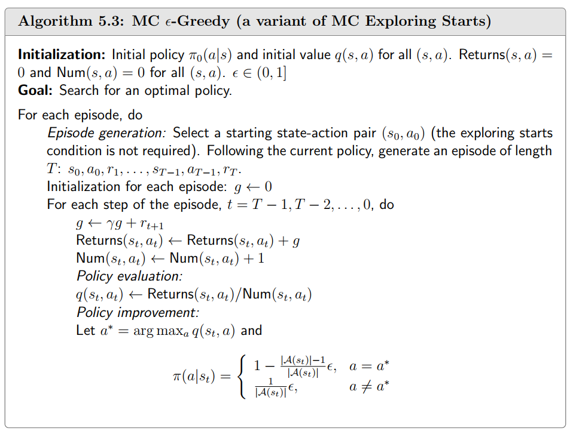

### 5.5 Exploration and expolitation of $\epsilon$-greedy policies
探索（Exploration）与利用（Exploitation）构成了强化学习中的一个基本权衡问题。
* **探索**指的是策略应尽可能尝试更多的动作，从而保证所有动作都能被充分访问与评估；
* **利用**则指改进后的策略应当选择动作价值最大的贪心动作。

但需要注意的是，若探索不充分，当前得到的动作价值可能并不准确。因此，我们需要在利用的过程中持续进行探索，以避免错失最优动作。

$\epsilon$-greedy policies提供了一种平衡探索与利用的有效方法。一方面，这个策略会以较高的概率选择贪心动作，充分利用估计的价值；另一方面保留了选择其他动作的可能，来保证探索能力。

而$\epsilon$-greedy policies的核心思想，就是通过**牺牲部分最优性/利用性来增强探索能力**。

若要提升利用效率与策略最优性，我们需要减小 ε 的取值；反之，若要增强探索能力，则需要增大 ε 的取值

书本P93中给出了对于不同ε下迭代结果对比。

首先介绍一个概念，策略的**一致性/consistence**
    针对两个 ε- 贪心策略$π_1$和$π_2$，它们被判定为一致的充要条件是：
    对于所有状态 s，策略 $π_1$在 s下概率最大的动作，与策略 $π_2$在 s下概率最大的动作完全相同。

* Optimality
  * 当 ε=0时，该策略退化为贪心策略，且在全体策略中均为最优；
  * 当 ε取值较小（如 0.1）时，最优 ε- 贪心策略与最优贪心策略保持一致。
  * 当 ε增大至某个值（例如 0.2）时，得到的 ε- 贪心策略就不再与最优贪心策略一致。
  
  因此，若要使 ε- 贪心策略与最优贪心策略保持一致，**ε的取值必须足够小**。

  以目标区域来分析，很容易理解，当ε较小时，最优策略是保持静止在原地，当ε增大时，有更大的概率进入forbidden area，获得负奖励，这时最优策略就不再是停留原地了，与最优贪心策略不一致。

* Exploration
  ε- 贪心策略的探索能力与 ε 取值呈正相关：ε 越大，探索能力越强；ε 越小，探索能力越弱。
  * ε=1 时：策略探索能力极强。任意状态下所有动作的选择概率均等，当轨迹长度足够长时，单次轨迹即可多次访问所有状态 - 动作对，且各状态 - 动作对的访问次数分布几乎均匀。
  * ε=0.5 时：策略探索能力弱于 ε=1 的情况。尽管轨迹足够长时仍能覆盖所有动作，但访问次数分布极不均衡—— 部分动作被高频访问，多数动作仅被少量访问。

实际训练过程，可以类似于机器学习中的余弦退火，动态调整ε，**先大后小**，初始设置较大的 ε 以充分探索状态空间，后续逐步减小 ε，在保证探索充分性的同时，最终收敛到性能较优的策略。

## Lec6 Stochastic Approximation
实际上，前序章节与后续章节之间存在一个知识断层：我们目前所学的算法均为非增量式，而后续章节将要学习的算法则属于**增量式**。
本章将通过介绍随机逼近（stochastic approximation）的基础知识来弥补这一知识断层。

### 6.1 Motivating example:Mean estimation
我们通过一个均值估计的问题来为算法引入增量式。

考虑一个取值于有限集合$\mathcal{X}$的随机变量$X$，我们的目标是去估计均值$\mathbb{E}[X]$。由大数定理，当我们已知一组独立同分布的采样（i.i.d）$\{x_i\}^n_{i=1}$，可以通过下列公式近似：
$$\mathbb{E}[X] \approx \bar{x} \doteq \frac{1}{n}\sum_{i=1}^n x_i. \tag{6.1}$$

而上述公式的实现可以分为**非增量式**和**增量式**两种：
* non-incremental
  需要先收集所有的采样，再计算均值，需要等待全部样本收集完，如果数目很多，需要等待很久。
* incremental
  通过增量式方法计算平均值，每次新收集一个样本，会直接在之前的均值基础上直接计算即可，更新很快，具体方式如下：
  假设
  $$w_{k+1} \doteq \frac{1}{k}\sum_{i=1}^k x_i, \quad k = 1,2,\dots$$
  $w_{k+1}$为k个样本的均值，那么前一步k-1个样本均值为：
  $$w_k = \frac{1}{k-1}\sum_{i=1}^{k-1} x_i, \quad k = 2,3,\dots$$
  我们用$w_k$和新增的$x_k$来表示$w_{k+1}$:
  $$w_{k+1} = \frac{1}{k}\sum_{i=1}^k x_i = \frac{1}{k}\left( \sum_{i=1}^{k-1} x_i + x_k \right) = \frac{1}{k}\left( (k-1)w_k + x_k \right) = w_k - \frac{1}{k}(w_k - x_k).$$
  故我们得到了一个**增量式求取均值的算法**:
  $$w_{k+1} =w_k - \frac{1}{k}(w_k - x_k) $$

增量式算法的优势在于，每接收一个样本，我们就能立即计算出平均值。该平均值可用于近似$\bar{x}$，进而估计$\mathbb{E}[X]$。

进一步可以把系数$\frac{1}{k}$换成更加通用的$\alpha_k$，得到更一般的形式，这也将和后边的RM算法产生联系：
$$w_{k+1} =w_k - \alpha_k(w_k - x_k) $$

### 6.2 Robbins-Monro algorithm
随机逼近是一类用于求解方程根或优化问题的随机迭代算法的统称。其优势在于**无需已知目标函数**或其导数的显式表达式。

RM算法是随机逼近领域的开创性成果，后续6.4会说明ML中的SGD其实可以看作RM的一种特殊形式，接下来正式介绍RM算法。

以一个求根问题为例：
$$g(w)=0$$
其中w是一个$\mathbb{R}$上的未知变量，g是$\mathbb{R}$到$\mathbb{R}$的函数。
为什么我们要选取一个求根问题呢？事实上很多问题都可以转化为求根问题，例如一个优化问题去min$J(w)$，那么一个必要条件就是梯度为0，我们令g为梯度就是上述的求根问题了。而我们在本章探索的是在g的表达式未知的情况，通过数据/采样去求解解$w^*$，这其实就体现了没有模型就要有数据的思想。

我们已知的数据是**输入**$w$和经过函数后**带噪声的采样值** $\tilde{g}(w,\eta)$，其表达式如下：
$$\tilde{g}(w,\eta) = g(w) + \eta,$$
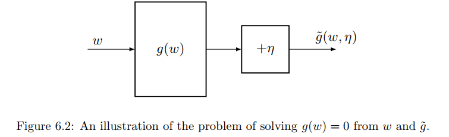
我们目的是通过$w$和$\tilde{g}$求解$g(w)=0$。

**RM算法通过下列公式求解：**
$$w_{k+1} = w_k - a_k \tilde{g}(w_k, \eta_k), \quad k = 1, 2, 3, \dots$$
其中$w_k$是第k次对于根的估计，$\tilde{g}(w_k, \eta_k)$是第k次带噪声的观测值。

#### 6.2.1 Convergencce

在书中通过一个例子$g(w)=tanh(w-1)$来进行分析算法的收敛性，下面给出严格的收敛条件定理：
##### Therorem 6.1 (Robbins-Monro theorem)
在RM算法中，如果：
* 对于任意的w，均有：$\quad 0 < c_1 \le \nabla_w g(w) \le c_2$
* $\sum_{k=1}^{\infty}a_k = \infty \quad \text{且} \quad \sum_{k=1}^{\infty}a_k^2 < \infty$
* $\mathbb{E}[\eta_k \mid \mathcal{H}_k] = 0 \quad \text{且} \quad \mathbb{E}[\eta_k^2 \mid \mathcal{H}_k] < \infty$

其中$\mathcal{H}_k = \{w_k, w_{k-1}, \dots\}$，那么$w_k$几乎必然收敛于满足$g(w^*)=0$的根。
该定理的核心依据是几乎必然收敛的概念，相关内容详见附录 B。

下面对定理 6.1 的三个条件分别进行解释：
1. **函数单调和梯度有界**：
   * $0 < c_1 \le \nabla_w g(w)$表明函数$g(w)$是单调递增的，这是个较强的条件，保证了方程$g(w)=0$的根存在且唯一。若为单减，取负也能作为单增分析，重要的是**单调性**。
   对应实际优化问题，g的梯度相当于$J(w)$的二阶导，其单增的条件等价于$J(w)$ **是凸函数**。
   * $g(w) \le c_2$表明$g(w)$的梯度有上界。
2. **系数序列约束**：
    关于系数序列$\{a_k\}$的条件设计十分巧妙，这类约束在强化学习算法中也十分常见。
    * $\sum_{k=1}^{\infty}a_k^2 < \infty$意味着系数平方的级数极限存在上界，要求系数$a_k$随k趋于无穷时**收敛于0**。
    * $\sum_{k=1}^{\infty}a_k = \infty$意味着系数级数极限趋于无穷大，这是要求$a_k$收敛到0的**速度不能太快**。我的理解不能让$a_k$比$w_k$先收敛，不然算法无法有效迭代。
3. **误差条件**：
  这一条件的约束是温和的，它不要求观测误差$η_k$服从高斯分布。这一条件要求噪声的均值为0，且其能量不会发散。
  一个重要的特例是：若$\{η_k\}$为独立同分布的随机序列，且满足$\mathbb{E}[η_k]=0$,$\mathbb{E}[η_k^2]<\infty$，那么这个条件自动成立，原因是此时$η_k$与历史信息集合$\mathcal{H}_k$无关。$\mathbb{E}[\eta_k \mid \mathcal{H}_k]=\mathbb{E}[η_k]=0$,$\mathbb{E}[\eta_k^2 \mid \mathcal{H}_k]=\mathbb{E}[η_k^2]<\infty$

接下来详细分析一下第二个关于系数序列的约束：
* $\sum_{k=1}^{\infty}a_k^2 < \infty$意味着$a_k$会收敛到0。
  $$w_{k+1}-w_k = -a_k \tilde{g}(w_k;\eta_k)$$
  当$a_k\rightarrow 0$时，才有$w_{k+1}\rightarrow w_k$，即保证k足够大的时候$w$能收敛。
* $\sum_{k=1}^{\infty}a_k = \infty$要求系数收敛到0的速度不能太快。如果过快会出现$\sum_{k=1}^{\infty}a_k < \infty$，对于$w$求解累加后的迭代式：
$$w_{\infty}-w_1 = -\sum_{k=1}^{\infty}a_k\tilde{g}(w_k;\eta_k)$$
在上述条件下，右侧的绝对级数会存在上界，设为b
$$|w_{\infty}-w_1| = \left|\sum_{k=1}^{\infty}a_k\tilde{g}(w_k;\eta_k)\right| \le b $$
此时若初始值过远时，超过这个上界时，那么就无法收敛到真实根，就跟我前面理解的一样，$a_k$先收敛了，但$w_k$还没收敛。这个条件实际是保证了**任意初值下都能收敛**。

一个满足第二个条件的典型序列是
$$a_k=\frac{1}{k}$$
这就是前面mean estimation对应的系数，具体的证明见书本P108。

在 RM 算法的诸多实际应用中，系数$a_k$常被选为一个足够小的常数，这不满足第二个条件，但某种意义上仍具有收敛性，这里不再展开。

#### 6.2.2 Application to mean estimation
实际上我们在6.1讲到的均值估计的增进式算法可以**视作一种特殊的RM算法**，下面进行说明：
首先回顾前面的公式：
$$w_{k+1} =w_k - \alpha_k(w_k - x_k) $$
其中当$\alpha_k=\frac{1}{k}$时，就是均值的估计算法，但是前面遗留了一个问题：当$\alpha_k$为一个通用参数时，此时算法的收敛性如何？我们下面证明上述算法是一种特殊的RM算法来说明这个问题。

我们定义函数：
$$g(w)=w-\mathbb{E}[X]$$
而原始问题是一个均值求解问题，我们通过构造转换为一个求根问题，求出得$w^*$就是均值。

我们能够已知带噪声的采样值，$\tilde{g} =w - x$其中x是X的一个采样。
$$
\begin{align*}
\tilde{g}(w,\eta) &= w - x \\
&= w - x + \mathbb{E}[X] - \mathbb{E}[X] \\
&= (w - \mathbb{E}[X]) + (\mathbb{E}[X] - x) = g(w) + \eta,
\end{align*}
$$
其中$ \eta = \mathbb{E}[X] - x$

那么求解这个问题的RM算法可以写成：
$$w_{k+1} = w_k - \alpha_k \tilde{g}(w_k, \eta_k) = w_k - \alpha_k (w_k - x_k),$$
这实际上就是前边的均值问题公式，其收敛性由6.2.1中的三个条件决定。

### 6.3 Dvoretzky's convergence theorem
详见P109，关于收敛性的详细证明。

### 6.4 Stochastic gradient descent（SGD）
这一节将会介绍在机器学习中广泛应用的随机梯度下降算法（SGD），并将说明SGD是RM算法的特殊情况，以及前面的均值估计问题是SGD的特殊情况。

我们考虑下面一个优化问题：
$$\min_{w} J(w) = \mathbb{E}\left[f(w, X)\right], \tag{6.10}$$
$w$是待优化的参数，$X$是一个随机变量，期望是对于$X$求的。

最直接的方法是通过梯度下降每次迭代$\alpha_k$倍的梯度，其中$\nabla_w \mathbb{E}\left[f(w, X)\right] = \mathbb{E}\left[\nabla_w f(w, X)\right]$，故公式写成：
$$w_{k+1} = w_k - \alpha_k \nabla_w J(w_k) = w_k - \alpha_k \mathbb{E}\left[\nabla_w f(w_k, X)\right]. \tag{6.11}$$
但很明显这种方法的难点在后边期望$\mathbb{E}\left[\nabla_w f(w_k, X)\right]$的求取。如果我们知道$X$的概率分布那么可以求解，但实际中大多数都是未知模型的，这时候跟前边一样，我们需要用大量的独立同分布采样$\{x_i\}_{i=1}^n$去估计期望：
$$\mathbb{E}\left[\nabla_w f(w_k, X)\right] \approx \frac{1}{n}\sum_{i=1}^n \nabla_w f(w_k, x_i).$$
回代入（6.11）：
$$w_{k+1} = w_k - \frac{\alpha_k}{n}\sum_{i=1}^n \nabla_w f(w_k, x_i). \tag{6.12}$$
这种算法的问题也很明显，一次迭代需要等待所有的采样进行完才能继续，实际中采样是一个个获得的，与前面的改进方法类似，我们也采取类似增量式的方法，每采样一次就更新一次$w$:
$$w_{k+1} = w_k - \alpha_k \nabla_w f(w_k, x_k), \tag{6.13}$$
其中$x_k$是第K步采样值。而这正是著名的随机梯度下降算法（SGD），相对梯度下降多了“随机”，因为SGD依赖于随机采样集合$\{x_k\}$。

**对比GD和SGD算法，本质上**是将$\mathbb{E}\left[\nabla_w f(w_k, X)\right]$这个真实的梯度用随机梯度$\nabla_w f(w_k, x_k)$来代替。这种方式不会影响迭代结果的收敛性，后面会有证明。

#### 6.4.1 Application to mean estimation
和RM算法类似，我们现在也用SGD算法去进行均值估计，然后可以证明前边的**均值估计算法是SGD的特殊形式**。

我们可以将均值估计问题转化为下列优化问题：
$$\min_{w} J(w) = \mathbb{E}\left[ \frac{1}{2}\|w - X\|^2 \right] \doteq \mathbb{E}\left[f(w,X)\right], \tag{6.14}$$
其中$f(w,X) = \frac{\|w - X\|^2}{2}, \quad \nabla_w f(w,X) = w - X$，很容易看出，这个优化问题的解$w^*$（$\nabla_w J(w)=0$）实际上就是均值$\mathbb{E}[X]$。

求解上述优化问题的**梯度下降算法**就可以写成下述形式：
$$
\begin{align*}
w_{k+1} &= w_k - \alpha_k \nabla_w J(w_k) \\
&= w_k - \alpha_k \mathbb{E}\left[ \nabla_w f(w_k, X) \right] \\
&= w_k - \alpha_k \mathbb{E}\left[ w_k - X \right].
\end{align*}
$$
自然也可以写出**SGD算法**：
$$w_{k+1} = w_k - \alpha_k \nabla_w f(w_k, x_k) = w_k - \alpha_k (w_k - x_k),$$
很明显，这跟前面6.1的mean estimation的算法形式一致。

#### 6.4.2 Convergence pattern of SGD
定义了一个随机采样和真实梯度的相对误差去进行分析，详见P116。
主要结论是；
* 当$w$离$w^*$较远时，相对误差很小，SGD和GD有相似的性质，会快速靠近$w^*$；
* 当$w$离$w^*$较近时，相对误差会变大，SGD会在目标值附近随机波动，表现出一定的随机性。
  

#### 6.4.3 A determinstic formulation of SGD
在式子（6.13）中SGD的形式包含了随机变量，但实际遇到的问题都是**确定的数据，不包含随机变量**，这个时候就需要**没有随机变量/确定形式的SGD算法**。

这个时候，我们已知的是一组实际存在的数据$\{x_i\}_{i=1}^n$。那么此时的优化问题变为：
$$\min_{w} J(w) = \frac{1}{n}\sum_{i=1}^n f(w, x_i),$$
事实上，这种情况才是实际常见的情况。
此时梯度下降算法公式为：
$$w_{k+1} = w_k - \alpha_k \nabla_w J(w_k) = w_k - \alpha_k \frac{1}{n}\sum_{i=1}^n \nabla_w f(w_k, x_i).$$
同理可以改写为增量式算法：
$$w_{k+1} = w_k - \alpha_k \nabla_w f(w_k, x_k). \tag{6.16}$$
需要注意的是，这里的$x_k$是第k个时间步获得的数值，不是集合$\{x_i\}_{i+1}^n$的第k个元素。上述形式跟SGD很相似，但区别在$x_k$。

实际上，我们可以把**确定性的集合**$\{x_i\}_{i=1}^n$**看作一个随机变量**$X$**的域**:
即定义$X$为集合$\{x_i\}_{i=1}^n$上的随机变量，其服从均匀分布，每次取一个数据的概率为$p(X = x_i) = 1/n$

那么就将一个**确定性优化**问题转换为**随机优化**问题：
$$\min_{w} J(w) = \frac{1}{n}\sum_{i=1}^n f(w, x_i) = \mathbb{E}\left[f(w, X)\right].$$
在我们人工定义的$X$下，上式的对随机变量均值是严格等于前面的求平均。

故（6.16）本质上就是SGD；只要$x_k$从集合$\{x_i\}_{i+1}^n$中独立且均匀抽样得到的，估计值就能收敛，注意这里每次由于是随机取值，可能取到重复的值，而对取值不同的处理就是下一小节要讲的BGD、SGD、mini-batch GD。

#### 6.4.4 BGD、SGD和mini-batch GD
原始的GD算法需要计算梯度的均值，而我们实际通过样本值去近似这个均值。根据一次迭代（iteration）使用的样本数，可以分为BGD、SGD和mini-batch GD

BGD在一次迭代中使用了所有的采样值；SGD在一次迭代中只使用一次采样值；而mini-batch GD在一次迭代中从样本集中随机抽样选取特定数目的采样值。

对于优化问题： $min J(w)=\mathbb{E}[f(w,X)]$ ，样本集为$\{x_i\}_{i=1}^n$，三种算法如下：

$$
% 批量梯度下降（BGD）
w_{k+1} = w_k - \alpha_k \frac{1}{n}\sum_{i=1}^n \nabla_w f(w_k, x_i), \quad \text{(BGD)}\\
% 小批量梯度下降（MBGD）
w_{k+1} = w_k - \alpha_k \frac{1}{m}\sum_{j \in \mathcal{I}_k} \nabla_w f(w_k, x_j), \quad \text{(MBGD)}\\
% 随机梯度下降（SGD）
w_{k+1} = w_k - \alpha_k \nabla_w f(w_k, x_k). \quad \text{(SGD)}
$$

MBGD可以看作BGD和SGD的中间版本：
* 与 SGD 相比，MBGD 的随机性更低 —— 因为它使用多个样本（而非 SGD 的单个样本）计算梯度；
* 与 BGD 相比，MBGD 不需要每次迭代都用全量样本，因此更灵活。

若取m=1，MBGD 就退化为 SGD；
但当m=n时，**MBGD 不一定等价于 BGD**—— 这是因为 MBGD 使用的是**n个随机抽取的样本**，随机抽取的n个样本可能无法覆盖整个样本集；而 BGD 使用的是**所有n个样本**（无重复）。

在收敛速度上，一般而言MBGD 的收敛速度快于 SGD，而BGD收敛最快，这里的速度指的是循环次数，实际运算时间跟处理器性能有关。

下面有三种方法的实际效果对比图：
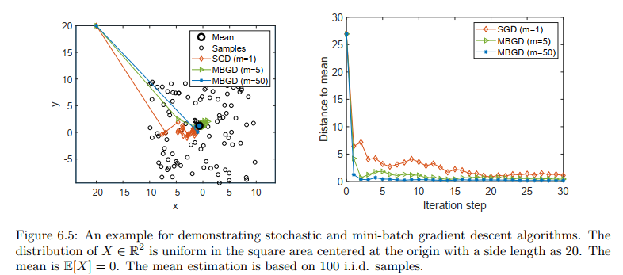

#### 6.4.5 Convergence of SGD
##### Theorem 6.4(Convergence of SGD)
$$w_{k+1} = w_k - \alpha_k \nabla_w f(w_k, x_k), \tag{6.13}$$
对于式 (6.13) 中的随机梯度下降（SGD）算法，若满足以下条件，则估计序列$w_k$**几乎必然收敛**到方程$\nabla_w \mathbb{E}[f(w; X)] = 0$
* 对任意取值$w$，有$0 < c_1 \le \nabla_w^2 f(w; X) \le c_2$
* $\sum_{k=1}^{\infty}\alpha_k = \infty \quad \text{且} \quad \sum_{k=1}^{\infty}\alpha_k^2 < \infty$
* 序列$\{x_k\}_{k=1}^{\infty} $为独立同分布序列

条件1针对函数$f$的**凸性**，要求$f$的曲率存在上下界。此处的$w$为标量，$\nabla_w^2 f(w; X)$也为标量；若$w$为向量，$\nabla_w^2 f(w; X)$就是经典的Hessian matrix（海森矩阵）。

条件2与 RM 算法的对应条件类似。在实际应用中,$α_k$常被选为足够小的常数；此时虽不满足条件 2，但算法仍能在某种意义下收敛。

条件3是算法收敛的常规要求。

## Lec7 Temporal-Difference Methods
### 7.1 TD learning of state values
TD学习是一系列很广泛的RL算法，我们在本节通过分析其对于状态值的估计，来引入最基本的TD learning算法公式。

#### 7.1.1 Algorithm description
首先我们直接给出TD learning的算法公式，后续再去详细分析含义。我们的目标是在给定的策略$\pi$下，基于一些在$\pi$下的经验采样$(s_0,r_1,s_1,\dots,r_{t+1}.s_{t+1},\dots)$，去估计state value。
$$
\begin{align}
v_{t+1}(s_t) &= v_t(s_t) - \alpha_t(s_t)\left[ v_t(s_t) - \left(r_{t+1} + \gamma v_t(s_{t+1})\right) \right], \tag{7.1} \\
v_{t+1}(s) &= v_t(s), \quad \text{for all } s \neq s_t, \tag{7.2}
\end{align}
$$
其中 t=0,1,2,…。这里的$v_t(s_t)$表示的是在时刻t下**对于state value** $v_\pi(s_t)$ **的估计**；$\alpha_t(s_t)$表示的是在时刻t下对于状态$s_t$的**学习率**。

由式子（7.2）可知，在时刻t仅对于被访问的状态$s_t$的状态值按照（7.1）进行更新，一般会省略（7.2），但我们要清楚有这一项式子。

观察迭代公式，我们发现这跟前面的SGD算法有些相似，区别是SGD的系数后是对梯度均值的估计，而TD中其实是当前值跟目标值的差，二者的效果本质上是相似的。

首次接触时序差分（TD）学习算法的读者可能会疑惑其设计思路的由来。事实上，该算法可被视作求解贝尔曼方程的一种特殊随机逼近算法。为说明这一点，首先回顾状态值函数的定义：
$$
\begin{align*}
v_\pi(s) 
&= \mathbb{E}[ G_{t} \big| S_t = s]\\
&= \mathbb{E}\left[R_{t+1} + \gamma G_{t+1} \big| S_t = s\right],\ s \in \mathcal{S} 
\tag{7.3}
\end{align*}
$$
而因为：
$$\mathbb{E}\left[G_{t+1} \big| S_t = s\right] = \sum_a \pi(a|s) \sum_{s'} p(s'|s,a) v_\pi(s') = \mathbb{E}\left[v_\pi(S_{t+1}) \big| S_t = s\right]$$
这个式子右边是对于$S_{t+1}$的期望，可以这样展开：
$$
\begin{align*}
\mathbb{E}\left[v_\pi(S_{t+1}) \big| S_t =s\right]
&= \sum_{s'}p(S_{t+1}=s'|S_t=s)v_{\pi}(s')\\
&= \sum_{s'}\sum_a \pi(a|s)  p(s'|s,a) v_\pi(s') 
\end{align*}
$$
这样就与左边式子相同了，故（7.3）可以改写为：
$$v_\pi(s) = \mathbb{E}\left[R_{t+1} + \gamma v_\pi(S_{t+1}) \big| S_t = s\right],\ s \in \mathcal{S} \tag{7.4}$$
这个式子是贝尔曼方程的另一种表达形式，又被称为**贝尔曼期望方程**。

时序差分（TD）算法可通过将RM算法应用于求解式 (7.4) 中的贝尔曼方程推导得出，详细推导见书P127，其实BE就是一个求一个期望，我们自然可以类比前面用RM去进行mean estimation的方式构造合适的函数$g$，具体的过程如下面两张图所示：
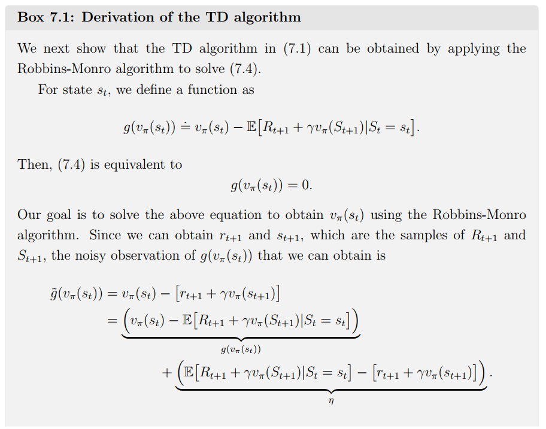
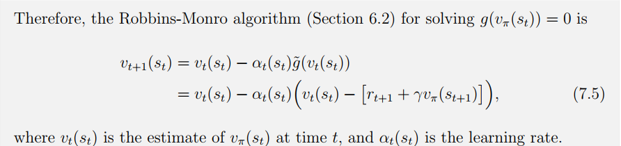
需要注意的是，相对于（7.1）的TD learning式子，在后边使用的是状态值$v_{\pi}(s_{t+1})$，而（7.1）使用的是$v_t(s_{t+1})$。这是因为在用RM求解贝尔曼方程式，对应的情况就是已知其他的状态值。如果我们想通过上式求解所有的状态值，那么我们将上述状态值替换成（7.1）中一样的对其他状态值的估计$v_t(s_{t+1})$就行。

#### 7.1.2 Property analysis
我们对于（7.1）中的算法计算式进行标注：
$$
\begin{equation}
\underbrace{v_{t+1}(s_t)}_{\text{new estimate}} = \underbrace{v_t(s_t)}_{\text{current estimate}} - \alpha_t(s_t)
[ \overbrace{v_t(s_t) -\underbrace{ ( r_{t+1} + \gamma v_t(s_{t+1}) )}_{\text{TD target } \bar{v}_t}}^{\text{TD error } \delta_t}],
\tag{7.6}
\end{equation}
$$
其中
* $\bar{v}_t \doteq r_{t+1} + \gamma v_t(s_{t+1})$被称作***TD target***;
* $\delta_t \doteq v(s_t) - \bar{v}_t = v_t(s_t) - \left( r_{t+1} + \gamma v_t(s_{t+1}) \right)$被称为***TD error***

自然我们会有对于上述定义的疑惑：
* **为什么$\bar{v_t}$叫做TD target**
  这其实可以从两个角度去共同理解：
  1. 首先，$\bar{v_t}$是算法**想要估计值$v(s_t)$达到的目标**。我们可以将（7.6）变形：
  \[
  \begin{aligned}
  v_{t+1}(s_t) - \bar{v}_t &= \left[ v_t(s_t) - \bar{v}_t \right] - \alpha_t(s_t)\left[ v_t(s_t) - \bar{v}_t \right] \\
  &= \left[ 1 - \alpha_t(s_t) \right] \left[ v_t(s_t) - \bar{v}_t \right].
  \end{aligned}
  \]
  取模长：
  \[
  \left| v_{t+1}(s_t) - \bar{v}_t \right| = \left| 1 - \alpha_t(s_t) \right| \left| v_t(s_t) - \bar{v}_t \right|.
  \]
  而由于$\alpha_t(s_t)$是一个在$（0,1）$之间的一个数，故：
  \[
  \left| v_{t+1}(s_t) - \bar{v}_t \right| < \left| v_t(s_t) - \bar{v}_t \right|.
  \]
  这一式子就代表每一次迭代值都在向着这个$\bar{v_t}$靠近。
  2. 另一个角度自然而然聚焦于：**我们为什么要靠近这个**$\bar{v_t}$？这是老师网课没有讲清楚的。
  $$
  v_\pi(s) = \mathbb{E}\left[R_{t+1} + \gamma v_\pi(S_{t+1}) \big| S_t = s\right],
  \\
  \\
  \bar{v}_t = r_{t+1} + \gamma v_t(s_{t+1})
  $$
  $\bar{v_t}$可以看作对于上述BE的单次近似采样，区别是后边不是真实的状态值，而是我们的估计。当所有的状态值都向着目标靠近时，最终收敛的就是真实的状态值。故某种程度上，向着$\bar{v_t}$靠近是实现算法收敛的高效方式。

* **如何理解TD error?**
  首先，这个误差被称为 “时序差分”，是因为$\delta_t = v(s_t) - \bar{v}_t = v_t(s_t) - \left( r_{t+1} + \gamma v_t(s_{t+1}) \right)$反映了两个时间步$t$和$t+1$之间的差异。其次，当状态值估计准确时，TD 误差的期望为零。具体来说，当$v_t=v_π$（估计值等于真实值）时，TD 误差的期望为：
  $$
  \begin{align*}
  \mathbb{E}\left[\delta_t \mid S_t = s_t\right] &= \mathbb{E}\left[v_\pi(S_t) - \left(R_{t+1} + \gamma v_\pi(S_{t+1})\right) \mid S_t = s_t\right] \\
  &= v_\pi(s_t) - \mathbb{E}\left[R_{t+1} + \gamma v_\pi(S_{t+1}) \mid S_t = s_t\right] \\
  &= 0. \quad \text{（由式(7.3)可得）}
  \end{align*}
  $$
  因此，TD 误差不仅反映了两个时间步之间的差异，更重要的是，它还反映了估计值$v_t$与真实状态值$v_\pi$之间的偏差。

  从更抽象的层面看，TD 误差可以被理解为 **“新息（innovation）”**—— 即从经验样本$(s_t,r_{t+1},s_{t+1})$中获得的新信息。TD 学习的核心思想，就是**基于新获取的信息修正当前的状态值估计**。新息在*卡尔曼滤波*等许多估计问题中都是核心概念

注意这一节的公式只是用来估计给定策略下的状态值的，需要找到最优策略的话还要计算动作值并结合policy improvement，这在7.2节中会讲解。

##### TD learning V.S Monto Carlo
这里给出TD和MC算法的对比:
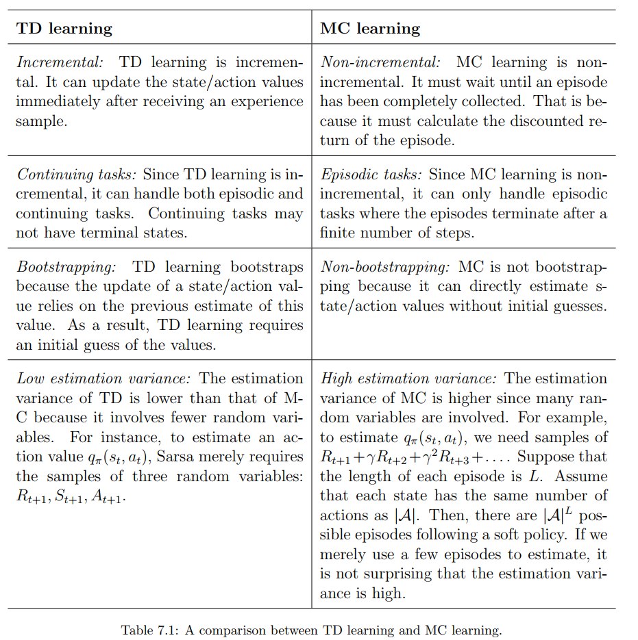
还要补充一点，由于TD有着**自举性（bootstrapping）**，故其受初值影响大，如果初值选取距离实际值相差太大，估计值在迭代早期会有bias，但最终随着次数增加这个bias会被消除。

需要注意的是，前面讲的MC是在求解最优的策略和状态值，这里最基本的TD-learning只是对于当前状态值的估计，并没有涉及策略的更新。

#### 7.1.3 Convergence analysis
收敛性对于学习率$\alpha_t(s)$有要求：
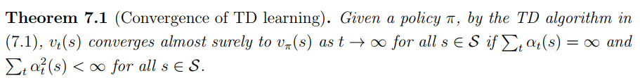
详细的说明和定理的证明参见书P130。

### 7.2 Sarsa:TD learning of action values
7.1中的最简单的TD learning估计的是状态值，而本节介绍的Sarsa将估计action value，并结合policy improvement实现最优策略的学习。

#### 7.2.1 Algorithm description
我们的目标是在给定的策略$\pi$下，基于一些在$\pi$下的经验采样$(s_0,a_0,r_1,s_1,a_1\dots,s_{t},a_{t},r_{t+1},s_{t+1},a_{t+1},\dots)$，去估计action value。接着就能根据估计的action value去进行策略改进。action value计算的算法公式如下：
$$
\begin{align*}
q_{t+1}(s_t, a_t) &= q_t(s_t, a_t) - \alpha_t(s_t, a_t) \left[ q_t(s_t, a_t) - \left( r_{t+1} + \gamma q_t(s_{t+1}, a_{t+1}) \right) \right]\tag{7.12}\\
q_{t+1}(s, a) &= q_t(s, a), \quad \text{for all } (s, a) \neq (s_t, a_t),
\end{align*}
$$
其中 t=0,1,2,…。这里的$q_t(s_t,a_t)$表示的是在时刻t下**对于action value** $q_\pi(s_t,a_t)$ **的估计**；$\alpha_t(s_t,a_t)$表示的是在时刻t下对于状态$s_t$-动作$a_t$对的**学习率**。
在时刻$t$，只有$(s_t,a_t)$的$q$值会被更新，**其他的状态动作对的**$q$**保持不变**。不要忘了这个，q值是每一个时刻都更新一次的，底下的下标代表的是新时刻下的q，跟后边的状态和动作的时间索引是不一样的。

下面分析Sarsa算法的一些重要性质：
* **为什么这个算法叫 “Sarsa”？**
  因为算法的每一次迭代都需要$(s_{t},a_{t},r_{t+1},s_{t+1},a_{t+1})$。Sarsa 是 “状态 - 动作 - 奖励 - 状态 - 动作（state-action-reward-state-action）” 的缩写。
* **为什么 Sarsa 要这样设计？**
  参考前面估计state value的TD learning算法，Sarsa实际上是将TD中的状态值替换为动作值。
* **Sarsa 在数学上的作用是什么？**
  与TD类似，Sarsa也是一种**求解给定策略下的贝尔曼方程**的随机近似算法，不过这里的贝尔曼方程是以action value进行表示的：
  $$% 公式 (7.13)
  q_\pi(s, a) = \mathbb{E}\left[ R + \gamma q_\pi(S', A') \middle| s, a \right], \quad \text{for all } (s, a). \tag{7.13}
  $$
  下图展示了（7.13）为什么是BE。
  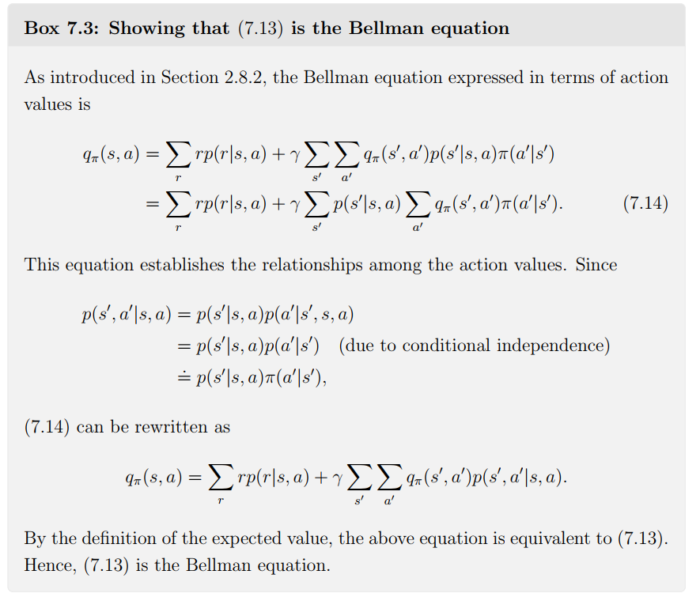

* **Sarsa是收敛的吗？**
  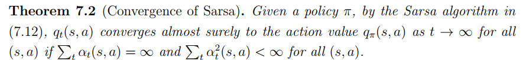
  这个定理跟前面TDlearning的收敛条件相似。
  特别的，$\sum_{t} \alpha_t(s; a) =\infty$ 这一条件要求**每个状态 - 动作对都必须被访问无穷多次（或足够多次）**。在时刻$t$,若$(s,a)=(s_t,a_t)$，则$\alpha_t(s; a)>0$，否则$\alpha_t(s; a)=0$。

#### 7.2.2 Optimal policy learning via Sarsa
上面只介绍了用Sarsa估计action value，实际的Sarsa是一个包括policy improvement的过程，其完整的算法如下：
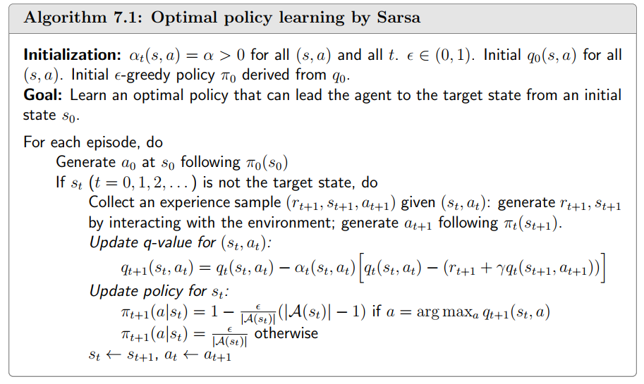

如算法 7.1 所示，每一轮迭代包含两个步骤：
1. 第一步是更新已访问状态 - 动作对的$q$值；
2. 第二步是将策略更新为$ϵ$-greedy策略。

$q$值更新步骤仅会更新时刻$t$访问到的单个状态 - 动作对的$q$值，之后立即更新$s_t$对应的策略。（理论上想要得到准确的action value需要多次重复进行q的更新，但实际只更新一次就去策略评估了）

因此，我们并不会在更新策略前充分评估当前策略 —— 这是基于广义策略迭代的思想。此外，策略更新后会立即用于生成下一个经验样本；这里采用$ϵ$-greedy策略是为了保证探索性。

书中举了一个例子。这里是用Sarsa去找到从特定起始状态到目标状态的最优路径，而非为所有状态找到最优策略。这种任务实际中更常见，这类任务相对简单，因为只需探索路径附近的状态，无需遍历所有状态；但造成的问题是得到的**最优策略可能是局部的**，其他访问少的状态的策略不一定是最优。

对比一下Sarsa和MC在策略更新上的区别：MC的实现是先基于策略采样一个episode，对于episode逆序每一步都估计action value并更新策略，只有等到所有更新完了才会用新的策略再去采样新的episode;而Sarsa是基于当前的$（s_t,a_t）$，与环境交互得到$（r_{t+1},s_{t+1}）$按照策略记为$\pi_t$得到$a_{t+1}$,接着通过迭代公式更新$q_t$的估计值并更新到策略$\pi_{t+1}$，这个更新的策略是会马上用在下一步的采样中去的，但注意的是，更新的仅仅是$（s_t,a_t）$的策略，选择$a_{t+2}$的策略跟旧策略$\pi_t$是一致的。

##### Expected Sarsa
Sarsa算法有一个变体：Expected Sarsa，区别是将后边的下一时序状态action value的估计换成了期望（对于动作A的期望）。
$$
\begin{align*}
q_{t+1}(s_t, a_t) &= q_t(s_t, a_t) - \alpha_t(s_t, a_t) \left[ q_t(s_t, a_t) - \left( r_{t+1} + \gamma \mathbb{E}[q_t(s_{t+1}, A) \right)] \right]\\
q_{t+1}(s, a) &= q_t(s, a), \quad \text{for all } (s, a) \neq (s_t, a_t),
\end{align*}
$$
其中：
$$
\mathbb{E}[q_t(s_{t+1}, A)]=\sum_a \pi_t(a|s_{t+1})q_t(s_{t+1},a)\doteq v_t(s_{t+1})
$$
是$q_t(s_{t+1},a)$在策略$\pi_t$下的期望值。
期望 Sarsa 的表达式与 Sarsa 极为相似，二者的区别仅在于时序差分（TD）目标的定义：具体来说，期望 Sarsa 的 TD 目标是$r_{t+1} + \gamma \mathbb{E}[q_t(s_{t+1}, A)$，而 Sarsa 的 TD 目标是$r_{t+1} + \gamma q_t(s_{t+1}, a_{t+1})$。

由于该算法的计算过程中引入了期望值，因此被命名为期望 Sarsa。

尽管计算期望值会略微增加算法的计算复杂度，但这一设计能**有效降低估计方差（estimation variances）**—— 原因是它将 Sarsa 中涉及的随机变量集合从$(s_{t},a_{t},r_{t+1},s_{t+1},a_{t+1})$降到了$(s_{t},a_{t},r_{t+1},s_{t+1})$。

而实际上期望Sarsa跟Sarsa一样，都是用来**求解贝尔曼方程的随机近似算法**：
$$
q_\pi(s; a) = \mathbb{E}\Bigl[R_{t+1} + \gamma\mathbb{E}\bigl[q_\pi(S_{t+1}; A_{t+1})\big|S_{t+1}\bigr]\Big|S_t = s; A_t = a\Bigr];\quad \text{for all } s, a: \tag{7.15}
$$
我们可以将下式：
$$\mathbb{E}\bigl[q_\pi(S_{t+1}; A_{t+1})\big|S_{t+1}\bigr] = \sum_{A'} q_\pi(S_{t+1}; A')\pi(A'|S_{t+1}) = v_\pi(S_{t+1})$$
代入式子（7.15）就能得到下面这个标准的贝尔曼方程：
$$
q_\pi(s; a) = \mathbb{E}\Bigl[R_{t+1} + \gamma v_\pi(S_{t+1})\Big|S_t = s; A_t = a\Bigr]
$$
这个式子其实就是**action value的定义**。（根据（7.4）的贝尔曼期望方程得到）

### 7.3 n-step Sarsa
这一节介绍n-step Sarsa，这是一种Sarsa的拓展。事实上，我们会发现Sarsa和前面的MC都是n-step Sarsa的特殊形式。

回忆一下状态值的定义：
$$
q_\pi(s, a) = \mathbb{E}\left[ G_t \middle| S_t = s, A_t = a \right], \tag{7.16}
$$
而$G_t$是满足下式定义的discounted return:
$$
G_t = R_{t+1} + \gamma R_{t+2} + \gamma^2 R_{t+3} + \dots
$$
事实上，Sarsa、n-step Sarsa和MC的区别就在于$G_t$的展开方式：
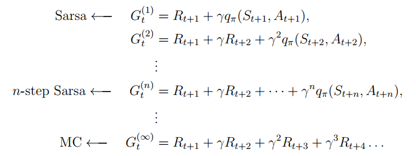
其中的$G_t^{(n)}$都是一个值，只是展开的数目不同而已。将不同的展开式代入（7.16）就能得到不同的算法：
* $n=1$时，就是本章的Sarsa算法；
  $$
  \begin{align*}
  q_\pi(s, a) &= \mathbb{E}\left[ G_t^{(1)} \middle| s, a \right] = \mathbb{E}\left[ R_{t+1} + \gamma q_\pi(S_{t+1}, A_{t+1}) \middle| s, a \right].\\
  q_{t+1}(s_t, a_t) &= q_t(s_t, a_t) - \alpha_t(s_t, a_t) \left[ q_t(s_t, a_t) - \left( r_{t+1} + \gamma q_t(s_{t+1}, a_{t+1}) \right) \right],
  \end{align*}
  $$
* $n=\infty$时，同时设置学习率为1，就是前面的MC learning算法。
  $$
  \begin{align*}
  q_\pi(s, a) &= \mathbb{E}\left[ G_t^{(\infty)} \middle| s, a \right] = \mathbb{E}\left[ R_{t+1} + \gamma R_{t+2} + \gamma^2 R_{t+3} + \dots \middle| s, a \right].\\
  q_{t+1}(s_t, a_t) &= g_t \doteq r_{t+1} + \gamma r_{t+2} + \gamma^2 r_{t+3} + \dots,
  \end{align*}
  $$
* $n$取其他值时，就是这节的n-step Sarsa：
  $$q_\pi(s, a) = \mathbb{E}\left[ G_t^{(n)} \middle| s, a \right] = \mathbb{E}\left[ R_{t+1} + \gamma R_{t+2} + \dots + \gamma^n q_\pi(S_{t+n}, A_{t+n}) \middle| s, a \right].$$
  其具体的算法公式如下：
  $$
  \begin{align*}
  q_{t+1}(s_t, a_t) &= q_t(s_t, a_t) \\
  &- \alpha_t(s_t, a_t) \left[ q_t(s_t, a_t) - \left( r_{t+1} + \gamma r_{t+2} + \dots + \gamma^n q_t(s_{t+n}, a_{t+n}) \right) \right]. \tag{7.17}
  \end{align*}
  $$
  要实现式 (7.17) 中的n-step Sarsa 算法，我们需要经验样本$(s_t,a_t,r_{t+1},s_{t+1},a_{t+1},\dots,r_{t+n},s_{t+n},a_{t+n}$。而在时刻$t$，$r_{t+n},s_{t+n},a_{t+n})$均未被采集，故我们必须等到时刻$t+n$，才能取更新$(s_t,a_t)$的action value，故式子（7.17）可以重写为：
  $$
  \begin{align*}
  q_{t+n}(s_t, a_t) &= q_{t+n-1}(s_t, a_t)\\
  &-\alpha_{t+n-1}(s_t, a_t) \left[ q_{t+n-1}(s_t, a_t) - \left( r_{t+1} + \gamma r_{t+2} + \dots + \gamma^n q_{t+n-1}(s_{t+n}, a_{t+n}) \right) \right],
  \end{align*}
  $$

由于n-step Sarsa 将 Sarsa 和 MC 学习作为两种极端情况包含在内，其性能介于 Sarsa 与 MC 学习之间也就不足为奇了。具体来说：
* 若n取较大的数值，n-step Sarsa会接近 MC 学习：估计结果的方差相对较高，但偏差较小；
* 若n取较小的数值，n-step Sarsa会接近 Sarsa：估计结果的偏差相对较大，但方差较低。

### 7.4 Q-learning：Q learning of optimal action values
前面介绍的都是对于给定策略状态值或者动作值的估计，这一节将会介绍大名鼎鼎的Q-learning算法，其**直接是对最优action value和最优policy进行估计**。

#### 7.4.1 Algorithm description
先给出其具体的算法：
$$
\begin{align*}
q_{t+1}(s_t, a_t) &= q_t(s_t, a_t) - \alpha_t(s_t, a_t) \left[ q_t(s_t, a_t) - \left( r_{t+1} + \gamma \max_{a \in \mathcal{A}(s_{t+1})} q_t(s_{t+1}, a) \right) \right], \tag{7.18} \\
q_{t+1}(s, a) &= q_t(s, a), \quad \text{for all } (s,a) \neq (s_t, a_t),
\end{align*}
$$
其他参数跟前面都是一样的，$q_{t+1}(s_t, a_t)$是对于$(s_t,a_t)$的**最优action value的估计**。

Q-learning跟Sarsa很像，只有后边的TD-target不同：
* Q-learning：
  $$r_{t+1} + \gamma \max_{a \in \mathcal{A}(s_{t+1})} q_t(s_{t+1}, a)$$
* Sarsa:
  $$r_{t+1} + \gamma  q_t(s_{t+1}, a_{t+1})$$

此外，一次迭代中，在给定的$(s_t,a_t)$下，Sarsa需要$(r_{t+1},s_{t+1},a_{t+1})$，而Q-learning只需要$(r_{t+1},s_{t+1})$。

跟前面介绍的所有的TD learning类似，Q-learning实际上也是在求解一个方程，不过这个方程从贝尔曼方程变成了**贝尔曼最优方程**：
$$q(s,a) = \mathbb{E} \left[ R_{t+1} + \gamma \max_{a} q(S_{t+1},a) \middle| S_t = s, A_t = a \right]. \tag{7.19}$$
上式是BOE的证明不再说明，详见书P140。

#### 7.4.2 Off-policy v.s. on-policy
接下来介绍RL中非常重要的两个概念：***Off-policy*(异策略学习)** 和***on-policy*(同策略学习)** 算法。

Q-learning与其他 TD 算法相比的特殊之处在于：Q-learning是off-policy的，而其他算法（如 Sarsa）是on-policy的。

下面介绍二者的定义：强化学习任务中存在两种策略： ***behavior policy*(行为策略)** 和 ***target policy*（目标策略）**。
* 行为策略是用于生成经验样本的策略；
* 目标策略是不断更新、最终收敛到最优策略的策略。

当**行为策略与目标策略相同时，这种学习过程称为同策略学习(on-policy)**；若二者不同，则称为异策略学习(off-policy)。

*off-policy*的优势在于：它可以基于其他策略（例如人类操作者执行的策略）生成的经验样本，来学习最优策略。

Sarsa是*on-policy*的，虽然使用$ϵ$- 贪心策略保留了一定的探索能力，但$ϵ$通常较小，探索能力有限。
而我们可以设计off-policy:行为策略可以被设计为具有强探索性的策略。例如，若我们希望估计所有状态 - 动作对的动作价值，必须生成能充分访问每个状态 - 动作对的回合;再通过异策略（optimal greedy）来优化策略，学习效率会显著提升。

判断一个算法是同策略还是异策略，可以从两个角度分析：
1. 算法要解决什么数学问题？（评估的是哪个策略）
2. 算法所需的经验样本是如何获得的？（通过什么策略）

下面对于前面提到过的三种典型算法进行分析：
* **Sarsa算法是*on-policy***
  原因如下：Sarsa 的每一轮迭代包含两个步骤:
  1. 第一步是通过求解某策略$\pi$的 Bellman 方程来评估$\pi$，这需要$\pi$生成的样本，因此$π$是行为策略(behavior policy);
  2. 第二步是基于$\pi$的估计值得到改进后的策略，因此$\pi$也是不断更新、最终收敛到最优策略的目标策略(target policy)。
 
  从样本生成角度也能验证：
  Sarsa 每轮迭代需要的样本是$(s_t, a_t, r_{t+1},s_{t+1},a_{t+1})$，其生成过程如下：
  $$s_t \xrightarrow{\pi_b} a_t \xrightarrow{\text{model}} r_{t+1}， s_{t+1} \xrightarrow{\pi_b} a_{t+1}$$
  可以看到，行为策略$\pi_b$同时用于在$s_t$生成$a_t$、在$s_{t+1}$生成$a_{t+1}$。Sarsa 要估计的是某策略$π_T$下$(s_t,a_t)$的动作价值，而$π_T$会基于估计值不断改进，因此是目标策略。

  实际上$π_T$和$\pi_b$是同一个——因为$\pi_T$的评估依赖样本$(r_{t+1},s_{t+1},a_{t+1})$，而$a_{t+1}$是依赖$\pi_b$生成的。换句话说，Sarsa 评估的策略，正是生成样本的策略。

* **蒙特卡洛（MC）学习是*on-policy***
  原因与 Sarsa 类似：待评估、改进的目标策略，与生成样本的行为策略是同一个。

* **Q-learning算法是*off-policy***
  根本原因在于：Q-learning是求解贝尔曼最优方程的算法，而 Sarsa 是求解给定策略的 Bellman 方程的算法。求解 Bellman 方程只能评估对应的策略，而求解 Bellman 最优方程可以直接得到最优价值与最优策略。
  Q-learning一次迭代所需的样本为$(s_t, a_t, r_{t+1}, s_{t+1})$
  $$s_t \xrightarrow{\pi_b} a_t \xrightarrow{\text{model}} r_{t+1}; s_{t+1}$$
  可以看到，行为策略$\pi_b$仅用于在$s_t$生成$a_t$；而算法估计的是$(s_t,a_t)$的最优action value，依赖的是$(r_{t+1},s_{t+1})$，而这两者的采样并不依赖策略$\pi_b$，而是由系统模型或与环境交互获得的。故目标策略和行为策略不是同一个，Q-learning是*off-policy*。

另一个易与 “On-policy / off-policy” 混淆的概念是 **“online / offline”**：
* online learning 指智能体在与环境交互的同时，更新价值与策略；
* offline learning 指智能体不与环境交互，仅使用预先采集的经验数据更新价值与策略。

若算法是同策略的，则可以在线实现，但无法使用其他策略生成的预采集数据；若算法是异策略的，则既可以在线实现，也可以离线实现。

#### 7.4.3 Implementation
下面图片给出了Q-learning的两个版本，对于off-policy而言，behavior policy和target policy可以不同，故on-policy可以看作off-policy的特殊情况。
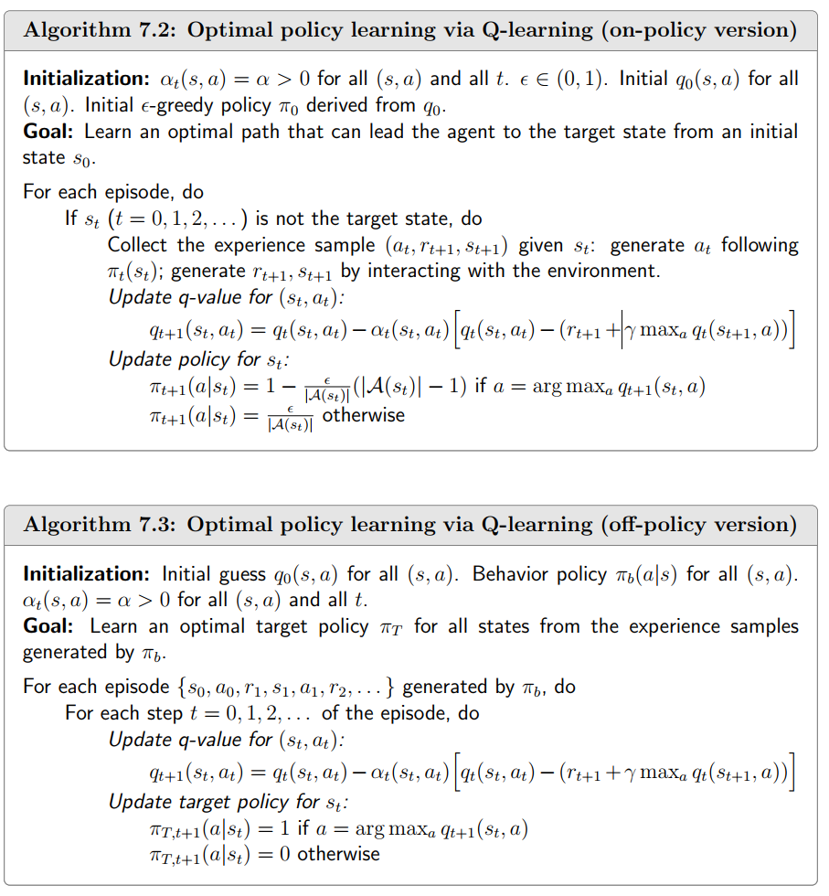
需要注意的是，off-policy的版本中，policy improvement的策略是greedy，这是因为当生成样本数据的策略$\pi_b$探索性足够时，就不需要再用$\epsilon$-greedy策略去提供探索性了。

### 7.5 A unified viewpoint
到目前为止，我们已经介绍了不同的时序差分（TD）算法，例如 Sarsa、n-step Sarsa 和 Q-learning。本节我们将引入一个统一框架，以涵盖所有这些算法以及蒙特卡洛（MC）学习。

具体来说，用于动作价值估计的 TD 算法可表示为如下统一形式：
$$q_{t+1}(s_t; a_t) = q_t(s_t; a_t) - \alpha_t(s_t; a_t)\bigl[q_t(s_t; a_t) - \bar{q}_t\bigr]; \tag{7.20}$$
其中$\bar{q}_t$为TD target，而介绍的算法的区别就是$\bar{q}_t$的不同，具体对比如下图所示：
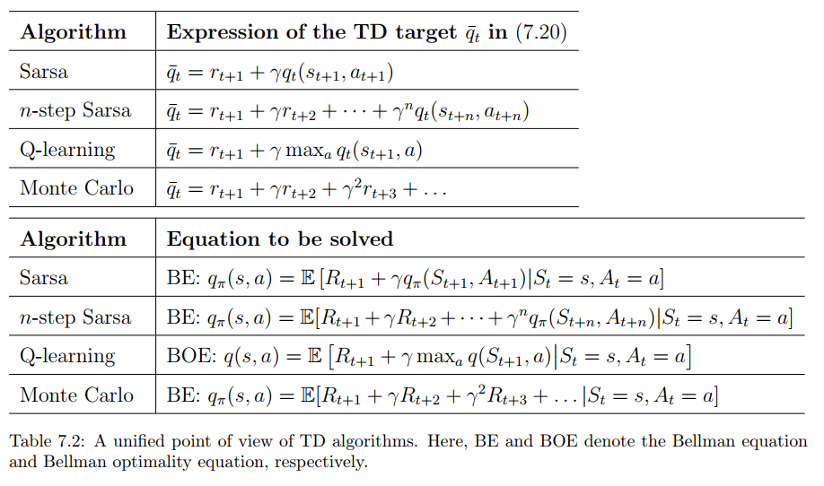
式 (7.20) 可被视为求解如下统一方程的随机近似算法：
$$q(s, a) = \mathbb{E}\bigl[\bar{q}_t \big| s, a\bigr]$$
该方程会随$\bar{q}_t$形式的不同而呈现不同表达式，这些表达式汇总于表 7.2。

可以看到，除 Q-learning以求解贝尔曼最优方程为目标外，其余所有算法均以求解贝尔曼方程为目标。

## Lec8 Value Function Methods
这一章我们学习时序差分算法，但是和前面不同的是，前面state/action value都是表格形式表示的，这很直观，但当状态很多的时候，这种方式会占用很大的存储，所以这一章引入*value function*去解决问题，这也为神经网络的引入奠定基础。

### 8.1 Value representation: From table to function
我们通过一个例子去解释tabular和function approximation方法的区别。

假设存在 n个状态$\{s_i\}_{i=1}^n$，其状态值为$\{v_\pi(s_i)\}_{i=1}^n$（$\pi$是给定的策略）。用$\{\hat{v}(s_i)\}_{i=1}^n$表示真实状态值的估计。

若采用表格法，估计值可通过如下表格维护，该表格可在内存中存储为数组或向量；要检索或更新任意值，直接读取或改写表格中对应的条目即可。
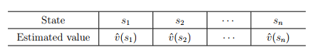

我们可以通过函数去近似上述离散的点，这些点用$(s_i,\hat{v}(s_i))$来表示，可以通过一条曲线进行拟合，这里以最简单的直线为例：
$$\hat{v}(s, w) = as + b = \underbrace{[s,\ 1]}_{\phi^T(s)} \underbrace{\begin{bmatrix} a \\ b \end{bmatrix}}_{w} = \phi^T(s)w \tag{8.1}$$
上式中，$\hat{v}(s, w) $是对状态值的近似的函数，其由状态$s$和参数向量$w$共同决定。其中，$\phi(s)$被称为状态$s$的**特征向量**。我们实际近似的最终效果由特征向量的形式决定，在近似的过程是对于$w$不断地更新，来获得更好的近似效果。

表格法与函数近似法的第一个显著区别，体现在 “如何检索和更新值” 上:
* **如何检索值：**
  1. 当值用表格表示时，若要检索某个值，直接读取表格中对应的条目即可；
  2. 但当值用函数表示时，检索过程会稍复杂 —— 需要将状态索引s输入函数并计算函数值，如图8.3，对于式 (8.1) 的例子，需先计算特征向量$\phi(s)$，再计算$\phi^T(s)w$；若函数是神经网络，则从输入到输出进行前向传播。
  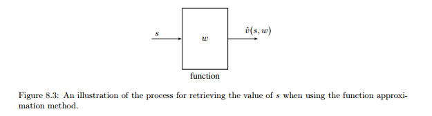

  函数近似法在存储效率上更优，原因在于其值的检索方式：表格法需要存储 n个值，而函数近似法只需存储低维的参数向量 w，因此存储效率可显著提升。
  不过，这种优势并非无代价 —— 状态值可能无法被函数准确表示，这也是该方法被称为 “近似法” 的原因。从本质上看，用低维向量表示高维数据集时，必然会损失部分信息。因此，**函数近似法是通过牺牲精度来提升存储效率**的。

* **如何更新值：**
  1. 当值用表格表示时，若要更新某个值，直接改写表格中对应的条目即可；
  2. 但当值用函数表示时，更新方式完全不同 —— 必须通过更新参数$w$来间接改变值（如何更新$w$以得到最优状态值，后续会详细介绍）
   
  得益于这种值的更新方式，函数近似法还有另一个优点：其**泛化能力**强于表格法。这很容易理解，表格法中，只有当某状态在一个回合中被访问时，才能更新其对应的值，未被访问的状态，其值无法更新；而函数法是在更新$w$，一改变其他未访问的状态的估计值也会改变。

实际中，我们可以采用复杂度更高、近似能力也更强的函数，来替代上述的直线函数，例如多项式曲线，但同时$w$的参数量也会相应增加。

需要注意的是：无论上述情况选取哪个特征向量，近似函数$\hat{v}(s, w)$关于$w都是线性的。（尽管该函数关于状态s可能是非线性的）这类方法被称为**线性函数近似**，它是形式最简单的函数近似方法。

要实现线性函数近似，核心是**选择合适的特征向量**$\phi(s)$也就是说，我们需要预先确定：应当采用一阶直线、还是二阶曲线来对数据点进行拟合。合适特征向量的选取绝非易事，这需要我们掌握待求解任务的先验知识 —— 对任务的理解越透彻，就越能选出优质的特征向量。

举个例子：如果我们已知图 8.2 中的数据点大致分布在一条直线上，那么直接用直线拟合即可。但在实际应用中，这类先验知识往往是未知的。当我们不具备任何先验知识时，一种主流的解决方案是：采用**神经网络**来实现非线性函数近似。

另一个核心问题是：如何求解最优的参数向量$w$。如果我们已知所有状态的真实价值$\{v_{\pi}(s_i)\}_{i=1}^n$,那么这个问题就转化为一个最小二乘问题。此时，最优参数可通过优化如下的目标函数求解得到：
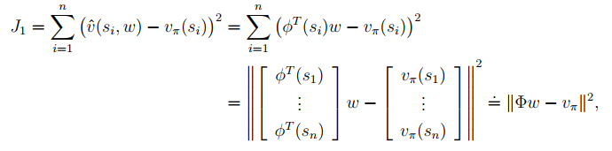
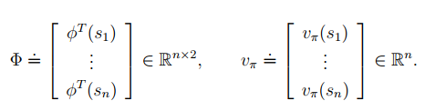
其解为：
$$w^* = \left( \Phi^T \Phi \right)^{-1} \Phi^T v_\pi.$$

### 8.2 TD learning of state values based on function 
这一节我们将上述的函数近似与TD-learning相结合，从而实现对于state value乃至action value的函数估计。

#### 8.2.1 Objective function（目标函数）
我们令$v_\pi(s)$和$\hat{v}(s, w)$分别为状态$s\in \mathcal{S}$的真实状态值和估计状态值，我们的目标就是找到一个optimal的参数$w$，使得$\hat{v}(s, w)$能对每个状态下的真实状态值$v_\pi(s)$实现最优近似。具体可以将上述问题转化为一个**优化问题**，其目标函定义为：
$$J(w) = \mathbb{E}\left[\left(v_\pi(S) - \hat{v}(S, w)\right)^2\right], \tag{8.3}$$
其中，期望是对随机变量$S\in\mathcal{S}$计算的。我们需要知道随机变量$S$的概率分布来帮助我们计算这个期望。$S$的概率分布可以分为以下两种：
* Uniform distribution(均匀分布)
  均匀分布下每个状态的概率设为$\frac{1}{n}$，此时意味着所有的状态是同等重要的，（8.3）的目标函数可以改写为：
  $$J(w) = \frac{1}{n} \sum_{s \in \mathcal{S}} \left(v_\pi(s) - \hat{v}(s, w)\right)^2, \tag{8.4}$$
  这是所有状态近似误差的平均值。然而，这种方式没有考虑给定策略下马尔可夫过程的真实动态，比如有的状态在策略下很少被访问到，将所有状态视为同等重要可能是不合理的，那么就要引入下面的平稳分布。

* **Stationary distribution(平稳分布)**
  这是本章的重点。平稳分布描述了马尔可夫决策过程的长期行为，更具体地说，在智能体执行给定策略足够长的时间后，其位于任意状态的概率可以由该平稳分布来描述。简单来说就是当执行给定策略的序列足够长时，agent出现在各个状态的概率是趋向于稳定的。

  基于上述的内容，我们可以得到平稳分布下的目标函数：令$\{{d_{\pi}(s)}_{s\in \mathcal{S}}\}$表示策略 π下马尔可夫过程的平稳分布。也就是说，经过长时间后，智能体访问状态s的概率为 $d_π(s)$。根据定义：$\sum_{s \in \mathcal{S}} d_\pi(s) = 1$，故（8.3）中的目标函数可以写为：
  $$J(w) = \sum_{s \in \mathcal{S}} d_\pi(s) \left(v_\pi(s) - \hat{v}(s, w)\right)^2 \tag{8.5}$$
  这是近似误差的**加权平均**。被访问概率更高的状态会被赋予更大的权重。
  值得注意的是，$d_{\pi}(s)$的值并不容易获得，虽然可以通过一个方程$d_{\pi}^T=d_{\pi}^T P_{\pi}$直接求解，但这个方程需要知道状态转移概率矩阵$P_{\pi}$(详见P157)。幸运的是，实际中我们不需要计算$d_{\pi}(s)$的具体值就能去最小化这个目标函数，下一个小节会进行说明。

#### 8.2.2 Optimization algorithms
针对于上述的目标函数，我们可以使用前面学到的梯度下降法：
$$w_{k+1} = w_k - \alpha_k \nabla_w J(w_k)$$
其中梯度的计算如下：
$$\begin{align*}
\nabla_w J(w_k) &= \nabla_w \mathbb{E}\left[\left(v_\pi(S) - \hat{v}(S, w_k)\right)^2\right] \\
&= \mathbb{E}\left[\nabla_w \left(v_\pi(S) - \hat{v}(S, w_k)\right)^2\right] \\
&= 2\mathbb{E}\left[\left(v_\pi(S) - \hat{v}(S, w_k)\right)\left(-\nabla_w \hat{v}(S, w_k)\right)\right] \\
&= -2\mathbb{E}\left[\left(v_\pi(S) - \hat{v}(S, w_k)\right)\nabla_w \hat{v}(S, w_k)\right].
\end{align*}$$
因此可以得到梯度下降算法：
$$w_{k+1} = w_k + 2\alpha_k \mathbb{E}\left[\left(v_\pi(S) - \hat{v}(S, w_k)\right)\nabla_w \hat{v}(S, w_k)\right], \tag{8.11}$$
其中$α_k$前的系数2可以不失一般性地合并到$α_k$中。(8.11)需要计算期望，我们可以使用随机梯度下降的思想，用随机梯度替代真实梯度，得到下式：
$$w_{t+1} = w_t + \alpha_t \left(v_\pi(s_t) - \hat{v}(s_t, w_t)\right)\nabla_w \hat{v}(s_t, w_t), \tag{8.12}$$
其中$s_t$是时间$t$时$S$的一个样本。
值得注意的是，**(8.12) 是不可实现的，因为它需要真实的状态值**$v_{\pi}$，而这个值是未知的，必须被估计，我们需要使用近似值来替代$v_{\pi}（s_t）$，下面有两种方法：

* **Monto Carlo(蒙特卡洛方法)：**
  假设我们有一个 episode$(s_0,r_1,s_1,r_2)$，令$g_t$为从$s_t$开始的discounted return，那么$g_t$可以用作$v_{\pi}（s_t）$的近似：
  $$w_{t+1} = w_t + \alpha_t \left(g_t - \hat{v}(s_t, w_t)\right)\nabla_w \hat{v}(s_t, w_t)$$
  这就是带函数近似的MC learning算法。

* **TD(时序差分方法)：**
  基于TD 学习的思想，$r_{t+1} + \gamma \hat{v}(s_{t+1}, w_t)$可以用作$v_{\pi}（s_t）$的近似：
  $$w_{t+1} = w_t + \alpha_t \left[r_{t+1} + \gamma \hat{v}(s_{t+1}, w_t) - \hat{v}(s_t, w_t)\right]\nabla_w \hat{v}(s_t, w_t). \tag{8.13}$$
  这就是带函数近似的 TD 学习算法，具体的算法细节如下图所示。
  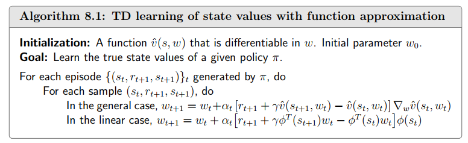

理解 **(8.13) 中的 TD 算法**对于学习本章中的其他算法至关重要。值得注意的是，(8.13) 只能学习给定策略的**状态价值**。在 8.3.1 和 8.3.2 节中，它将被扩展为可以学习**动作价值**的算法。

#### 8.2.3 Selection of function approximators
为了应用 (8.13) 中的 TD 算法，我们需要选择合适的$\hat{v}(s_t, w_t)$。有两种方法可以做到这一点。第一种是使用人工神经网络作为非线性函数近似器。神经网络的输入是状态s，输出是状态的近似值$\hat{v}(s_t, w_t)$，网络参数是$w$；第二种是简单地使用线性函数：
$$\hat{v}(s, w) = \phi^T(s)w$$
其中$\phi(s)\in \mathbb{R}^m$是状态$s$的特征向量。$\phi(s)$和$w$的长度均为$m$，而$m$通常远小于状态数量。在线性情况下，梯度为：
$$\nabla_w \hat{v}(s, w) = \phi(s)$$
代入（8.13）可以得到：
$$w_{t+1} = w_t + \alpha_t \left[r_{t+1} + \gamma \phi^T(s_{t+1})w_t - \phi^T(s_t)w_t\right]\phi(s_t). \tag{8.14}$$

这就是带线性函数近似的 TD 学习算法，我们简称为 TD-Linear。

线性情况在理论上比非线性情况更容易理解。然而，其近似能力有限，并且在复杂任务中选择合适的特征向量也并非易事。相比之下，人工神经网络可以作为黑箱式的通用非线性近似器，使用起来更加友好。

尽管如此，研究线性情况仍然很有意义。对线性情况的深入理解，能帮助读者更好地掌握函数近似方法的思想。此外，对于本书中考虑的简单网格世界任务，线性情况就已足够。更重要的是，线性情况依然很强大，因为**表格法可以被视为线性情况的一个特例**。更多信息可参见框 8.2(P163)，其实只要令$\phi(s)=e_s$，$e_s$向量只在第s个位置为1，其他均为0。这样用其转置乘上$w$得到的就是一个列表，可以代入进其表达式：
$$\hat{v}(s, w) = \phi^T(s)w=e_s^Tw=w(s)$$

#### 8.2.4 Illustrative examples
这一节通过一个5x5grid world的例子来说明TD-Linear算法在给定策略下估计状态值的应用，同时我们会说明其中很重要的一步————**如何选择特征向量**。

#### 8.2.5 Theoretical analysis
回顾一下我们基于目标函数
$$J(w) = \mathbb{E}\left[\left(v_\pi(S) - \hat{v}(S, w)\right)^2\right], \tag{8.3}$$
得到的随机梯度下降算法：
$$w_{t+1} = w_t + \alpha_t \left(v_\pi(s_t) - \hat{v}(s_t, w_t)\right)\nabla_w \hat{v}(s_t, w_t), \tag{8.12}$$
我们前面已经说明过由于$v_{\pi}(s_t)$是未知的，故在实际算法中用近似值去替代，得到TD-Learning和函数近似相结合的算法：
$$w_{t+1} = w_t + \alpha_t \left[r_{t+1} + \gamma \hat{v}(s_{t+1}, w_t) - \hat{v}(s_t, w_t)\right]\nabla_w \hat{v}(s_t, w_t). \tag{8.13}$$
当时直接替换，是不严谨的，这一节书上给出了替换后算法收敛性的证明。

值得注意的是，上述算法实际上优化的不是（8.3）的目标函数，只是为了故事的顺畅进行的操作。

上式实际上优化的是projected Bellman error（投影贝尔曼误差）：
$$J_{PBE}(w) = \|\hat{v}(w) - M T_\pi(\hat{v}(w))\|_D^2$$
详细的证明解释部分参考书上。

### 8.3 TD learning of action values based on function approximation
8.2节我们学习了对于state value的函数近似，而这一节，我们拓展到对于action value 的近似————结合Sarsa/Q-learning的函数近似。

#### 8.3.1 Sarsa with function approximation
带函数近似的 Sarsa 算法可以很容易地从 (8.13) 得到，只需将**state value替换为action value**即可：
$$w_{t+1} = w_t + \alpha_t \left[r_{t+1} + \gamma \hat{q}(s_{t+1}, a_{t+1}, w_t) - \hat{q}(s_t, a_t, w_t)\right]\nabla_w \hat{q}(s_t, a_t, w_t). \tag{8.35}$$
当使用线性函数近似时，我们有：
$$\hat{q}(s,a,w) = \phi^T(s,a)w$$
其中$\phi(s,a)$是特征向量，这种情况$\nabla_w \hat{q}(s,a,w) = \phi(s,a)$

将（8.35）的value estimation和policy improvement相结合就能去学习最优策略，详细的算法如下图所示：
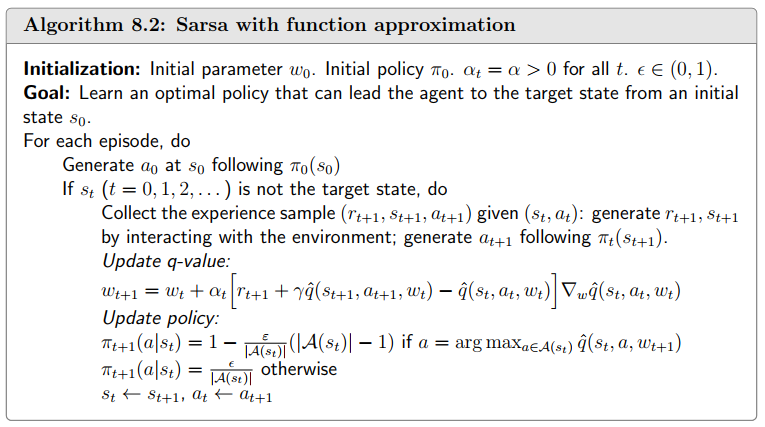

需要注意的是，要准确估计给定策略的动作价值，需要充分多次地运行 (8.35)，然而上述实际算法中在策略改进前只会用（8.35）更新一次，这与tabular的Sarsa是类似的，这并不会影响最终的收敛性。

此外算法 8.2 中的实现旨在解决从**指定起始状态到目标状态的寻路任务**。因此，它无法为每个状态找到最优策略。但是，如果有足够的经验数据，实现过程可以很容易地调整，以找到每个状态的最优策略。

书中给出了一个基于线性值近似的Sarsa算法寻路示例，线性特征向量被选为 5 阶傅里叶函数。在这个示例中，任务是找到一个好的策略，使智能体从左上状态出发时能够到达目标状态。总奖励和每个 episode 的长度逐渐收敛到稳定值。详见书P180。

#### 8.3.2 Q-learning with function approximation
表格形式的Q-learning也可以拓展到函数近似的场景。更新算法为：
$$w_{t+1} = w_t + \alpha_t \left[r_{t+1} + \gamma \max_{a \in \mathcal{A}(s_{t+1})} \hat{q}(s_{t+1}, a, w_t) - \hat{q}(s_t, a_t, w_t)\right]\nabla_w \hat{q}(s_t, a_t, w_t). \tag{8.36}$$
这与Sarsa（8.35）的类似，只是target不同。

与表格型情况类似，(8.36) 可以以 on-policy 或 off-policy 的方式实现。on-policy 版本在算法 8.3 中给出。图 8.10 展示了一个演示 on-policy 版本的示例。在这个示例中，任务是找到一个好的策略，使智能体从右上状态出发时能够到达目标状态。
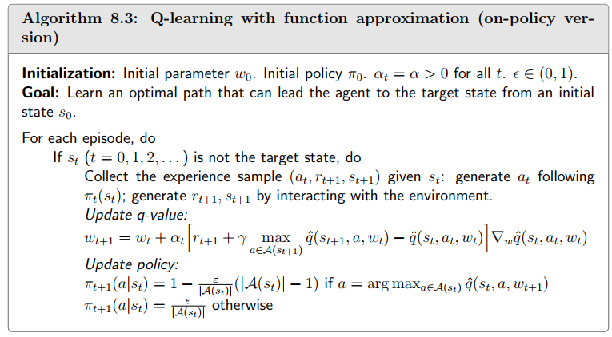

你会注意到在算法 8.2 和算法 8.3 中，尽管（价值）函数是以函数形式表示的，但**策略**$π(a∣s)$**仍然是以表格形式表示的**。因此，这两种算法依然假设状态和动作的数量是有限的。在第 9 章中，我们会看到**策略也可以表示为函数形式**，从而能够处理**连续的状态空间和动作空间**。

### 8.4 Deep Q-learning
我们可以将深度神经网络集成到 Q-learning 中，得到一种称为Deep Q-learning或DQN(deep Q-network)的方法。Deep Q-learning是最早最成功将深度学习引入RL中的算法。值得注意的是，神经网络不一定需要很深。对于像我们的网格世界示例这样的简单任务，带有一到两个隐藏层的浅层网络可能就足够了。

Deep Q-learning可以被视为式 (8.36) 中算法（Q-learning和value function approximation集结合算法）的扩展。然而，其数学公式和实现技术有很大不同，值得特别关注。

#### 8.4.1 Algorithm description
从数学上讲，DQN旨在最小化以下目标函数：
$$J = \mathbb{E}\left[\left(R + \gamma \max_{a \in \mathcal{A}(S')} \hat{q}(S', a, w) - \hat{q}(S, A, w)\right)^2\right], \tag{8.37}$$
其中涉及到四个随机变量$(S,A,R,S')$，分别表示状态、动作、即时奖励和下一状态。该目标函数可以被视为贝尔曼最优平方误差，这是因为
$$q(s,a) = \mathbb{E}\left[R_{t+1} + \gamma \max_{a \in \mathcal{A}(S_{t+1})} q(S_{t+1}, a) \mid S_t = s, A_t = a\right], \quad \text{for all } s,a$$
是贝尔曼最优方程（证明见框 7.5），目标函数的优化就是在缩小$\hat{q}(S, A, w)$与上述最优action value的误差。因此，当$\hat{q}(S, A, w)$能够准确的近似最优action value 时，$R + \gamma \max_{a \in \mathcal{A}(S')} \hat{q}(S', a, w) - \hat{q}(S, A, w)$在期望意义下应该等于0。

为了最小化式 (8.37) 中的目标函数，我们可以使用梯度下降算法。但在计算梯度时，我们发现$w$不仅出现在$\hat{q}(S, A, w)$，还出现在$y\doteq\gamma \max_{a \in \mathcal{A}(S')} \hat{q}(S', a, w)$中，后者的梯度很难去计算。

于是在实际中我们引入了**两个network**来简化梯度求解：
* **main network**:用来表示$\hat{q}(s, a, w)$，每新增一次采样都要更新一次。
* **target network**:用来表示$\hat{q}(s, a, w_T)$，一般是固定的，相隔特定的次数，将$w$的值赋给$w_T$，再保持不变。
这个时候，当$w_T$固定时，上述的目标函数就变为：
$$J = \mathbb{E}\left[\left(R + \gamma \max_{a \in \mathcal{A}(S')} \hat{q}(S', a, w_T) - \hat{q}(S, A, w)\right)^2\right]$$
相应的我们可以得到其**梯度计算公式**：
$$\nabla_w J = -\mathbb{E}\left[\left(R + \gamma \max_{a \in \mathcal{A}(S')} \hat{q}(S', a, w_T) - \hat{q}(S, A, w)\right)\nabla_w \hat{q}(S, A, w)\right], \tag{8.38}$$
在使用上式的梯度去最小化目标函数时，我们需要关注两个技术：
* 第一种技术是**使用两个网络**：主网络和目标网络，这在我们计算 (8.38) 中的梯度时已经提到。下面将详细说明实现细节：

  令$w$和$w_T$分别表示主网络和目标网络的参数。它们的初始值被设置为相同。

  在每次迭代中，我们从经验回放缓冲区（replay buffer，稍后会解释）中抽取一个小批量样本 
  $\{(s,a,r,s')\}$。主网络的输入是$s$和$a$，输出$y=\hat{q}(s,a,w)$是估计的 Q 值。输出的目标值为$y_T \doteq r + \gamma \max_{a \in \mathcal{A}(s')} \hat{q}(s', a, w_T)$主网络被更新以最小化样本$\{(s,a,y_T)\}$上的 TD 误差（也称为损失函数）$\sum (y - y_T)^2$.

  更新主网络中的$w$并不显式使用 (8.38) 中的梯度，而是依赖于训练神经网络的现有软件工具。因此，我们需要用一个小批量样本来训练网络，而不是像 (8.38) 那样使用单个样本来更新主网络。这是深度强化学习与非深度强化学习算法之间的一个显著区别。

  主网络在每次迭代中都会更新。相比之下，目标网络每隔一定次数的迭代才被设置为与主网络相同，以满足在计算 (8.38) 中梯度时$w_T$是固定的这一假设。

* 第二种技术是**经验回放（experience replay）**：在收集到一些经验样本后，我们不会按照收集的顺序使用它们，而是将它们存储在一个称为经验回放缓冲区（replay buffer）的数据集中。次更新主网络时，我们都可以从经验回放缓冲区中抽取一个小批量的经验样本。**样本的抽取（称为经验回放）应遵循均匀分布**。
  
  为什么经验回放在DQN中是必要的，并且为什么回放必须遵循均匀分布？答案在于 (8.37) 中的目标函数：
  $$J = \mathbb{E}\left[\left(R + \gamma \max_{a \in \mathcal{A}(S')} \hat{q}(S', a, w) - \hat{q}(S, A, w)\right)^2\right], \tag{8.37}$$
  具体来说，为了恰当地定义目标函数，我们必须指定$S,A,R,S'$的概率分布，$R$和$S'$ 的分布由系统模型$(S,A)$给定，描述$(S,A)$分布的最简单方式是假设它是**均匀分布的**。

  然而，在实践中，状态 - 动作样本可能不是均匀分布的，因为它们是根据行为策略生成的样本序列。有必要**打破序列中样本之间的相关性**，以**满足均匀分布的假设**。为此，我们可以使用经验回放技术，从回放缓冲区中均匀地抽取样本。

  随机采样的一个好处是，每个经验样本可以被多次使用，这可以提高数据效率。在我们数据量有限时，这一点尤为重要。

下面给出了Deep Q-learning的off-policy算法细节：
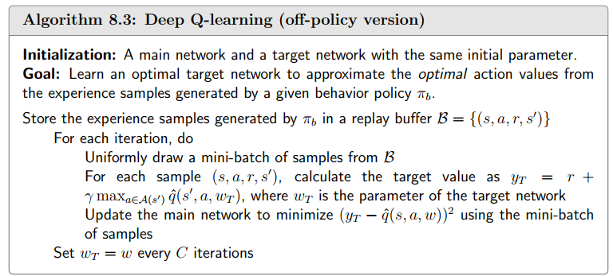
我们需要**重点关注这个算法流程**，有三个问题：
1. **为什么没有策略更新？**
   其实很简单，因为上述算法是off-policy的，根本不需要策略更新，只需要有策略生成的数据即可。
   当然可以改为on-policy的形式，论文原文就是使用的on-policy。想要得到最优的策略，其实直接在action value的估计结束后用一次策略更新即可。
2. **为什么迭代公式与上面介绍的不同？**
  因为上述固定一个$w_T$求另一个的梯度的方法是很底层、原理性的，帮助我们理解的。实际我们跟深度学习结合，上述的过程是直接通过成熟的工具黑盒处理的。
  所以这里的算法是结合了深度学习对于批量训练的要求。我们只需要从数据集中得到一个样本$(s,a,r,s')$：
     * 用$(r,s')$代入目标网络得到$y_T$
     * 用$(s,a)$代入主网络得到$\hat{q}$
  就可以直接用神经网络去最小化误差$(y_T-\hat{q}(s,a,w))^2$

1. **算法跟论文原本的算法不同**
  算法的本质是一样的。
     * 本算法的网络选取是$s,a$输入，$\hat{q}$输出，论文中是$s$输入，直接输出5个action value的值，相对而言输入减少，是更高效的，但对于网络训练的技巧也有要求。
     * 论文算法中使用的是on-policy,而本文中是off-policy，并不影响最终的结果，只是性能和适用范围有所不同。

#### 8.4.2 Illustrative examples
详见P184.

DQN相较于tabular形式的Q-learning，表现出了数据利用的高效性。在例子中一个1000steps的episode就足以训练出最优的策略，而使用表格形式时，足足使用了100000steps的episode才得到最优策略。

表格 Q-learning 采用查表式存储每个状态 - 动作对的 Q 值，无泛化能力，必须逐个状态探索更新，因此需要更长的 episode 来覆盖所有状态；而 DQN 用神经网络作为函数近似器，能从少量经验中学习到空间规律并泛化到未见过的状态，再配合经验回放和目标网络等技术，大幅提升了学习效率，因此只需更短的 episode 就能收敛到较好的策略。

### 8.5 Summary
本章继续介绍了 TD 学习算法，但从**表格法转向了函数近似法**。理解函数近似法的关键在于，它本质上是一个优化问题。最简单的目标函数是真实状态价值与估计价值之间的平方误差，还有其他目标函数，如贝尔曼误差和投影贝尔曼误差。我们已经证明，TD-Linear 算法实际上最小化的是投影贝尔曼误差。

本章还介绍了几种优化算法，例如**带价值近似的 Sarsa 和 Q-learning**。

价值函数近似法之所以重要，一个原因是它允许**将人工神经网络与强化学习相结合**。例如，Deep Q-learning就是最成功的深度强化学习算法之一。

尽管神经网络已被广泛用作非线性函数近似器，但本章对线性函数情况进行了全面介绍。充分理解线性情况对于更好地理解非线性情况至关重要。

本章还引入了一个重要概念————**平稳分布**。平稳分布在价值函数近似法中定义合适的目标函数时扮演着重要角色，在第 9 章我们用函数近似策略时，它也将起到关键作用。

## Lec9 Policy Gradient Methods
函数近似的思想不仅可以应用于state/action value的计算上，还可以应用在策略的表示上。在本书中，策略此前一直以表格形式表示：所有状态的动作概率都存储在表格中（例如表 9.1）。本章将展示，**策略可由参数化函数表示**，记为\(\pi(a|s,\theta)\)，其中\(\theta \in \mathbb{R}^m\)是参数向量。

当策略以函数形式表示时，可通过优化某些标量指标（scalar metrics）来获得最优策略。这类方法称为**策略梯度**。策略梯度方法是本书的一大进步，因为它是基于策略的。相比之下，本书前几章讨论的均为基于价值的方法。策略梯度方法具有诸多优势，例如，它在处理大规模状态 / 动作空间时效率更高，泛化能力更强，因此在样本使用效率上也更具优势。

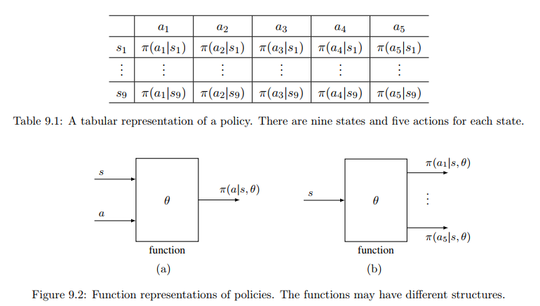

### 9.1 Policy representation: From table to function
当策略的表示方式从表格切换为函数时，有必要明确这两种表示方法的区别。
1. **如何定义最优策略？**
   以表格形式表示时，若一个策略能最大化每个状态价值，则被定义为最优；以函数形式表示时，若一个策略能**最大化某些scalar metrics**，则被定义为最优。
2. **如何更新策略？**
   以表格形式表示时，可通过直接修改表格中的条目来更新策略；以参数化函数形式表示时，策略无法再以此方式更新，而只能通过**改变参数**$θ$来更新。
3. **如何获取动作的概率？**
   在表格情形下，可通过直接查找表格中对应的条目来获取动作的概率；在函数表示情形下，需要将$(s,a)$输入函数来计算其概率（见图 9.2 (a)）。根据函数的结构，我们也可以输入一个状态，然后输出所有动作的概率（见图 9.2 (b)）。

基于上述的区别，可以给出policy gradient的i基本思想：假设$J(\theta)$是我们需要的scalar metrics，通过基于梯度的算法优化该指标，即可获得最优策略：
\[\theta_{t+1} = \theta_t + \alpha \nabla_\theta J(\theta_t)\]
其中$\nabla_\theta J$是$J$关于$\theta$的梯度，$t$是时间步，$\alpha$是优化步长（学习率）。

后边几节基于上述基本思想，会详细介绍算法。

### 9.2 Metrics for defining optimal policies
当策略由函数表示时，定义最优策略的指标有两类：一类基于状态价值，另一类基于即时奖励。
#### Metric 1:Average state value
第一种指标是average state value，或简称为average value，其**定义为**：
$$\bar{v}_\pi = \sum_{s \in \mathcal{S}} d(s) v_\pi(s)$$
其中$d(s)$是状态$s$的权重。它满足：对任意$s\in \mathcal{S}$,$d(s)\leq 0$,且$\sum_{s\in \mathcal {S}}d(s)=1$。在另一个角度，$d(s)$其实就是状态$s$的概率分布（probability distribution）。此时，该指标**也可写作**：
\[\bar{v}_\pi = \mathbb{E}_{S \sim d} [v_\pi(S)]\]
如何去选取$d$的分布呢？这是一个重要问题，主要分为两种情况：

* 第一种也是最简单的情况是，$d$**与策略**$π$**无关**
  此时，我们将其记为$d_0$,对应的平均价值记为$\bar{v}_{\pi}^0$**以表明该分布与策略无关**。
  * 一种情形是将所有状态视为同等重要，选择\(d_0(s) = 1/|\mathcal{S}|\)
  * 另一种情形是仅关注特定状态$s_0$（例如，智能体始终从$s_0$出发），此时可设计：\(d_0(s_0) = 1,\ d_0(s \ne s_0) = 0\)
  

* 第二种情况是$d$**依赖于策略**$π$
  在这种情况下，通常选择$d$为$d_{\pi}$，即策略 $\pi$下的平稳分布。而根据前一章关于平稳分布的知识，$d_{\pi}$**一个基本性质**应该满足：
  \[d_\pi^T P_\pi = d_\pi^T\]

  为什么选择平稳分布呢？
  平稳分布反映了马尔可夫决策过程在给定策略下的长期行为。如果某个状态在长期中被频繁访问，它就更重要，应被赋予更高的权重；如果某个状态很少被访问，其重要性就较低，应被赋予更低的权重。

顾名思义，$\bar{v}_{\pi}$是状态价值的加权平均。不同的$\theta$值会导致不同的$\bar{v}_{\pi}$值。我们的最终目标是找到一个最优策略（最优的$\theta$）,来最大化我们的metrics $\bar{v}_{\pi}$

接下来，我们介绍$\bar{v}_{\pi}$的另外两个重要等价表达式，这在论文中更加常见。
* 假设智能体遵循给定策略$\pi(\theta)$收集奖励$\{R_{t+1}\}_{t=0}^{\infty}$读者在文献中可能经常看到如下指标：
  \[J(\theta) = \lim_{n \to \infty} \mathbb{E}\left[ \sum_{t=0}^n \gamma^t R_{t+1} \right] = \mathbb{E}\left[ \sum_{t=0}^\infty \gamma^t R_{t+1} \right]\tag{9.1}\]

  这个指标初看可能不易理解。事实上，它与$\bar{v_{\pi}}$是等价的。为了说明这一点，我们有：
  $$
  \begin{align*}
  \mathbb{E}\left[ \sum_{t=0}^\infty \gamma^t R_{t+1} \right]
  &=\sum_{s \in \mathcal{S}}d(s)\mathbb{E}\left[ \sum_{t=0}^\infty \gamma^t R_{t+1} \mid S_0 = s \right]\\
  &=\sum_{s \in \mathcal{S}}d(s)v_{\pi}(s)\\
  &=\bar{v}_{\pi}
  \end{align*}
  $$
  上述等式中的第一个等号是由于**全期望公式**，第二个等号则是根据**状态价值的定义**。
* metric $\bar{v}_{\pi}$ 也可以被重写为两个向量的内积。具体来说，令：
  \[
  \begin{align*}
  v_\pi &= \left[ \dots, v_\pi(s), \dots \right]^T \in \mathbb{R}^{|\mathcal{S}|}\\
  d &= \left[ \dots, d(s), \dots \right]^T \in \mathbb{R}^{|\mathcal{S}|}
  \end{align*}
  \]
  那么我们就有：
  $$\bar{v}_{\pi}=d^Tv_{\pi}$$
  这个表示在我们分析**梯度计算**时很有用。
  
#### Metric 2: Average reward
第二种指标是平均单步奖励（average one-step reward），或简称为平均奖励(avarge reward)。其定义为：
$$
\begin{align*}
\bar{r}_\pi &\doteq \sum_{s \in \mathcal{S}} d_\pi(s) r_\pi(s)\\
&= \mathbb{E}_{S \sim d_\pi} [r_\pi(S)]\tag{9.2}
\end{align*}
$$
其中$d_{\pi}$是平稳分布，而
$$
r_\pi(s) \doteq \sum_{a \in \mathcal{A}} \pi(a|s,\theta) r(s,a)\tag{9.3}
$$
是即时奖励的期望。这里，\(r(s,a) \doteq \mathbb{E}[R|s,a] = \sum_r r p(r|s,a)\)

事实上，$r(s,a)$对$a$求期望得到了$r_\pi(s)$，而$r_\pi(s)$对于$s$求期望就得到了metric:$\bar{r}_\pi$。

接下来，我们给出$\bar{r}_\pi$的另外两个重要等价表达式:

* 假设智能体遵循给定策略$\pi(\theta)$收集奖励$\{R_{t+1}\}_{t=0}^\infty$。读者在文献中常见的一个指标是：
  $$J(\theta) = \lim_{n \to \infty} \frac{1}{n} \mathbb{E}\left[ \sum_{t=0}^{n-1} R_{t+1} \right]\tag{9.4}$$
  这个指标初看可能不易理解。事实上，它与$\bar{r}_\pi$等价：
  $$\lim_{n \to \infty} \frac{1}{n} \mathbb{E}\left[ \sum_{t=0}^{n-1} R_{t+1} \right] = \sum_{s \in \mathcal{S}} d_\pi(s) r_\pi(s) = \bar{r}_\pi\tag{9.5}$$
  式 (9.5) 的证明见框 9.1。

* 式 (9.2) 中的平均奖励$\bar{r}_\pi$也可写作两个向量的内积。具体来说，令：
  $$
  \begin{align*}
  r_\pi = \left[ \dots, r_\pi(s), \dots \right]^T \in \mathbb{R}^{|\mathcal{S}|}\\
  d_\pi = \left[ \dots, d_\pi(s), \dots \right]^T \in \mathbb{R}^{|\mathcal{S}|}
  \end{align*}
  $$
  其中$r_{\pi}(s)$由式 (9.3) 定义。于是，显然有：
  $$\bar{r}_\pi = \sum_{s \in \mathcal{S}} d_\pi(s) r_\pi(s) = d_\pi^T r_\pi$$
  这个表达式在我们**推导其梯度**时会非常有用。

#### Some remarks
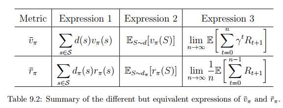
到目前为止，我们已经介绍了两类指标：$\bar{v}_\pi$和$\bar{r}_\pi$	。每个指标都有几种不同但等价的表达式，它们总结在表 9.2 中。

我们有时用$\bar{v}_\pi$特指状态分布为平稳分布 $d_{\pi}$的情形，用$\bar{v}_{\pi}^0$指代$d_0$与$\pi$独立的情形，下面给出关于这些指标的一些补充说明。

* 所有的这些**metrics本质上都是**$\pi$**的函数**。由于策略$\pi$有由$\theta$参数化，因此这些指标也是θ的函数。而我们的核心目标就是去搜索最优的参数$\theta$来最大化设置的metrics。这就是策略梯度方法的基本思想。
* 事实上，基于state value和reward设置的metrics其实是**等价的**。
  在折扣因子$\gamma\leq1$的折扣情形下，$\bar{v}_\pi$**和**$\bar{r}_\pi$**是等价的**，具体来说可以证明：
  $$\bar{r}_\pi=(1-\gamma)\bar{v}_\pi$$
  上述等式表明，这**两个指标可以同时被最大化**。该等式的证明将在后面的引理 9.1 中给出。

  
### 9.3 Gradients of the metrics
基于上一节介绍的指标，我们可以使用基于梯度的方法来最大化它们。为此，我们需要首先计算这些指标的梯度。本章最重要的理论结果是如下定理：

##### Theorem 9.1 (Policy gradient theorem)
$J(\theta)$的梯度公式如下：
$$
\nabla_\theta J(\theta) = \sum_{s \in \mathcal{S}} \eta(s) \sum_{a \in \mathcal{A}} \nabla_\theta \pi(a|s,\theta) q_\pi(s,a)\tag{9.8}
$$
其中$\eta$是状态分布，$\nabla_\theta \pi$是策略$\pi$关于$\theta$的梯度。此外，式子（9.8）可以用期望的形式紧凑地表示为：
$$
\nabla_\theta J(\theta) = \mathbb{E}_{S \sim \eta, A \sim \pi(S,\theta)} \big[ \nabla_\theta \ln \pi(A|S,\theta) q_\pi(S, A) \big]\tag{9.9}
$$
其中$ln$是自然对数。

下面给出关于定理 9.1 的一些重要说明：
* 定理 9.1 是对定理 9.2、9.3 和 9.5 结果的**总结**。这三个定理分别针对不同场景（不同metrics、discounted / undiscounted）。这些场景下的梯度表达式形式相似，因此被总结在定理 9.1 中。

  实际使用时只需要将**不同的指标代入作为**$J(\theta)$即可，可以是$\bar{v}_\pi^0、\bar{v}_\pi、\bar{r}_\pi$。代入不同的值，式子（9.8）中对应的等号可能是严格相等，也可能是近似，对应的分布$\eta$在不同场景下也会有所不同。

* 梯度的推导是策略梯度方法中最复杂的部分。对大多数读者而言，熟悉定理 9.1 的结论即可，无需掌握其证明。本节后续的推导细节对数学要求较高，建议读者根据自身兴趣选择性学习。
  
* 式 (9.9) 比 (9.8) 更受青睐，因为它以期望的形式表达。我们将在 9.4 节中说明，这个真实梯度可以通过随机梯度来近似。

* 为什么 (9.8) 可以表示为 (9.9)？证明如下。根据期望的定义，(9.8) 可重写为：
  $$
  \begin{align*}
  \nabla_\theta J(\theta) 
  &=\sum_{s \in \mathcal{S}} \eta(s) \sum_{a \in \mathcal{A}} \nabla_\theta \pi(a|s,\theta) q_\pi(s,a)\\
  &= \mathbb{E}_{S \sim \eta} \big[ \sum_{a \in \mathcal{A}}\nabla_\theta \pi(a|S,\theta) q_\pi(S, a) \big]
  \end{align*}\tag{9.10}
  $$
  其中可以根据$\ln\pi(a|s,\theta)$的梯度进一步化简式子：
  $$\nabla_\theta \ln \pi(a|s,\theta) = \frac{\nabla_\theta \pi(a|s,\theta)}{\pi(a|s,\theta)}$$
  由此可得：
  $$\nabla_\theta \pi(a|s,\theta)=\pi(a|s,\theta)\nabla_\theta \ln \pi(a|s,\theta)\tag{9.11}$$
  将上式9.11代入9.10可得：
  $$
  \begin{align*}
  \nabla_\theta J(\theta) 
  &=\mathbb{E} \big[ \sum_{a \in \mathcal{A}}\pi(a|S,\theta) \nabla_\theta \ln \pi(a|S,\theta)q_\pi(S, a) \big]\\
  &= \mathbb{E}_{S \sim \eta, A \sim \pi(S,\theta)} \big[ \nabla_\theta \ln \pi(A|S,\theta) q_\pi(S, A) \big]
  \end{align*}
  $$
  上面利用$\ln$的梯度去化简梯度式子，目的是为了将metric的**梯度写成一个期望形式**（对于s和a），这样在实际中，方便使用**SGD算法**去用采样代替期望。

* 需要注意的是，为了保证$\ln \pi(a|s,\theta)$有意义，$\pi(a|s,\theta)$必须对所有$(s,a)$都为正。这可以通过使用 **softmax 函数**来实现：
  $$\pi(a|s,\theta) = \frac{e^{h(s,a,\theta)}}{\sum_{a' \in \mathcal{A}} e^{h(s,a',\theta)}}\tag{9.12}$$
  其中$h(s,a,\theta)$是表示在状态$s$下选择动作$a$偏好的函数。式 (9.12) 中的策略满足$\pi(a|s,\theta)\in (0,1)$,且$\sum_{a\in\mathcal{A}}\pi(a|s,\theta)=1$(对于任意的$s\in \mathcal{S}$)。

  softmax函数实际上是在**归一化（标准化）**，将$（-\infty,\infty）$的向量投射到$(0,1)$上，但不会严格等于0或1。

  该策略可**通过神经网络实现**：网络输入为$s$,输出层为 softmax 层，网络对于所有的$a$输出$\pi(a|s,\theta)$，且和为1。由于对于所有的$a$都有$\pi(a|s,\theta)>0$，故**策略是随机的（stochastic），**因此**具有探索性（exploratory）**。策略不会直接指示采取哪个动作，而是应根据策略的概率分布来生成动作。

  实际中还有**deterministic policy gradient（DPG）**的方法，用来解决**神经网络输出为无穷**的情形。

#### 9.3.1 Derivation of the gradients in the discounted case
接下来就来分析第一种情况，discounted下的梯度计算$\gamma\in(0,1)$。
折扣情形下的state value和action value定义为：
$$
\begin{align*}
v_\pi(s) &= \mathbb{E}\big[ R_{t+1} + \gamma R_{t+2} + \gamma^2 R_{t+3} + \dots \mid S_t = s \big]\\
q_\pi(s,a) = \mathbb{E}\big[ R_{t+1} + \gamma R_{t+2} + \gamma^2 R_{t+3} + \dots \mid S_t = s, A_t = a \big]
\end{align*}
$$

有$v_\pi(s)=\sum_{a\in A}\pi(a|s,\theta)q_\pi(s,a)$，且state value是满足BE的。

首先我们可以证明$\bar{v}_{\pi}(\theta)$和$\bar{r}_\pi(\theta)$是等价的。

##### Lemma 9.1 $\bar{v}_{\pi}(\theta)$和$\bar{r}_\pi(\theta)$等价性
在discounted的情形下$(\gamma\in (0,1))$，满足：
$$\bar{v}_{\pi}(\theta)=(1-\gamma)\bar{r}_\pi(\theta)\tag{9.13}$$
**证明：**
我们注意到$\bar{v}_\pi(\theta)=d_{\pi}^T v_\pi$,$\bar{r}_\pi(\theta)=d_{\pi}^T r_\pi$,而其中$v_\pi$和$r_\pi$满足贝尔曼方程$v_\pi=r_\pi+\gamma P_\pi v_\pi$
在方程的两边同时左乘$d_\pi^T$得到：
$$\bar{v}_\pi = \bar{r}_\pi + \gamma d_\pi^T P_\pi v_\pi = \bar{r}_\pi + \gamma d_\pi^T v_\pi = \bar{r}_\pi + \gamma \bar{v}_\pi$$
其中第二个等号运用了$d_\pi^T$的性质：$d_\pi^T P_\pi=d_\pi^T$，进一步合并同类项得到上述（9.13）。

##### Lemma 9.2 $v_\pi$的梯度
在discounted情形下，对于任意$s\in\mathcal{S}$有：
$$\nabla_\theta v_\pi(s) = \sum_{s' \in \mathcal{S}} \Pr_\pi(s'|s) \sum_{a \in \mathcal{A}} \nabla_\theta \pi(a|s',\theta) q_\pi(s',a)\tag{9.14}$$
其中：
$$\Pr_\pi(s'|s) \doteq \sum_{k=0}^\infty \gamma^k [P_\pi^k]_{ss'} = \big[ (I_n - \gamma P_\pi)^{-1} \big]_{ss'}$$
是策略$\pi$ 下从状态$s$转移到$s'$的（discounted total probability）折扣总概率。这里，$[.]_{ss'}$表示第$s$行第$s'$列的元素，$[P_\pi^k]_{ss'}$是策略$\pi$下恰好经过$k$步从$s$转移到$s'$的概率。

详细的证明参考书P201。

基于引理9.2,我们可以推导出$\bar{v}_\pi^0$的梯度。

##### Theorem 9.2 折扣下$\bar{v}_\pi^0$的梯度
在折扣条件下$\gamma\in(0,1)$，$\bar{v}_\pi^0=d_0^T v_\pi$的梯度为：
$$\nabla_\theta \bar{v}_\pi^0 = \mathbb{E}\big[ \nabla_\theta \ln \pi(A|S,\theta) q_\pi(S, A) \big]$$

其中$S\sim \rho_\pi,A \sim \pi(S,\theta)$。这里的状态分布$\rho_\pi$定义为：
$$\rho_\pi(s) = \sum_{s' \in \mathcal{S}} d_0(s') \Pr_\pi(s|s')，s\in \mathcal{S}\tag{9.19}$$
其中
$$\Pr_\pi(s|s') = \sum_{k=0}^\infty \gamma^k [P_\pi^k]_{s's} = \big[(I - \gamma P_\pi)^{-1}\big]_{s's}$$
是策略$\pi$下从$s'$转移到$s$的折扣总概率。

利用引理 9.1 和引理 9.2，我们可以推导出$\bar{v}_\pi$**和**$\bar{r}_\pi$**的梯度：**

##### Theorem 9.3 折扣下$\bar{r}_\pi$和$\bar{v}_\pi$的梯度
在折扣条件下$\gamma\in(0,1)$，$\bar{r}_\pi$和$\bar{v}_\pi$的梯度为：
$$
\begin{align*}
\nabla_\theta \bar{r}_\pi = (1 - \gamma) \nabla_\theta \bar{v}_\pi
& \approx \sum_{s \in \mathcal{S}} d_\pi(s) \sum_{a \in \mathcal{A}} \nabla_\theta \pi(a|s,\theta) q_\pi(s,a)\\
&=\mathbb{E}\big[ \nabla_\theta \ln \pi(A|S,\theta) q_\pi(S, A) \big]
\end{align*}
$$

其中$S\sim d_\pi,A \sim \pi(S,\theta)$。这里，当$\gamma$越接近1时，近似的精度越高。

具体的证明参考书P203，204。

实际中，我们只需要**掌握理解式子（9.10）即可**，因为引理9.1、9.2和定理9.2、9.3等具体的表达式都可以总结写成（9.10）的形式。
#### 9.3.2 Derivation of the gradients in the undiscounted case
这里略过去，如有需要，参见书P205

### 9.4 Monte Carlo policy gradient (REINFORCE)
利用定理 9.1 给出的梯度，我们接下来展示如何使用基于梯度的方法优化目标函数，以获得最优策略。

用于最大化$J(\theta)$的梯度上升算法为：
$$
\begin{align*}
\theta_{t+1} 
&=\theta_t + \alpha\eta_\theta J(\theta_t)\\
&= \theta_t + \alpha \mathbb{E}\big[\nabla_\theta \ln \pi(A|S, \theta_t) q_\pi(S, A)\big] \tag{9.31}
\end{align*}
$$
其中$\alpha>0$是常数学习率。实际中我们使用随机梯度来替代式子中真实的梯度：
$$\theta_{t+1} = \theta_t + \alpha \nabla_\theta \ln \pi(a_t|s_t, \theta_t) q_t(s_t, a_t) \tag{9.32}$$
需要注意的是，（9.32）已经对于（9.31）中无法获得的$q_\pi(s_t,a_t)$进行了近似，即$q_t(s_t,a_t)$。这个近似计算的不同方法引出了不同的算法。

如果$q_t(s_t,a_t)$是通过蒙特卡洛估计得到的，该算法就被称为 **REINFORCE** 或 **Monto Carlo policy gradient**，它是最早且最简单的策略梯度算法之一。

式 (9.32) 中的算法非常重要，因为许多其他策略梯度算法都可以通过对它进行扩展得到。接下来我们更细致地考察式 (9.32) 的含义。

由于$\nabla_\theta \ln \pi(a|s,\theta) = \frac{\nabla_\theta \pi(a|s,\theta)}{\pi(a|s,\theta)}$，代入（9.32）可以得到：
$$\theta_{t+1} = \theta_t + \alpha \underbrace{\left( \frac{q_t(s_t, a_t)}{\pi(a_t|s_t, \theta_t)} \right)}_{\beta_t} \nabla_\theta \pi(a_t|s_t, \theta_t)$$
进一步简化为：
$$\theta_{t+1} = \theta_t + \alpha \beta_t \nabla_\theta \pi(a_t|s_t, \theta_t) \tag{9.33}$$

从这个方程中可以看到两个重要的解释。
首先，由于式 (9.33) 是一个简单的梯度上升算法，我们可以得到如下观察：

* 若$\beta_t\geq 0$,则选择$(s_t,a_t)$的概率会被增强，即$\pi(a_t|s_t, \theta_{t+1})\geq \pi(a_t|s_t, \theta_t)$,$\beta_t$越大，这种增强效果越强。
* 若$\beta_t\leq 0$,则选择$(s_t,a_t)$的概率会降低，即$\pi(a_t|s_t, \theta_{t+1})\leq \pi(a_t|s_t, \theta_t)$

上述**结论的证明如下**：
当$\theta_{t+1}-\theta_t$足够小时，由于泰勒展开可得：
$$
\begin{aligned}
\pi(a_t|s_t, \theta_{t+1}) &\approx \pi(a_t|s_t, \theta_t) + \big(\nabla_\theta \pi(a_t|s_t, \theta_t)\big)^T (\theta_{t+1} - \theta_t) \\
&= \pi(a_t|s_t, \theta_t) + \alpha \beta_t \big(\nabla_\theta \pi(a_t|s_t, \theta_t)\big)^T \big(\nabla_\theta \pi(a_t|s_t, \theta_t)\big) \quad (\text{代入式 (9.33)}) \\
&= \pi(a_t|s_t, \theta_t) + \alpha \beta_t \|\nabla_\theta \pi(a_t|s_t, \theta_t)\|_2^2.
\end{aligned}
$$
由上式，上述观察是显然的。

此外，该算法在一定程度上可以在 **探索（exploration）与利用（exploitation）** 之间取得平衡，这源于$\beta_t$的表达式：
$$\beta_t=\frac{q_t(s_t, a_t)}{\pi(a_t|s_t, \theta_t)}$$
* 一方面,$\beta_t$与$q_t(s_t,a_t)$成正比，当$(s_t,a_t)$的action value近似较大时，$\beta_t$会相应的变化，代入算法后，$\pi(a_t|s_t,\theta)$会被增大，从而选择$a_t$的概率提高。算法会尝试**利用价值更高的动作**。
* 另一方面，当$q_t(s_t,a_t)>0$时，$\beta_t$与$\pi(a_t|s_t,\theta)$成反比。如果选择$a_t$的概率很小，$\pi(a_t|s_t,\theta)$就会被增大，从而增大选择$a_t$的概率。算法会尝试**探索概率较低的动作**。

所以该算法兼顾了探索和利用性，二者相互平衡。

下面给出了详细的算法流程图：
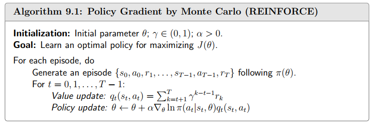

补充一下**算法实现的细节**：
* **如何采样$S$**:
  真实梯度$\mathbb{E}\big[\nabla_\theta \ln \pi(A|S, \theta_t) q_\pi(S, A)\big]$中的$S$应该服从分布$\eta$，这个分布可以是平稳分布$d_\pi$或者折扣总概率分布$\rho_\pi$（见式（9.19））。$d_\pi$和$\rho_\pi$都代表策略$\pi$下的长期行为。

* **如何采样$A$**:
  真实梯度$\mathbb{E}\big[\nabla_\theta \ln \pi(A|S, \theta_t) q_\pi(S, A)\big]$中的$A$
  应服从分布$\pi(A|S, \theta_t)$。采样$A$的理想方式按照$\pi(a|s, \theta_t)$选择$a_t$。因此,**策略梯度算法是on-policy**的。

遗憾的是，在实践中，由于**样本使用效率较低**，上述采样$S$和$A$理想方式并未被严格遵循。式 (9.32) 的一种更具样本效率的实现方式在算法 9.1 中给出。

在算法9.1中，首先按照策略$\pi(\theta)$生成一个 episode，然后使用 episode 中的每一条经验样本对$\theta$进行多次更新。

### 9.5 Summary
本章介绍了策略梯度方法，它是许多现代强化学习算法的基础。策略梯度方法属于基于策略（policy-based） 的方法，这是本书的一大重要进展 —— 因为前几章介绍的所有方法均为基于价值（value-based） 的方法。策略梯度方法的核心思想十分简洁：选取一个合适的标量指标，然后通过梯度上升算法对其进行优化。

策略梯度方法中最复杂的部分是指标梯度的推导过程。这是因为我们必须区分不同指标对应的各类场景，以及有折扣 / 无折扣两种情况。幸运的是，不同场景下的梯度表达式具有相似性。因此，我们将这些表达式总结在**定理 9.1** 中 —— 这也是本章最重要的理论结论。对于多数读者而言，只需理解该定理的核心内容即可；其证明过程并非易事，不要求所有读者都深入钻研。

必须透彻理解**式 (9.32) 中的策略梯度算法**，因为它是许多高级策略梯度算法的基础。在下一章中，该算法将被拓展为另一种重要的策略梯度方法，即actor-critic算法。即使用TD算法去计算$q_t(s_t,a_t)$。

## Lec10 Actor-Critic Methods 
这一章我们将要学习actor-critic方法。首先对于其名字，actor代表着执行者（表演者），对应的是策略的更新，因为action是按照策略执行；而critic的字面意思是评论家，对应的是对策略的估计，实际上是对于值的更新（因为action/state value就代表了策略的优劣）。actor-critic恰好又对应台上演员和台下评论家的关系。

从一个角度来看，actor-critic是将基于值和基于策略的方法相结合的一种方法，也可以从上一章介绍的policy gradient方法推导得到。

### 10.1 The simplest actor-critic algorithm (QAC)
这一节介绍最简单的actor-critic算法。算法可以从上一章（9.32）的策略梯度算法公式演变化得到。

首先回顾一下上一章节的梯度上升算法：
核心思想是通过最大化指标函数$J(\theta)$来找到一个最优策略，算法如下：
$$\begin{align*}
\theta_{t+1} &= \theta_t + \alpha \nabla_\theta J(\theta_t) \\
&= \theta_t + \alpha \mathbb{E}_{S \sim \eta, A \sim \pi} \left[ \nabla_\theta \ln \pi(A|S, \theta_t) q_\pi(S, A) \right],\tag{10.1}
\end{align*}$$
上述公式含中真实的期望不知道，故采用随机梯度去近似得到下面算法：
$$\theta_{t+1} = \theta_t + \alpha \nabla_\theta \ln \pi(a_t|s_t, \theta_t) q_t(s_t, a_t).\tag{10.2}$$

式子（10.2）很重要，从这个式子很容易看出基于策略和基于值的方法是如何结合在一起的。

一方面，这是一个基于策略的算法，这个公式本身就是在更新策略的参数。另一方面，这也是基于值的算法，公式需要知道$q_t(s_t, a_t)$,即我们也需要对于action value进行估计。将我们之前学到的两种值估计算法结合进去，就得到两种算法：
* 如果使用MC方法更新$q_t(s_t, a_t)$，这就是第九章介绍的REINFORCE/Monte Carlo策略梯度；
* 如果使用TD-learning的方法更新$q_t(s_t, a_t)$，就是这章的标题actor-critic。

最简单的actor-critic算法在下图中总结：
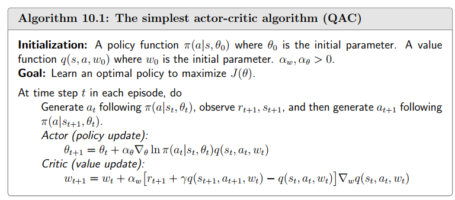
**critc(value update)**用SARSA算法更新值，其中action valu（$q(s,a,w)$）使用函数近似表示;
**actor(policy update)**按照梯度递增算法（10.2）更新策略。

由于涉及q值估计，故该算法又被称为**Q actor-critc(QAC)**，很容易看出这是一个on policy 的算法，同时因为策略是使用函数近似表示的，是stochastic的，不需要$\epsilon$-greedy策略也能保证探索性。

### 10.2 Advantage actor-critic (A2C)
接下来介绍一种更优的算法：**advantage actor-critic(A2C)**，其核心思想是引入了**baseline**的概念来**减小估计的方差**。

#### 10.2.1 Baseline invariance
首先介绍策略梯度的一个有趣的性质：即新加入一个额外的偏差/基准，均值是不变的。也就是说：
$$\mathbb{E}_{S \sim \eta, A \sim \pi} \left[ \nabla_\theta \ln \pi(A|S, \theta_t) q_\pi(S, A) \right] = \mathbb{E}_{S \sim \eta, A \sim \pi} \left[ \nabla_\theta \ln \pi(A|S, \theta_t) \left( q_\pi(S, A) - b(S) \right) \right], \tag{10.3}$$
其中左边就是$J(\theta)$的梯度。额外的基准$b(S)$是关于状态$S$的标量函数。

自然而然对于上述性质我们会产生疑问:为什么10.3成立？这个性质有什么用？
下面来回答这两个问题。
* 为什么等式10.3成立？
  （10.3）成立的充要条件是：
  $$\mathbb{E}_{S \sim \eta, A \sim \pi} \left[ \nabla_\theta \ln \pi(A|S, \theta_t) b(S) \right] = 0.$$
  下式给出了上述等式的证明：其中利用了baseline$b(s)$与a无关的性质，将其从对于a的求和中提取出来。
  $$
  \begin{align*}
  \mathbb{E}_{S \sim \eta, A \sim \pi} \left[ \nabla_\theta \ln \pi(A|S, \theta_t) b(S) \right]
  &= \sum_{s \in S} \eta(s) \sum_{a \in A} \pi(a|s, \theta_t) \nabla_\theta \ln \pi(a|s, \theta_t) b(s) \\
  &= \sum_{s \in S} \eta(s) \sum_{a \in A} \nabla_\theta \pi(a|s, \theta_t) b(s) \\
  &= \sum_{s \in S} \eta(s) b(s) \sum_{a \in A} \nabla_\theta \pi(a|s, \theta_t) \\
  &= \sum_{s \in S} \eta(s) b(s) \nabla_\theta \sum_{a \in A} \pi(a|s, \theta_t) \\
  &= \sum_{s \in S} \eta(s) b(s) \nabla_\theta 1 = 0.
  \end{align*}
  $$
* 加入baseline有什么作用？
  先给出结论，引入baseline可以帮助减少使用样本去估计真实梯度的方差，使得估计更稳定可靠，训练更容易收敛。
  令
  $$X(S, A) \doteq \nabla_\theta \ln \pi(A|S, \theta_t) \left[ q_\pi(S, A) - b(S) \right] \tag{10.4}$$
  那么真实梯度就是$\mathbb{E}[X(S, A)]$。我们需要使用一个随机的样本$x$去估计近似均值$\mathbb{E}[X]$，而我们希望的是这个随机变量$X$的方差，即var($X$)尽量的小，从而保证近似的准确性。
  例如当方差为0时，任意一个样本$x$都能准确的近似$\mathbb{E}[X]$。

  加入baseline不会影响$\mathbb{E}[X]$的值，但会影响$X$的方差，我们的目标就是去找到一个 **合适的** $b*(s)$**使得**var($X$)**最小**。

  在前面的REINFORCE和QAC算法中，可以看作取$b=0$，但这不一定是最优的baseline.

  实际上，能使得var($X$)最小的**最优的baseline**表达式为：
  $$b^*(s) = \frac{\mathbb{E}_{A \sim \pi} \left[ \left\| \nabla_\theta \ln \pi(A|s, \theta_t) \right\|^2 q_\pi(s, A) \right]}{\mathbb{E}_{A \sim \pi} \left[ \left\| \nabla_\theta \ln \pi(A|s, \theta_t) \right\|^2 \right]}, \quad s \in \mathcal{S}. \tag{10.5}$$

  尽管上式是最优的，但是因为计算复杂，实际中，当我们去除式子（10.5）中的权重$\left[ \left\| \nabla_\theta \ln \pi(A|s, \theta_t) \right\|^2 \right]$，能获得**次最优的baseline**：
  $$b^\dagger(s) = \mathbb{E}_{A \sim \pi} \left[ q_\pi(s, A) \right] = v_\pi(s), \quad s \in \mathcal{S}.$$

  有趣的是，这个**suboptimal baseline的表达式就是state value**。

  关于上述optimal baseline的证明参考BOX 10.1
 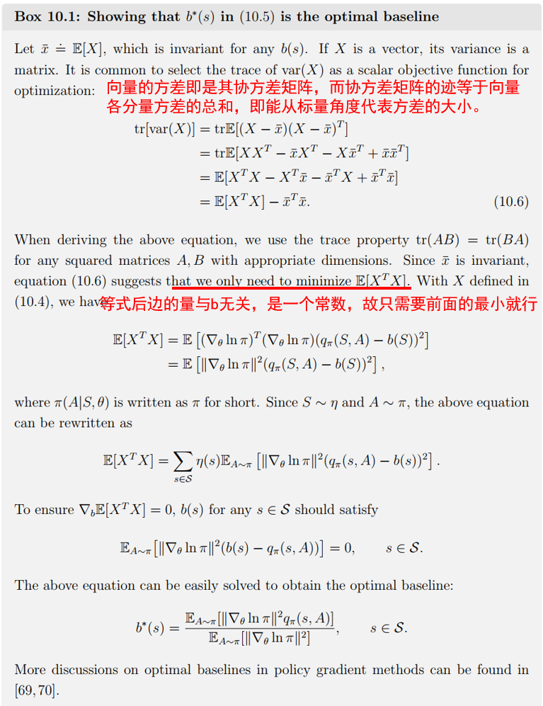

#### 10.2.2 Algorithm description
基于前面得到的次优baseline，将$b(s)=v_{\pi}(s)$代入梯度上升算法得到：
$$
\begin{align*}
\theta_{t+1} &= \theta_t + \alpha \mathbb{E}\left[ \nabla_\theta \ln \pi(A|S, \theta_t) \left[ q_\pi(S, A) - v_\pi(S) \right] \right] \\
&\doteq \theta_t + \alpha \mathbb{E}\left[ \nabla_\theta \ln \pi(A|S, \theta_t) \delta_\pi(S, A) \right].
\end{align*} \tag{10.7}
$$

这里:
$$\delta_\pi(S, A) \doteq q_\pi(S, A) - v_\pi(S)$$
被称作**优势函数**。这个函数能体现一个action相对于其他的优势，因为$v_\pi(S)$是对于action的均值，当$\delta_\pi(S, A)>0$的时候，代表这个action value相较于其他的action value更大。

(10.7)对应的随机梯度版本为：
$$\begin{align*}
\theta_{t+1} &= \theta_t + \alpha \nabla_\theta \ln \pi(a_t|s_t, \theta_t) \left[ q_t(s_t, a_t) - v_t(s_t) \right] \\
&= \theta_t + \alpha \nabla_\theta \ln \pi(a_t|s_t, \theta_t) \delta_t(s_t, a_t),
\end{align*} \tag{10.8}$$
其中$s_t,a_t$是$S,A$在时刻$t$的采样。$q_t(s_t,a_t)$和$v_t(s_t)$是对于$q_{\pi(\theta_t)}(s_t,a_t)$和$v_{\pi(\theta_t)}(s_t)$的近似。
（10.8）实际上是根据$q_t$相较于$v_t$的相对值进行策略更新，而不是$q_t$的绝对值。

与前面类似，当$q_t(s_t,a_t)$和$v_t(s_t)$使用MC进行估计时，算法就是**REINFORCE with a baseline**，使用TD-learning估计就是**advantage actor-critic(A2C)**

但是（10.8）式子中$q_t(s_t, a_t) - v_t(s_t)$的估算，需要使用两个神经网络分别对于$q_t$和$v_t$进行估计，而我们可以根据$q_\pi$的定义，来使用TD error近似优势函数：（注意区分SARSA的TD error）
$$q_t(s_t, a_t) - v_t(s_t) \approx r_{t+1} + \gamma v_t(s_{t+1}) - v_t(s_t).$$
上述近似是合理的，可由下面$q_\pi$**的定义**进行说明：
$$q_\pi(s_t, a_t) - v_\pi(s_t) = \mathbb{E}\left[ R_{t+1} + \gamma v_\pi(S_{t+1}) - v_\pi(S_t) \mid S_t = s_t, A_t = a_t \right],$$
这个时候我们只需要一个神经网络来表示$v_\pi$的值就行了，否则就需要使用两个神经网络分别表示.基于TD error的算法流程如下：
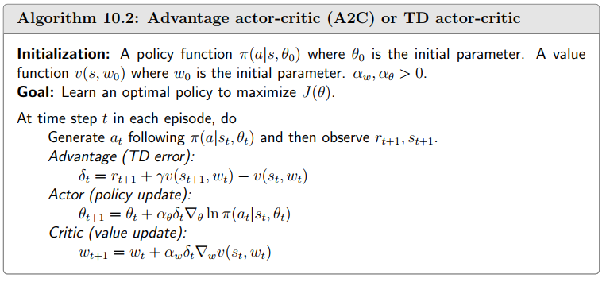

当我们使用TD error时候算法也被称为**TD actor critic**。此外，需要注意的是用函数近似的策略$\pi(\theta_t)$是随机的，故也是探索性的（任意$\pi(a|s_t,a_t)$均>0），因此可以直接用来产生经验样本而不需要使用类似$\epsilon$-greedy等工具。显然，上述图片中的A2C算法也是on-policy的。

### 10.3 Off-policy actor-critic
我们在前面学习到的**REINFORCE、QAC、A2C等梯度上升算法都是on-policy**的，这一点其实从梯度的计算公式就能看出：
$$\nabla_\theta J(\theta) = \mathbb{E}_{S \sim \eta, A \sim \pi} \left[ \nabla_\theta \ln \pi(A|S, \theta) \left( q_\pi(S, A) - v_\pi(S) \right) \right].$$
实际中我们需要使用样本取近似真实的梯度，而样本按照上述公式需要根据$\pi(\theta)$来生成（因为$A\sim \pi$）。所以$\pi(\theta)$是behavior policy，而梯度上升算法在更新参数$\theta$就是在更新策略$\pi(\theta)$，故$\pi(\theta)$也是target policy，所以这几种梯度上升算法都是on-policy的。

而在我们已经有了根据给定的behavior policy生成的样本后，同样可以使用策略梯度的方法去利用这些样本，这样算法就变成了off-policy了。其中的关键技术是**importance sampling（重要性采样）**。值得注意的是，这项技术不仅可以用在强化学习中，也是一种使用一种分布下的样本去近似另一种分布下的期望值的方法。

#### 10.3.1 Importance sampling
我们先用一个例子来介绍importance sampling技术。考虑随机变量$X\in \mathcal{X}$，假设$p_0(X)$是一个概率分布，我们的目标是去估计$\mathbb{E}_{X\sim p_0}[X]$，我们已知一些独立同分布（i.i.d.）的样本$\{x_i\}_{i=1}^n$。

* 如果样本$\{x_i\}_{i=1}^n$是遵循$p_0$生成的，那很简单，直接使用$x_i$的平均值$\bar{x}=\frac{1}{n}\sum_{i=1}^{n}x_i$就能近似$\mathbb{E}_{X\sim p_0}[X]$。由于大数定理可以证明这是无偏估计，同时方差随着$n\approx\infty$而收敛到0。
* 更常见的情况是生成样本$\{x_i\}_{i=1}^n$分布是另一个分布$p_1$，此时不能使用上面的均值$\bar{x}$来近似了，需要使用**重要性采样**技术。

具体来说：目标$\mathbb{E}_{X\sim p_0}[X]$满足：
$$\mathbb{E}_{X \sim p_0}[X] = \sum_{x \in \mathcal{X}} p_0(x) x = \sum_{x \in \mathcal{X}} p_1(x) \underbrace{\frac{p_0(x)}{p_1(x)} x}_{f(x)} = \mathbb{E}_{X \sim p_1}[f(X)]. \tag{10.9}$$
因此估计$\mathbb{E}_{X\sim p_0}[X]$转变为估计$\mathbb{E}_{X \sim p_1}[f(X)]$的问题，这一步的核心思想是对于$p_0$分布下的均值通过一个系数（重要性权重）转换到$p_1$分布下的均值。

而上式右端的近似为$\bar{f}$:
$$\bar{f} \triangleq \frac{1}{n} \sum_{i=1}^n f(x_i).$$
将上式代入（10.9）得：
$$\mathbb{E}_{X \sim p_0}[X] = \mathbb{E}_{X \sim p_1}[f(X)] \approx \bar{f} = \frac{1}{n} \sum_{i=1}^n f(x_i) = \frac{1}{n} \sum_{i=1}^n \underbrace{\frac{p_0(x_i)}{p_1(x_i)}}_{\text{importance weight}} x_i. \tag{10.10}$$
式子（10.10）表示，$\mathbb{E}_{X\sim p_0}[X]$可以近似为$x_i$**的加权平均**。其中$\frac{x_0}{x_1}$被称为**重要性权重**。
* 当$p_1=p_0$时，权重为1，$\bar{f}$退化为$\bar{x}$;
* 当$p_0(x_i)\geq p_1(x_i)$时，此时样本$x_i$由$p_0$生成得频率高于$p_1$，此时重要性权重大于1，所以当我们用$p_1$生成得样本去近似时，需要乘上一个大得权重去**突出该样本的重要性**。

式子（10.10）中需要用到$p_0(x)$，可能会有疑问，已经知道了$p_0$那为什么不直接使用定义$\mathbb{E}_{X\sim p_0}[X]=\sum_{x\in \mathcal{X}p_0(x)x_0}$来计算呢？

回答如下：要使用该定义式，我们需要获取$p_0$**的解析表达式**（连续的情况），或得到$p_0$在**样本空间**$\mathcal{X}$**所有取值**$x$**下的函数值**。
然而，当分布由（例如）神经网络表示时，我们很难得到$p_0$的解析表达式；此外，当样本空间规模较大时，获取所有$x\in\mathcal{X}$对应得概率分布$p_0$也不现实。相比之下， (10.10) 仅需要计算**部分样本**$x_1$**对应的**$p_0(x_i)$，在实际应用中更容易实现。

书中给了一个简单的例子，见P223，这里补充了书上没有展示的具体使用重要性采样计算的步骤。
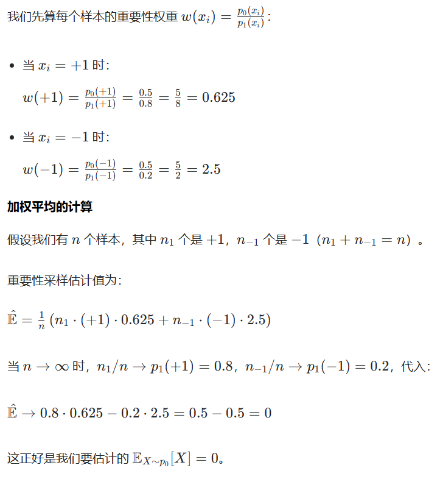

#### 10.3.2 The off-policy policy gradient theorem
基于重要性采样技术，我们可以给出**off-policy策略梯度定理**。这里我们假设$\beta$是一个behavior策略，我们的目标是利用$\beta$生成的样本，来学习一个能最大化下列指标的target policy$\pi$:
$$
J(\theta) = \sum_{s \in S} d_\beta(s) v_\pi(s) = \mathbb{E}_{S \sim d_\beta} [v_\pi(S)],$$
其中$d_\beta$是策略$\beta$下的平稳分布,$v_\pi$是策略$\pi$下的state value。该指标的梯度由以下定理给出：

##### Theorem 10.1 Off-policy policy gradient theorem(off-policy策略梯度定理)
在discounted情况下$\gamma\in(0,1)$，$J(\theta)$的梯度为：
$$
\nabla_\theta J(\theta) = \mathbb{E}_{S \sim \rho, A \sim \beta} \left[ \underbrace{\frac{\pi(A|S, \theta)}{\beta(A|S)}}_{\text{importance weight}} \nabla_\theta \ln \pi(A|S, \theta) q_\pi(S, A) \right], \tag{10.11}
$$
其中状态分布$\rho$满足：
$$\rho(s) \triangleq \sum_{s' \in S} d_\beta(s') \Pr_\pi(s|s'), \quad s \in S,$$
而$\Pr_\pi(s|s') = \sum_{k=0}^\infty \gamma^k [P_\pi^k]_{s' s} = [(I - \gamma P_\pi)^{-1}]_{s' s}$是在策略$\pi$下从$s'$转移到$s$的折扣总概率。

式 (10.11) 中的梯度与定理 9.1 中的同策略梯度相似，但存在两点区别：
* 第一是多了重要性权重；
* 第二是动作$A$由$\beta$采样，而非由$\pi$采样。
由上面的定理，我们就能使用遵循$\beta$生成的动作样本来近似真实的梯度。
上述定理的详细证明参考BOX 10.2。
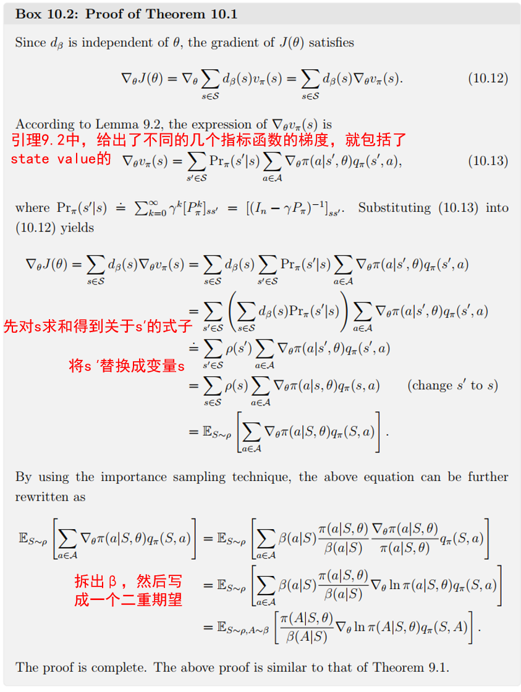

#### 10.3.3 Algorithm description
基于off-policy策略梯度定理，现在可以给出**off-policy actor critic算法**。off-policy和on-policy的算法非常相似，这里只介绍一些关键步骤。

首先，off-policy策略梯度对于baseline$b{s}$仍具有不变性，具体来说我们有：
$$
\begin{align*}
\nabla_\theta J(\theta) &= \mathbb{E}_{S \sim \rho, A \sim \beta} \left[ \frac{\pi(A|S, \theta)}{\beta(A|S)} \nabla_\theta \ln \pi(A|S, \theta)  q_\pi(S, A)  \right]\\
&= \mathbb{E}_{S \sim \rho, A \sim \beta} \left[ \frac{\pi(A|S, \theta)}{\beta(A|S)} \nabla_\theta \ln \pi(A|S, \theta) \left( q_\pi(S, A) - b(S) \right) \right]
\end{align*}
$$
跟前边A2C中证明过程相似，可以证明$\mathbb{E}[\frac{\pi(A|S, \theta)}{\beta(A|S)} \nabla_\theta \ln \pi(A|S, \theta) b(S)]=0$，为了降低估计的方差，跟前边一样，选取baseline$b(S)=v_\pi(S)$，从而得到：
$$
\nabla_\theta J(\theta) = \mathbb{E}\left[ \frac{\pi(A|S, \theta)}{\beta(A|S)} \nabla_\theta \ln \pi(A|S, \theta) \left( q_\pi(S, A) - v_\pi(S) \right) \right].
$$
对应的随机梯度上升算法为：
$$\theta_{t+1} = \theta_t + \alpha_\theta \frac{\pi(a_t|s_t, \theta_t)}{\beta(a_t|s_t)} \nabla_\theta \ln \pi(a_t|s_t, \theta_t) \left( q_t(s_t, a_t) - v_t(s_t) \right),$$
其中$\alpha_\theta>0$。与on-policy类似，优势函数可以使用TD-error代替：
$$q_t(s_t, a_t) - v_t(s_t) \approx r_{t+1} + \gamma v_t(s_{t+1}) - v_t(s_t) \doteq \delta_t(s_t, a_t).$$
于是**算法变成了：**
$$
\theta_{t+1} = \theta_t + \alpha_\theta \frac{\pi(a_t|s_t, \theta)}{\beta(a_t|s_t)} \nabla_\theta \ln \pi(a_t|s_t, \theta) \delta_t(s_t, a_t).
$$
具体的内容总结在**下图中**：
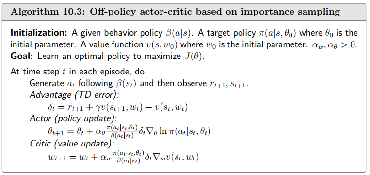
可以看到，该算法与A2C算法完全相同，只是在critic和actor部分**额外包含了importance weigh**t。需要注意的是，不仅是前面的actor部分的参数更新公式使用了重要性采样，在critic的**value估计**过程中也使用了**重要性采样**从on-policy转换到off-policy（如果不进行转换，那么这些样本估计的结果会趋向于$v_\beta$,而不是我们需要的$v_\pi$）。

事实上，重要性采样是一种通用技术，可以应用于基于策略和基于价值的算法。最后，算法 10.3 可以通过多种方式扩展，以融入更多技术，例如资格迹（eligibility traces）等。

### 10.4 Deterministic actor-critic
前面介绍的策略梯度算法，在策略上都有一个条件：任意的$\pi(a|s,\theta)>0$，即方法都是stochastic的。

而这一节，将会介绍**deterministic策略的策略梯度算法（DPG）**。先来解释一下这里的deterministic，这里的确定性指的是对于任意一个state，仅给单个动作分配概率 1，其余所有动作的概率均为 0。

为什么要研究deterministic的情况呢？因为他是**天然off-policy**的，同时能有效**处理连续的动作空间**。

我们一直使用$\pi(a|s,\theta)$来表示一般策略，既可以是随机也可以是确定的。本节中，我们使用：
$$a=\mu(s,\theta)$$
来专门表示deterministic策略。$\pi$是给出动作的概率，而这里的$\mu$直接**输出选择的动作**，因此，他可以看作一个从状态空间$\mathcal{S}$到动作空间$\mathcal{A}$的映射。

这种确定性策略可以使用神经网络来表示：以s为输入，a为输出，参数是$\theta$，有时候将$\mu(s,\theta)$简写为$\mu(s)$。

#### 10.4.1 The deterministic policy gradient theorem
上一章介绍的策略梯度定理仅对于随机策略有效。当我们要求策略为确定性时，必须推导新的策略梯度定理。

##### Theorem 10.2 Deterministic policy gradient theorem（确定性策略梯度定理）
$J(\theta)$**的梯度为：**
$$
\begin{align*}
\nabla_\theta J(\theta) &= \sum_{s \in S} \eta(s) \nabla_\theta \mu(s) \left( \nabla_a q_\mu(s, a) \right) \big|_{a = \mu(s)} \\
&= \mathbb{E}_{S \sim \eta} \left[ \nabla_\theta \mu(S) \left( \nabla_a q_\mu(S, a) \right) \big|_{a = \mu(S)} \right],
\end{align*} \tag{10.14}
$$
其中$\eta$是状态的分布。

跟前面的梯度定理类似，10.2定理是对于不同指标下的梯度公式的总结，不同指标（$\bar{v}_\pi$和$\bar{q}_\pi$）的公式在定理10.3、10.4中有详细的表达和证明。

公式期望由两部分组组成，前面是$\mu(S)$关于$\theta$的梯度，后边是先对于$q_\mu(S,a)$求关于$a$的梯度，再将$a$替换为$\mu(S)$。

与随机情形不同，式 (10.14) 所示的确定性情形下的梯度**不涉及动作随机变量**$A$，因为被替换成了$\mu(S)$。因此，当我们使用样本近似真实梯度时，**无需对动作进行采样**。所以确定性策略梯度方法是off-policy的。（随机策略梯度涉及了$A\sim\pi$的期望，所以是on-policy）

此外，一些读者可能会疑惑，为什么$\left( \nabla_a q_\mu(S, a) \right) \big|_{a = \mu(S)}$不能写成更简洁的$\nabla_a q_\mu(S, \mu(S))$。原因很简单：如果这样写，就不清楚$q_\mu(S, \mu(S))$是关于a的函数。一个更简洁但容易混淆的表达式是$\nabla_a q_\mu(S, a=\mu(S))$。

书在本节后半部分会给出两种不同指标（average value和average reward）的公式，但对大多数读者而言，熟悉定理 10.2 即可，无需了解其推导细节。
具体可以详见P228-P233。

#### 10.4.2 Algorithm description
基于定理 10.2 给出的梯度，我们可以应用梯度上升算法来最大化$J(\theta)$:
$$\theta_{t+1} = \theta_t + \alpha_\theta \mathbb{E}_{S \sim \eta} \left[ \nabla_\theta \mu(S) \left( \nabla_a q_\mu(S, a) \right) \big|_{a = \mu(S)} \right].$$
对应的随机梯度上升算法为：
$$\theta_{t+1} = \theta_t + \alpha_\theta \nabla_\theta \mu(s_t) \left( \nabla_a q_\mu(s_t, a) \right) \big|_{a = \mu(s_t)}.$$
该算法的实现总结在下图中算法 10.4。
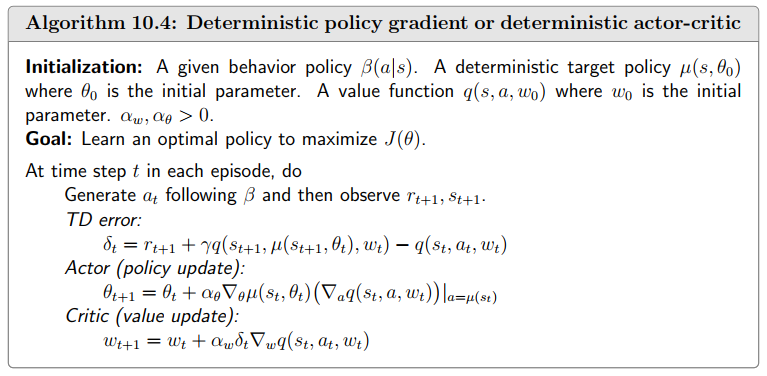
需要注意的是，由于行为策略$\beta$可能与$\mu$不同，因此该算法是off-policy的。
首先actor部分是off-policy的，因为不涉及到$A$的分布；其次critic也是off-policy的，需要特别注意的是，为什么这里的critic（对比前面的off-policy的随机梯度）不需要使用重要性采样呢？

具体来说，critic所需的经验样本是$(s_t,a_t,r_{t+1},s_{t+1},\tilde{a}_{t+1})$其中$\tilde{a}_{t+1} = \mu(s_{t+1})$。

生成该经验样本涉及两种策略：第一种是在$s_t$生成$a_t$的策略，第二种是在$s_{t+1}$生成$\tilde{a}_{t+1}$的策略。生成$a_t$的第一个策略是行为策略，因为$a_t$用于与环境交互;生成$\tilde{a}_{t+1}$的第二个策略必须是$\mu$因为它是critic要评估的目标策略。要注意的是，$\tilde{a}_{t+1}$不会用于在下一个时间步与环境交互。因此$\mu$不是行为策略，所以critic是off-policy的。

那么如何选择函数$q(s,a,w)$呢?提出DPG(Deterministic policy gradient)方法的原始论文采用了**线性函数**：$q(s,a,w) = \phi^T(s,a) w$，其中$\phi(s,a)$是特征向量；目前使用**神经网络**来表示$q(s,a,w)$也是非常流行的方法，例如DDPG（Deep deterministic policy gradient）。

如何选择行为策略$beta$呢？他可以是任意的探索性策略。可以直接在$\mu$的基础上添加噪声得到一个随机策略，在这样的情况下，$\mu$也是行为策略，因此这样也是一种on-policy的实现。

### 10.5 Summary
在本章中，我们介绍了actor-critic方法。内容总结如下：
* 10.1 节介绍了最简单的actor-critic算法，称为**QAC**。该算法与上一章介绍的策略梯度算法 REINFORCE 类似。唯一的区别在于，QAC 中的**动作价值（q-value）**估计依赖于**TD learning**，而 REINFORCE 依赖于蒙特卡洛估计。
* 10.2 节将 QAC 扩展为**A2C（advantage actor-critic）**。我们证明了策略梯度对任意额外的**基准（baseline）**具有不变性，并且最优基准有助于降低估计方差。
* 10.3 节进一步将A2C算法扩展到 **off-policy**场景。为此，我们介绍了一种重要技术 ——重要性采样（importance sampling）。
* 最后，虽然之前介绍的所有策略梯度算法都依赖于随机策略，但在 10.4 节中，我们证明了**策略也可以是确定性的**。我们推导了对应的DPG，并介绍了DPG算法。

策略梯度和actor-ritic方法在现代强化学习中得到了广泛应用。文献中存在大量高级算法，例如 SAC [76,77]、TRPO [78]、PPO [79] 和 TD3 [80]。此外，单智能体场景也可以扩展到多智能体强化学习场景 [81–85]。经验样本也可用于拟合系统模型，以实现基于模型的强化学习 [15,86,87]。分布强化学习提供了与传统方法根本不同的视角 [88,89]。强化学习与控制理论之间的关系已在 [90–95] 中进行了讨论。本书无法涵盖所有这些主题。希望本书奠定的基础能够帮助读者在未来更好地研究它们。