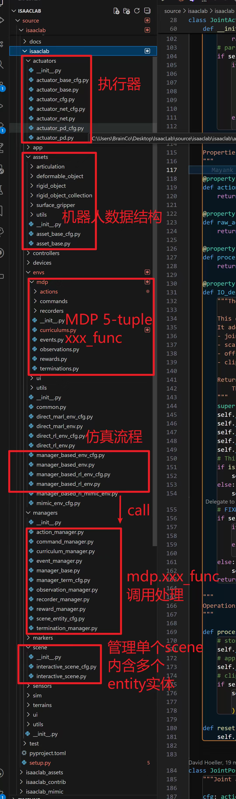

# 前期学习
>#### 学习顺序
>先按照下面的聊天记录和notion上面的内容，把**isaaclab的框架**搞清楚
>期间也可以用宇树的unitree_rl_lab跑g1或者go2的例程，看看有什么问题，宇树自己写的奖励有些实现的有问题
>之后就看**rsl_rl**这个算法库，克隆下来,把distillation和ppo弄清楚

文档里面cartpole的例子是direct base，但我们现在大部分都用manager based。Direct based就是需要自己管理mdp五元组，每一步都要用单独的函数去读取机器人和环境相关的数据来计算obs和奖励，课程和随机化也比较麻烦。Manager base对于mdp五元组每一项都创建了一个管理器，这样可维护性和复用性都有提升。


## Notion link
https://lapis-router-502.notion.site/hcl-lab-kickstart?source=copy_link

## 聊天记录
自己把代码看一遍，从使用cfg进行初始化，到每一步仿真中的数据流调用：
- 比如你现在想随机化每个关节的干摩擦系数，你要怎么修改关系；
- 再比如你要创建一个考虑了电机反电动势和轴向磁通效应的电机模型，且你的控制量是速度，那你要怎么添加jointAction

这个要在EventCfg里面修改
是在这里，但是怎么访问prim的这个属性？ prim path的树状结构是咋样的，一个机器人是用啥对象描述，articulation，rigid object collection，以及rigid body、joint这些属性怎么获取

关键两件事，1是知道仿真中初始化以及步进中的所有数据流和调用关系，以及如何处理termination和reset；2是熟悉仿真中机器人对象以及其他环境中物体的数据结构和api，也就是想要访问机器人下的数据、进行修改等要怎么操作

比如termcfg里面传入一个mdp.term_func，term_func会根据函数里的判断条件分析是否应该终止。但这个term_func具体是哪里调用的？调用频率多少？被谁调用？和奖励计算、观测计算的先后关系是什么
同理也可以推广到action、obs、event还有curriculum

本质上就是mdp五元组+event+curriculum

为了计算奖励、观测，判断是否中止之类的，就需要获取机器人和环境相关的数据，所以刚刚和你说，要把如何访问env以及其中的articulation（主要是机器人）以及刚体等弄清楚
那么为了应用控制或者施加外力扰动，就需要将一些数据写入机器人，或者写入仿真器

>比如，下面是我让claudecode浏览isaaclab以后总结的：
> 场景中Prim的层级结构和表示方式
>1. 场景层级结构
在Isaac Lab中，场景的prim层级结构遵循以下模式：
以及MDP里各个manager的处理流程：
Isaac Lab Manager-based 环境 MDP 全流程分析
>1. 环境初始化流程
>1.1 核心组件初始化
>ManagerBasedRLEnv 继承自 ManagerBasedEnv 和 gym.Env，初始化流程如下：

之后如果上地形，最好再把terrain generator和terrain管理看明白
你还要看看rsl rl的源码，这是unitree rl lab默认的rl library。看看isaaclab是怎么实现vec_env的

后续要做mimic任务的话，就按照类似的流程看isaaclab_mimic部分的代码。场景里的实体（机器人、其他可交互物体）是一样的，但是mimic的逻辑和纯rl训练有些差异。

>你看下mdp里面随便一个和robot数据相关的函数是怎么访问robot数据的:隔了15天后的回复
应该是env.scene[‘name’]获取到的状态。
# 任务实现
## 1、基本任务
基于当前的躯干+下肢urdf，训练amp行走/奔跑+mimic舞蹈/行走/奔跑
0. 当前urdf是串联。
1. urdf有一些小问题，你查一下然后修复，并给我反馈。一般推荐对称关节做镜像动作的时候是角度变化方向相同，但joint坐标不改也可以。bonus: 其他问题查出来，再告诉我[旺柴] 有些问题影响训练性能和速度。
- Re:right_ankle_pitch_joint和left_ankle_pitch_joint的限位不对称
2. 纯RL任务实现串联行走，并在mujoco部署，4m/s速度跟踪
3. retarget LAFAN动作到test_robo上，实现至少3个序列的mimic任务。可以单序列过拟合，也可以训练一个unify wbc tracker。
4. 基于2，利用LAFAN retarget的行走和奔跑序列做amp-RL训练，实现拟人步态的运动
5. 创建并联mjcf文件，使用串联训练，但在mujoco中进行串转并部署（g1实际上内部完成了该转换，它也支持ab mode，直接控制小腿上驱动踝关节的电机，就需要自己进行fk&ik）
6. bonus: 自己创建并联的USD/mjcf，直接用 并联构型 在isaaclab/mjlab中完成上述训练

## 2、进阶任务
1. amp可以实现明显的风格化行走，你把lafan里面的行走、奔跑、冲刺都加进来，需要加一些trick让策略可以在不同速度的情况下平滑的过渡。
2. mimic要弄完，参考beyondmimic（whole_body_tracking)或者unitree_rL_lab的mimic改，这个所需的retarget数据和amp是类似的，至少实现行走奔跑冲刺的序列，也可以自己尝试舞蹈（但没有手所以看不太出来）
---
## 3、参考资料
- 有些仓库用的gym，但是rl library都是可移植的。可以先摸透**manager/direct based的训练框架以及lab是如何与rl library（e.g. rsl rl）对接**的方式：https://lapis-router-502.notion.site/2aca501c6ee58049b8d2da6fd006d6c7

- **机器人描述文件（urdf/mjcf/usd）在线查看：**
https://viewer.robotsfan.com/
https://gkjohnson.github.io/urdf-loaders/javascript/example/bundle/
mujoco viewer（按i查看惯量，按1/2/3/4显示碰撞体、mesh，按t透明mesh/碰撞体）

- **参考仓库：**
  1. retarget：https://github.com/amazon-far/holosoma https://github.com/YanjieZe/GMR
  2. amp：
  - https://github.com/linden713/humanoid_amp  
  - https://github.com/escontra/
  - https://github.com/gbionics/amp-rsl-rl/tree/main
  3. AMP_for_hardware  https://github.com/Open-X-Humanoid/TienKung-Lab
  4. RL & tracking codebase：
  - https://github.com/unitreerobotics/unitree_rl_lab   
  - https://github.com/HybridRobotics/whole_body_tracking    
  - https://github.com/xbpeng/MimicKit 
  - isaaclab自带的 tracking task
  

- **如何使用coding agent**
    建议写代码多用原生ide/cli coding agent哈，学习怎么与ai交互、怎么提需求，怎么让它教你看代码。有问题多和llm讨论。 闲鱼上可以开gpt plus/team，一个月十多块。也可以用国产qoder/trae有一些免费额度。github-copilot验证学生身份之后可以直接使用
    
  - cs146s 现代软件开发 : https://themodernsoftware.dev/ ****
  - 如何使用mcp和skill: https://anthropic.skilljar.com/claude-with-the-anthropic-api
  - cursor official, how to use agent: https://cursor.com/cn/learn

- **算力资源**
    https://www.gpufree.cn/home
    https://www.autodl.com/login
    这里有一些免费资源可用，阿里和火山也有赠送isaaclab开箱即用的实例。


# 每日总结
## 4.7
### 1. 变量与类型注释
  - **类型注释**
  类型注释不会影响代码运行，但可以被类型检查工具（如 mypy、Pyright、VSCode）用来做静态类型检查。只是建议，不是强制变量类型。

  - **单下划线 _**
  仅仅是“约定俗成”，表示“内部使用”，不应该被外部代码访问或修改。

  - **双下划线 __**
  触发 Python 的“名称重整（name mangling）”机制。
  例如：self.__foo 在类内部会变成 _类名__foo，防止子类或外部直接访问，主要用于防止子类覆盖父类的私有属性。
  只能在类内部通过 self.__foo 访问，外部无法通过实例 .app_launcher.__foo 访问。
  容器类型
  - **tuple**：元组，类似于列表，但不可修改。用圆括号 () 定义，元素用逗号分隔。
  - **list**：列表，是一种可变的有序集合。用方括号 [] 定义，元素用逗号分隔。
### 2. Python 特殊方法与语法
- **setattr(obj, name, value)**
内置函数，等价于 obj.name = value，但 name 可以是变量或动态字符串。这样可以在不知道属性名的情况下，动态地给对象加属性。

- **\_\_call\_\_ 魔法方法**
让对象像函数一样被调用。当你定义了 \_\_call\_\_ 方法后，你就可以直接调用对象实例，就像调用函数一样。

- **@property 装饰器**
将方法变为只读属性，使得可以通过访问属性的方式调用方法，而不需要加括号。

- **静态方法与类型注解**
静态方法，不依赖实例，可直接通过类调用。
parser: argparse.ArgumentParser：参数类型注解，要求传入一个 argparse 的 ArgumentParser 实例。
-> None：返回值类型注解，表示无返回值。

- **@configclass**
 主要用处包括：
1. 简化配置类的定义：
自动生成初始化方法，支持默认值和类型注解。
2. 增强配置的灵活性：
支持嵌套配置和字段替换，便于动态调整配置。
3. 提高配置的可操作性：
提供字典转换、实例复制等功能，便于调试和扩展。

### isaaclab/isaaclab/app/app_launcher.py 代码结构与功能总结

#### 文件整体功能

本文件用于**配置和启动 Isaac Sim 仿真应用（SimulationApp）**。它负责解析命令行参数、环境变量和关键字参数，统一管理仿真启动相关的所有配置，并根据这些配置初始化仿真环境、加载扩展、设置渲染和信号处理等。  
这是 IsaacLab 各类仿真/训练脚本的**底层入口和配置枢纽**。

---

#### 主要类及其功能

##### 1. `ExplicitAction`
- **功能**：自定义 argparse.Action，用于标记命令行参数是否被用户显式传递。
- **主要方法**：
  - `__call__`: 在参数被解析时，除了设置参数值，还会额外设置一个“xxx_explicit”标志，方便后续判断参数是否被用户主动指定。

---

##### 2. `AppLauncher`
- **功能**：Isaac Sim 应用的启动器和配置管理器。负责解析所有仿真相关参数，初始化 SimulationApp，并进行一系列环境和扩展设置。
- **主要方法/属性**：
  - `__init__`: 构造函数，整合参数、解析配置、初始化 SimulationApp、加载扩展、设置信号处理等。在这里**调用了后面创建的一系列方法**
  - `app` (property): 返回已创建的 SimulationApp 实例，供外部访问。
  - `add_app_launcher_args` (staticmethod): 向 argparse.ArgumentParser 添加所有支持的仿真启动参数（如 headless、livestream、device 等）。
  - `_config_resolution`: 解析所有输入参数和环境变量，决定最终仿真配置。
  - 一系列 `_resolve_xxx_settings` 方法：分别处理 livestream、headless、camera、xr、viewport、device、experience file、动画录制等配置。
  - `_create_app`: 真正调用 SimulationApp 构造函数，完成仿真应用的初始化。根据已经解析好的仿真配置，根据_config_resolution中汇总的_sim_app_config去**正式创建并初始化 SimulationApp 实例**，并处理一些环境变量、命令行参数和 Python 模块的兼容性问题，确保仿真环境能够顺利启动。


  - `_load_extensions`: 根据配置加载所需的 Omniverse/IsaacLab 扩展。
  - `_hide_stop_button`、`_hide_play_button`: 控制 GUI 工具栏按钮的显示/隐藏。
  - `_set_rendering_mode_settings`、`_set_animation_recording_settings`: 设置渲染和动画录制相关参数到底层 carb settings。
  - `_abort_signal_handle_callback`、`_interrupt_signal_handle_callback`: 信号处理，保证仿真进程优雅退出。
  - `is_isaac_sim_version_4_5`: 判断当前是否为 Isaac Sim 4.5 版本，决定经验文件路径等兼容性问题。
  - `__patch_simulation_start_app`、`__patch_pxr_gf_matrix4d`: 针对底层库的兼容性补丁。

- **静态/类变量**：
  - `_APPLAUNCHER_CFG_INFO`、`_SIM_APP_CFG_TYPES`: 记录所有支持的参数类型和默认值，用于参数校验和类型检查。

---

#### 实际训练中的调用流程

1. **训练/仿真脚本**会首先通过 `AppLauncher` 初始化仿真环境，例如：
   ```python
   from isaaclab.app import Applauncher
   # 创建一个“参数容器”，后续所有 CLI 参数规则都会注册到这里
   parser = argparse.ArgumentParser()

   # 向 parser 中注册 Isaac Lab 相关参数
   # 这里只是“定义规则”，并没有读取参数
    # 👉 本质是在 parser 中添加如下参数：
    # --headless
    #    --device
    #    --livestream
    #    --enable_cameras
    #    ...
    # 👉 等价于：告诉 argparse “这个程序支持哪些命令行参数”
   AppLauncher.add_app_launcher_args(parser)
   # 解析命令行参数（真正读取用户输入）
   args = parser.parse_args()
   # 创建启动器，构造方法进行了一系列的参数解析和配置
   app_launcher = AppLauncher(args)
   # 获得仿真器实例
   sim_app = app_launcher.app
   # 后续用while simulation_app.is_running():来循环训练任务

## 4.8
今天主要根据/scripts/reinforcement_learning/rsl_rl的训练脚本train.py了解了训练脚本运行时对于参数配置的处理。
还主要了解了**命令行传入参数的两种处理方式：**
主要是hydra.py，/source/isaaclab_tasks/isaaclab_tasks/utils/hydra.py

>运行脚本时，命令行参数会被分为 `args_cli` 和 `hydra_args` 两部分，其中 `hydra_args` 会隐式写入 `sys.argv` 供 Hydra 读取。在 Hydra 处理流程中，会根据传入的 `args_cli.task` 和 `args_cli.agent` 参数，从任务注册表中读取默认的 `env_cfg` 和 `agent_cfg`，并转换为 Hydra 可处理的格式进行存储；随后使用命令行中的 `hydra_args` 覆写默认配置，再将配置从字符串格式还原为正常格式后传入 `main` 函数。

>使用 Hydra 的核心目的是实现**命令行参数对默认配置的自动覆写**，方便灵活修改训练相关配置；而未交由 Hydra 处理的 `args_cli` 参数，则遵循独立的处理逻辑，在 `main` 函数内被手动读取并覆写配置。

而接下来要重点聚焦于脚本对于其他cfg和训练函数的调用链：
>训练脚本内部调用链（cfg → 环境 → 数据流 → 训练）
  1. `load_cfg_from_registry`这个是在hydra中进行调用的
    → 调用 `registered_tasks.py` + `XXXCfg.py`
    → 得到 `env_cfg`、`agent_cfg`

  2. `gym.make(args_cli.task, cfg=env_cfg)`
    → 调用 `XXXEnv.py`
    → 创建机器人、仿真、观测/奖励/动作逻辑

  3. `RslRlVecEnvWrapper(env)`
    → 调用包装器
    → 环境数据 → 训练数据格式

  4. `OnPolicyRunner(...)`
    → 创建训练管理器

  5. `runner.learn()`
    → 调用 `collect_rollouts()`
      → 循环 `env.step()` 采集轨迹
    → 调用 `PPO.update()`
      → 用轨迹数据训练网络

### IsaacLab + RSL-RL 训练脚本 核心流程总结
#### 外层流程（极简）
1. 创建`argparse`解析器，管理**训练、RSL-RL、AppLauncher**三类命令行参数
2. `parse_known_args()`拆分参数：`args_cli`（仿真/启动参数）、`hydra_args`（配置参数）
3. 用`args_cli`初始化`AppLauncher`并启动Isaac Sim
4. 检查`rsl-rl-lib`版本兼容性
5. `@hydra_task_config(args_cli.task, args_cli.agent)`加载配置并启动`main`

---

#### main 函数（训练核心要点）
入口参数
- `env_cfg`：环境/仿真完整配置
- `agent_cfg`：强化学习算法/训练器配置

1. 命令行参数覆盖
  - `cli_args.update_rsl_rl_cfg`：用`args_cli`更新智能体配置
  - 覆盖`env_cfg.scene.num_envs`、`agent_cfg.max_iterations`

2. 训练基础配置
  - `handle_deprecated_rsl_rl_cfg`：兼容旧版配置
  - 统一`seed`、指定运行`device`、校验分布式训练合法性
  - 多GPU训练：分配`cuda:{local_rank}`、设置独立种子

3. 日志与环境创建
  - 生成带时间戳的`log_dir`，赋值给`env_cfg.log_dir`
  - `gym.make(args_cli.task)`创建Isaac环境
  - 多智能体环境：`multi_agent_to_single_agent`转换
  - 视频录制：`gym.wrappers.RecordVideo`包装环境

4. 训练环境与Runner初始化
  - `RslRlVecEnvWrapper`：包装环境适配RSL-RL训练
  - 根据`agent_cfg.class_name`创建`OnPolicyRunner`/`DistillationRunner`
  - 恢复训练：`get_checkpoint_path`获取模型路径 + `runner.load()`加载权重

5. 训练执行与收尾
  - `dump_yaml`：保存最终`env_cfg`/`agent_cfg`
  - `runner.learn()`：启动强化学习主训练循环
  - 训练结束：`env.close()`关闭环境


## 4.9
今天基于训练脚本中关于从注册表读取配置的部分，去了解了一个具体的task是如何去注册的，以及它的配置文件是如何组织的。以/isaaclab_tasks/manager_based/classic/humanoid为例：
其目录结构如下：

    ├── __init__.py
    ├── humanoid_env_cfg.py
    ├── agents/
            __init__.py
            rl_games_ppo_cfg.yaml
            rsl_rl_ppo_cfg.py
            sb3_ppo_cfg.yaml
            skrl_ppo_cfg.yaml
    ├── mdp/
            __init__.py
            observations.py
            rewards.py


1. `__init__.py` 中注册了当前任务，注册了任务的 `id`，并且将任务的 `env_cfg_entry_point` 以及在不同 RL 框架下的配置与这个 `id` 相关联，可以通过 `id` 进而访问到这些相关的 `cfg`；
2. `humanoid_env_cfg.py` 中定义了当前任务的环境配置类 `HumanoidEnvCfg`，继承自 `ManagerBasedRLEnvCfg`，定义 Humanoid 任务的具体配置，包括场景、动作、观测、奖励、终止条件等；
3. `agents` 目录下存放了不同 RL 框架（`rsl_rl`、`rl_games`、`sb3`、`skrl`）下的训练配置文件；
4. `mdp` 目录下存放了与当前任务相关的 MDP 五元组的具体实现，包括观测计算、奖励计算等。

接下来需要去具体了解isaaclab底下通用的**envs**是怎么实现的，尤其是**manager based**的；以及**mdp五元组的manager**是怎么设计的，以及它们在训练过程中是如何被调用的,后续还需去看**rsl_rl的训练流程**，看看它是怎么调用环境的，以及它对于数据流的处理方式是什么样的.


## 4.10
今天在昨天的基础上进一步了解了humanoid这个task的具体设置和实现，其主要任务环境设置都在本身文件底下，同时还去结合了assets中的humanoid.py，这个文件是对于humanoid这个机器人本身的定义，包括它的几何、物理和运动学属性。

想要基于自己的机器人模型创建一个任务就是参考这两个文件的配置形式，配置机器人模型后，再配置环境设置（比如奖励函数、观测空间、动作空间等），最后在训练脚本中通过任务名字调用这个环境进行训练。

接下来去进一步了解envs和managers的设计，以及它们在训练中的调用关系，尤其是manager based的训练框架，以及后续了解rsl_rl的训练流程，看看它是怎么调用环境的，以及它对于数据流的处理方式是什么样的，进而理解训练的每一步更新过程。
### Humanoid 仿真任务总结

---

#### 1. **`humanoid.py` 文件**
- **作用**：完整定义了机器人本身这个 `Prim`，包括其几何、物理和运动学属性。
- **内容**：
  - **USD 文件路径**：
    - 通过 `sim_utils.UsdFileCfg` 指定了机器人模型的 USD 文件路径。
    - 这是机器人在仿真场景中的几何和物理定义的来源。
  - **刚体和关节属性**：
    - 定义了刚体的物理属性（如是否启用重力、最大分离速度等）。
    - 定义了关节的属性（如刚度、阻尼、速度限制等）。
  - **初始状态**：
    - 指定了机器人在仿真中的初始位置和关节状态。
  - **关节执行器（Actuators）**：
    - 定义了关节的名字模式（正则表达式）和不同关节的刚度、阻尼等参数。
- **总结**：
  - 这个文件的核心作用是设计和配置机器人本身，使其成为一个完整的 `Prim`，可以被加载到仿真场景中。

---

#### 2. **`humanoid_env_cfg.py` 文件**
- **作用**：定义了整个仿真环境的配置，构建了一个完整的仿真世界 `Prim` 树，并设置了强化学习相关的逻辑。
- **内容**：
  - **场景配置**：
    - 使用 `MySceneCfg` 定义了仿真场景的 `Prim` 树，包括地面、机器人和光源。
    - 通过 `HUMANOID_CFG` 加载机器人到场景中，设置了机器人在场景中的路径和层级。
  - **动作空间（Actions）**：
    - 使用 `ActionsCfg` 定义了机器人关节的动作空间。
    - 通过调用 `mdp.JointEffortActionCfg`，为机器人关节设置了动作的缩放比例（`scale`）。
  - **观察空间（Observations）**：
    - 使用 `ObservationsCfg` 定义了机器人在仿真中的观察空间。
    - 通过调用 `mdp` 中的函数（如 `base_pos_z`、`base_lin_vel` 等），设置了观察的内容和缩放比例。
  - **事件（Events）**：
    - 使用 `EventCfg` 定义了仿真中的事件（如重置机器人状态）。
    - 通过调用 `mdp` 中的函数（如 `reset_root_state_uniform`），设置了事件的触发逻辑。
  - **奖励函数（Rewards）**：
    - 使用 `RewardsCfg` 定义了强化学习中的奖励函数。
    - 通过调用 `mdp` 中的函数（如 `progress_reward`、`is_alive` 等），设置了奖励的计算方式。
  - **终止条件（Terminations）**：
    - 使用 `TerminationsCfg` 定义了仿真的终止条件。
    - 通过调用 `mdp` 中的函数（如 `time_out`、`root_height_below_minimum`），设置了终止的触发逻辑。
  - **强化学习环境配置**：
    - 使用 `HumanoidEnvCfg` 继承 `ManagerBasedRLEnvCfg`，将上述所有配置（场景、动作、观察、奖励、终止条件等）整合到一个强化学习环境中。
    - 设置了仿真的时间步长、渲染间隔等参数。
- **总结**：
  - 这个文件的核心作用是定义仿真环境的整体配置，使得机器人能够在一个完整的仿真世界中运行，并与强化学习逻辑相结合。

---

#### 3. **`mdp` 文件夹**
- **作用**：为仿真环境提供观察空间和奖励函数的具体实现，注意这里的都是基于其对应的通用的父类，创建了具体的子类，添加了**针对这个任务的obs和reward函数**
- **内容**：
  - **`observations.py`**：
    - 定义了观察空间的计算逻辑。
    - 包括机器人位置、速度、姿态等信息的提取和处理。
  - **`rewards.py`**：
    - 定义了奖励函数的计算逻辑。
    - 包括前进奖励、存活奖励、能量消耗惩罚等。
- **总结**：
  - `mdp` 文件夹中的文件为强化学习任务的观察和奖励逻辑提供了底层支持，是任务逻辑的核心部分。

---

#### 4. **`agents` 文件夹**
- **作用**：为不同强化学习框架提供算法配置，定义了训练过程中的超参数。
- **内容**：
  - **`rl_games_ppo_cfg.yaml`**：
    - RL Games 框架的 PPO 算法配置文件。
    - 包括学习率、折扣因子、网络结构等超参数。
  - **`rsl_rl_ppo_cfg.py`**：
    - RSL-RL 框架的 PPO 算法配置文件。
    - 包括训练步数、优化器设置等。
  - **`sb3_ppo_cfg.yaml`**：
    - Stable-Baselines3 框架的 PPO 算法配置文件。
    - 包括训练超参数和环境设置。
  - **`skrl_ppo_cfg.yaml`**：
    - skrl 框架的 PPO 算法配置文件。
    - 定义了训练超参数和模型结构。
- **总结**：
  - `agents` 文件夹中的配置文件为不同强化学习框架的算法提供了超参数设置，确保训练过程的灵活性和适配性。

---

#### 5. **`__init__.py` 文件**
- **作用**：将环境注册为 Gym 环境，使得强化学习算法可以通过任务名字调用这个环境。
- **内容**：
  - 使用 `gym.register` 将 `HumanoidEnvCfg` 注册为一个 Gym 环境。
  - 注册时指定了环境的入口点（`env_cfg_entry_point`）。
- **总结**：
  - 任务注册是将环境配置与 Gym 接口连接起来的关键步骤，完成了从环境定义到算法调用的桥接。

---

#### 6. **训练脚本**
- **作用**：通过 Gym 的 `make` 方法加载注册的环境，完成从环境配置到训练的最后一步。
- **内容**：
  - 在训练脚本中，通过以下代码加载环境：
    ```python
    import gym
    env = gym.make("Isaac-Humanoid-v0")
    ```
  - 加载环境后，强化学习算法与环境交互，进行训练。
- **总结**：
  - 训练脚本通过任务名字调用注册的环境，完成了任务的最终执行。

---

#### 7. **总结**
- **`humanoid.py`**：完整定义了机器人本身这个 `Prim`，包括其几何、物理和运动学属性。
- **`humanoid_env_cfg.py`**：定义了仿真环境的整体配置，构建了一个完整的仿真世界 `Prim` 树，并设置了强化学习相关的逻辑。
- **`mdp` 文件夹**：为仿真环境提供观察空间和奖励函数的具体实现，是强化学习任务的核心逻辑。
- **`agents` 文件夹**：为不同强化学习框架提供算法配置，定义了训练过程中的超参数。
- **`__init__.py`**：将环境注册为 Gym 环境，完成了从环境定义到算法调用的桥接。
- **训练脚本**：通过 Gym 的 `make` 方法加载注册的环境，完成了任务的最终执行。

## 4.11
### 机器人资产配置
humanoid这个文件主要定义了机器人资产的基本配置，其最基本的父类参考assets文件夹底下。
具体设计的各个属性对应的父类参考humanoid.py文件注释，有详细的补充。
大概的包含关系如下，HUMANOID_CFG 是ArticulationCfg类的实例（ArticulationCfg又来自于AssetBaseCfg这个最基础的类），详细的类的包含关系参考下图：


### managers总体框架理解
`manager_base.py`是最基本的manager框架,定义了两类：
1. **ManagerTermBase**：定义了manager术语的基本结构和功能。
2. **ManagerBase**：定义了manager的基本结构和功能，包括初始化、重置、更新等方法。

不同的术语（如奖励、观察、动作、事件等）会继承`ManagerTermBase`，并实现其特定的逻辑；而每个类型又会有自己的manager类，继承自`ManagerBase`，负责管理对应的术语；
这里需要注意的是**同一个类型的术语可能有多个不同的实现（比如奖励函数可以有很多种），但它们都由同一个manager进行管理，当然这种框架下也可以用来管理不同环境的相同术语**

需要注意的另一点，在一系列的manager中，只有action和command继承ManagerTermBase定义了自己的termbase，而其他的（reward、obs、event、curriculum等）并没有这样操作，而是在具体的任务中直接继承ManagerTermBase来创建term实例。这是因为action和command的通用性更强，可以抽象为一个模版term，而其他的term个性化需求高，故基于ManagerTermBase类就行。

其中还有一个特殊的manager框架：scene_entity_cfg，它并没有继承ManagerTermBase，而是自己定义了一套术语体系和管理逻辑。主要定义了一个SceneEntityCfg类，专门服务其他的term
  - SceneEntityCfg 的作用：
  为 xxxTerm 提供接口，支持从场景中读取实体的信息。通过 resolve 方法，将字符串形式的实体名称解析为索引。而xxxterm就能从这个索引去获取到对应实体的状态信息。
  - resolve 方法的功能：
  调用内部方法，解析关节、刚体等的名称，生成对应的索引。

##### 最重要的是：基于创建一个自定义任务的目标去理解这个框架。今天基于昨日的基础继续深化，主要总结了以下过程：
1. **定义机器人资产:** 配置机器人模型及其属性（articulationcfg），期间会使用一些assets中定义的类，例如actuatorcfg来配置驱动器参数；
2. **编写个性化mdp实现函数：** 基于manager框架，编写个性化的奖励函数、观察函数、事件函数等的具体实现；
3. **定义环境配置：** 定义环境的整体配置，包括场景、动作、观察、奖励、事件、终止条件等；
    - 场景配置中首先加载terrain，再依次加载前面定义的机器人资产，并设置它在场景中的位置和层级关系，以及一些其他的资产例如环境中的物体，再是sensor，以及其他的例如light；
    - 动作、观察、奖励、事件的cfg会包含许多各自的xxxtermcfg实例,这个termcfg实例中的func属性在实例化时会被传入第2步定义的个性化mdp函数的引用/地址，环境实际调用mdp五元组的函数就是通过xxxterm.func来调用的；
    - 最终将这些配置整合到一个环境配置类envcfg(HumanoidEnvCfg)中，这个类继承自ManagerBasedRLEnvCfg，envcfg中还会包含一些强化学习相关的参数，例如仿真时间步长、渲染间隔等；

4. **注册环境：** 在`__init__.py`中将定义好的环境注册为一个Gym环境，这个注册过程中包括传入任务的entry_point（指向任务对应的环境类的位置）；还会传入env_cfg和agent_cfg的entry_point（也就是这些配置的地址）
5. **实际训练通过运行脚本：** 其中的gym.make("task_name"，cfg...)来创建环境实例（类就是之前注册时entry_point指向的类）；同时还会调用rsl_rl根据agent_cfg创建runner实例,最后调用runner.learn()开始训练

##### 以上是我目前总结的流程，接下来需要针对于在环境中（`ManagerBasedEnv/ManagerBasedRLEnv`）具体的mdp五元组函数调用和数据流处理流程进行深入理解；同时结合rsl_rl去看算法如何去调用环境数据进行训练的，以及它对于数据流的处理方式是什么样的，进而理解训练的每一步更新过程。

## 4.12
今天对着网站的指导，补充阅读了前面漏掉的InteractiveSceneCfg和SceneEntityCfg;
InteractiveSceneCfg是在env_cfg中配置的第一步，配置了场景中的prim，具体需要配置的cfg参考前面的图片；其涉及的InteractiveScene类中有一系列处理和复制场景中的prim的函数，同时制定了prim的层级结构。
SceneEntityCfg是一个特殊的manager工具，主要是被其他的mdp项调用来获取场景中实体的状态信息。

接着开始阅读ManagerBasedEnv及其Cfg类的设计


## 4.13
今天主要阅读了ManagerBasedEnv和ManagerBasedRLEnv的设计，主要理解了环境初始化流程以及其定义的训练核心函数（是提供给rsl_rl的）：step,reset，reset_to等，重点理解step的具体过程。

### 1.ManagerBasedEnv代码框架总览
- `ManagerBasedEnv` 是“场景 + 多管理器”驱动的基础环境壳层：场景负责物理实体与传感器，管理器负责动作、观测、事件、记录四条主线。
- 环境步长由 `step_dt = sim.dt * decimation` 决定：每个环境步会执行多个物理子步，保证稳定性。
- 代码位置：[`manager_based_env.py`](/Users/zhuran/IsaacLab/source/isaaclab/isaaclab/envs/manager_based_env.py)

#### 1.1`__init__` 初始化主线（聚焦场景与 manager）
1. 配置与随机种子  
   - `cfg.validate()` 校验配置，`seed()` 设置全局随机性。
2. 建立仿真上下文  
   - 创建/接管 `SimulationContext`，并绑定设备（CUDA 时 `torch.cuda.set_device`）。
3. 创建场景（核心）  
   - 在 `use_stage(...)` 上下文内构造 `InteractiveScene(self.cfg.scene)`，并 `attach_stage_to_usd_context()`。
4. 创建并预执行事件管理器（核心）  
   - 初始化 `EventManager(self.cfg.events, self)`。  
   - 若支持 `prestartup`，先执行 `event_manager.apply("prestartup")`（典型用于仿真启动前的 USD 随机化）。
5. 启动物理并加载其余 managers（核心）  
   - 在特定启动路径下先 `sim.reset()` + `scene.update(...)`，随后 `load_managers()`。  
   - `load_managers()` 内按顺序创建：`RecorderManager` → `ActionManager` → `ObservationManager`，最后可触发 `startup` 事件。
6. 收尾初始化  
   - 可选 UI 可视化器、`obs_buf` 初始化、可选 IO 描述导出、兼容旧参数 `rerender_on_reset`。

#### 1.2`step` 调用流程（主链路）
1. `action_manager.process_action(action)`  
   - 将策略网络的输出动作转为内部动作表示（裁剪/映射/分发）。
2. `recorder_manager.record_pre_step()`  
   - 记录步前信息。
3. 物理循环 `for _ in range(decimation)`  
   - `action_manager.apply_action()`：把动作写入各 action term,得到各个实体的目标buffer。  
   - `scene.write_data_to_sim()`：把目标buffer同步到物理引擎。  
   - `sim.step(render=False)`：推进一个物理步。  
   - 满足渲染间隔时 `sim.render()`。  
   - `scene.update(dt=physics_dt)`：刷新场景缓冲（状态/传感器等）。
4. 步后阶段  
   - 可选 `event_manager.apply("interval", dt=step_dt)`。  
   - `observation_manager.compute(update_history=True)` 生成观测。  
   - `recorder_manager.record_post_step()` 记录步后信息。  
   - 返回 `(obs_buf, extras)`。

#### 1.3其他关键方法（简要）
- `reset(...)`：调用 `_reset_idx(env_ids)` 做场景与各 manager 的 reset，再 `sim.forward()`/可选重渲染，最后重算观测。
- `reset_to(state, ...)`：先走 `_reset_idx` 的标准 reset 流，再把场景置为指定状态 `scene.reset_to(...)`。
- `_reset_idx(env_ids)`：  
  - `scene.reset(env_ids)`；  
  - 可选触发 `event_manager.apply("reset", ...)`；  
  - 顺序 reset 各 manager（`observation`→`action`→`event`→`recorder`），日志写入 `extras["log"]`。
- `load_managers()`：集中创建 manager 的关键入口，且顺序敏感。
- `close()`：按顺序销毁 scene/manager/UI，并清理 sim 回调与实例。


### 2.`ManagerBasedRLEnv` 框架定位（对比 `ManagerBasedEnv`）
- `ManagerBasedEnv` 更像“仿真执行壳层”：核心是场景搭建 + 动作/观测/事件/记录管理，不直接定义 RL 的奖励与终止。
- `ManagerBasedRLEnv` 在其上补齐 RL 闭环：新增 `CommandManager`、`TerminationManager`、`RewardManager`、`CurriculumManager`，并输出 Gym 风格五元组。
- 两者都保持向量化并行环境思想；区别是 `ManagerBasedRLEnv.step` 会在同一次 step 内完成“终止判断 + 局部 reset + 奖励计算 + 再观测”。

#### 2.1 初始化主线（聚焦场景与 manager）
1. 在 `__init__` 中先准备 RL 计数缓存：`common_step_counter`、`episode_length_buf`。  
2. 调用 `super().__init__(cfg)` 进入基类主线：创建 `SimulationContext`、构建 `InteractiveScene`、创建 `EventManager`、启动仿真并触发 `load_managers`。  
3. `load_managers` 在子类重写后形成 RL 版本顺序：
   - 先建 `command_manager`
   - 再 `super().load_managers()` 建立 `recorder/action/observation`
   - 再建 `termination/reward/curriculum`
   - 最后 `_configure_gym_env_spaces()` 配置 Gym `observation_space/action_space`
4. 初始化末尾设置 `render_mode` 与 `metadata["render_fps"]`。

#### `step` 主流程（RL 版，对比基类）
- 前半段与基类一致：`process_action` → 物理 decimation 循环（`apply_action`、`write_data_to_sim`、`sim.step`、按需 `render`、`scene.update`）。
- RL 增量逻辑：
  - 更新计数：`episode_length_buf += 1`、`common_step_counter += 1`
  - 终止判断：`termination_manager.compute()`
  - 奖励计算：`reward_manager.compute(dt=self.step_dt)`
  - 对终止环境做局部 reset：`_reset_idx(reset_env_ids)`，并触发 recorder reset hooks
  - 更新命令：命令可能是动态改变的`command_manager.compute(dt=self.step_dt)`
  - interval 事件与最终观测：`event_manager.apply("interval")` + `observation_manager.compute(update_history=True)`
- 返回值从基类的 `(obs, extras)` 扩展为 `(obs, reward, terminated, time_outs, extras)`。

#### 2.3 关键辅助方法
- `load_managers`：核心扩展点，体现“基类仿真 manager + RL manager”的组合装配。
- `_configure_gym_env_spaces`：按 observation group/term 自动构建 `single_*_space`，再 batch 成向量化空间。
- `_reset_idx`（RL 重写）：比基类多了 `curriculum_manager.compute/reset`、`reward_manager.reset`、`command_manager.reset`、`termination_manager.reset`，并重置 `episode_length_buf[env_ids]`。
- `render`：支持 `human`/`rgb_array`，`rgb_array` 路径下通过 replicator annotator 拉取图像.


### 3.OnPolicyRunner 代码框架总览

- `OnPolicyRunner` 是训练流程编排层，负责组织“采样 -> 计算回报 -> 更新参数 -> 日志/保存”。
- 在 IsaacLab 训练脚本中，`runner.learn(...)` 由 `scripts/reinforcement_learning/rsl_rl/train.py` 调用，环境对象是 `RslRlVecEnvWrapper` 包装后的 `VecEnv` 风格环境。
- `OnPolicyRunner` 是一个汇总的运行器，负责训练流程的编排和管理，具体的算法计算是在算法类（如PPO）中实现的，`OnPolicyRunner` 会调用算法类的方法来完成训练过程中的计算和更新。

---

#### 1. `__init__` 初始化主线（环境配置与解析、日志组装）

1. 保存输入对象  
   - 内容：保存 `env`、`train_cfg`、`device` 到 runner 内部状态。

2. 配置多卡信息  
   - 调用：`self._configure_multi_gpu()`  
   - 来源：`rsl_rl.runners.on_policy_runner.OnPolicyRunner._configure_multi_gpu`  
   - 作用：解析 `WORLD_SIZE/LOCAL_RANK/RANK`，设置 `self.is_distributed`，并写入 `self.cfg["multi_gpu"]`。

3. 获取一次初始观测用于“构建”  
   - 调用：`self.env.get_observations()`  
   - 来源：接口定义在 `rsl_rl.env.vec_env.VecEnv.get_observations`；具体实现由环境包装器提供（训练脚本中是 `isaaclab_rl.rsl_rl.RslRlVecEnvWrapper`）。

4. 动态构造算法实例  
   - 调用：`resolve_callable(self.cfg["algorithm"]["class_name"])`  
   - 来源：`rsl_rl.utils.utils.resolve_callable`  
   - 后续调用：`alg_class.construct_algorithm(obs, self.env, self.cfg, self.device)`  
   - 来源：算法类静态方法（如 `rsl_rl.algorithms.ppo.PPO.construct_algorithm`，蒸馏时为 `Distillation.construct_algorithm`）。

5. 创建日志系统  
   - 调用：`Logger(...)`  
   - 来源：`rsl_rl.utils.logger.Logger`  
   - 作用：后续记录 reward/loss/fps、写 TensorBoard/WandB/Neptune、管理模型上传。

---

#### 2. `learn` 训练主流程（主链路）

1. 训练前准备  
   - 可选随机化初始 episode 进度：  
     - 调用：`torch.randint_like(self.env.episode_length_buf, high=int(self.env.max_episode_length))`  
     - 来源：`torch`  
   - 取初始观测并放到训练设备：  
     - 调用：`self.env.get_observations().to(self.device)`  
     - 来源：`VecEnv.get_observations` + `TensorDict.to`  
   - 切换算法到训练模式：  
     - 调用：`self.alg.train_mode()`  
     - 来源：算法对象方法（`PPO.train_mode` 或 `Distillation.train_mode`）。
   - 多卡参数同步：  
     - 条件：`self.is_distributed`  
     - 调用：`self.alg.broadcast_parameters()`  
   - 初始化日志 writer：  
     - 调用：`self.logger.init_logging_writer()`  

2. **每轮 iteration 的 rollout 采样阶段**
  在 torch.inference_mode() 下循环 num_steps_per_env 次，在该上下文中会禁用梯度以节省内存和加速

   1. 采样动作  
      - 调用：`actions = self.alg.act(obs)`  
      - 相关方法在算法eg:PPO.py中定义  

   2. 与环境交互  
      - 调用：`obs, rewards, dones, extras = self.env.step(actions.to(self.env.device))`  
      - 来源：接口定义在 `rsl_rl.env.vec_env.VecEnv.step`；IsaacLab 训练时由 `RslRlVecEnvWrapper.step` 实现并转接到底层 `ManagerBasedRLEnv.step`。  

   3. NaN 检查（可选）  
      - 调用：`check_nan(obs, rewards, dones)`  
      - 来源：`rsl_rl.utils.utils.check_nan`。  

   4. 数据迁移到训练设备  
      - 调用：`obs.to(self.device), rewards.to(self.device), dones.to(self.device)`  
      - 来源：`TensorDict/Tensor.to`。  

   5. 算法处理这一步的环境交互数据（obs, rewards, dones, extras）
      - 调用：`self.alg.process_env_step(obs, rewards, dones, extras)`  
      - 来源：算法对象方法（`PPO.process_env_step` / `Distillation.process_env_step`）。  
      - 典型行为（PPO）：更新归一化统计、写入 `RolloutStorage`、处理 timeout bootstrap、处理 RND 内在奖励。  

   6. 日志逐步记账  
      - 调用：`self.logger.process_env_step(rewards, dones, extras, intrinsic_rewards)`  
      - 来源：`rsl_rl.utils.logger.Logger.process_env_step`。  

3. rollout 收尾：计算回报/优势  
   - 调用：`self.alg.compute_returns(obs)`  
   - 来源：算法对象方法（`PPO.compute_returns`；蒸馏算法中该函数为空操作）。  
   - 输入的 `obs` 为 rollout 最后一步后的最新观测，用于 bootstrap value。

4. 策略更新阶段  
   - 调用：`loss_dict = self.alg.update()`  
   - 来源：算法对象方法（`PPO.update` / `Distillation.update`）。  
   - 典型行为（PPO）：从 `RolloutStorage` 取 mini-batch，重算 log_prob/value，计算损失并反传更新。

5. 日志输出与周期保存  
   - 调用：`self.logger.log(...)`  
   - 来源：`rsl_rl.utils.logger.Logger.log`。  
   - 传入项包含：`collect_time`、`learn_time`、`loss_dict`、`learning_rate`、`action_std`、`rnd_weight`。  
   - 周期保存：  
     - 调用：`self.save(...)`  
     - 来源：`OnPolicyRunner.save`（内部调用 `self.alg.save()` + `torch.save` + `self.logger.save_model(...)`）。

6. 训练结束收尾  
   - 调用：最终 `self.save(...)` + `self.logger.stop_logging_writer()`  
   - 来源：`OnPolicyRunner.save` + `Logger.stop_logging_writer`。

---

#### 3. 其他方法在整体流程中的作用

1. `save(path, infos=None)`  
   - 主要调用链：  
     - `self.alg.save()`（来源：算法对象）  
     - `torch.save(...)`（来源：`torch`）  
     - `self.logger.save_model(...)`（来源：`Logger`）。  

2. `load(path, load_cfg=None, strict=True, map_location=None)`  
   - 主要调用链：  
     - `torch.load(...)`（来源：`torch`）  
     - `self.alg.load(...)`（来源：算法对象）  
   - 根据算法返回值决定是否恢复 `current_learning_iteration`。

3. `get_inference_policy(device=None)`  
   - 主要调用链：  
     - `self.alg.eval_mode()`（来源：算法对象）  
     - `self.alg.get_policy().to(device)`（来源：算法对象 + `torch.nn.Module.to`）。

4. `export_policy_to_jit(...)` 与 `export_policy_to_onnx(...)`  
   - 来源链：  
     - `self.alg.get_policy().as_jit()/as_onnx()`（模型对象导出接口）  
     - `torch.jit.script(...)` / `torch.onnx.export(...)`（`torch`）。


## 4.14
### KL 散度（从概率层面）更详细解释

#### 1. 定义
对离散分布 \(P, Q\)：

\[
D_{KL}(P\|Q)=\sum_x P(x)\log\frac{P(x)}{Q(x)}
\]

对连续分布：

\[
D_{KL}(P\|Q)=\int p(x)\log\frac{p(x)}{q(x)}\,dx
\]

可以改写为期望形式：

\[
D_{KL}(P\|Q)=\mathbb{E}_{x\sim P}\left[\log P(x)-\log Q(x)\right]
\]

---

#### 2. 概率直觉

##### 2.1 “在 P 看来，Q 有多不匹配”
KL 是在 **\(P\) 的采样分布下取平均**，所以：
- \(P\) 常见的事件权重大
- \(P\) 罕见的事件权重小

如果某些“\(P\) 常见事件”在 \(Q\) 里概率很低，KL 会明显变大。

##### 2.2 “额外编码代价”
信息论里可解释为：
- 用最优编码描述 \(P\) 数据的平均码长：\(H(P)\)
- 用按 \(Q\) 设计的编码描述 \(P\) 数据的平均码长：\(H(P,Q)\)

两者差值就是 KL：

\[
D_{KL}(P\|Q)=H(P,Q)-H(P)
\]

即“因为模型错配，多花了多少比特（或 nats）”。

---

#### 3. 为什么不对称

\[
D_{KL}(P\|Q)\neq D_{KL}(Q\|P)
\]

原因是期望的权重分布不同：
- \(D_{KL}(P\|Q)\)：按 \(P\) 加权
- \(D_{KL}(Q\|P)\)：按 \(Q\) 加权

所以它不是严格意义上的“距离”。

---

#### 4. 一个极简离散例子

设二分类：
- \(P=(0.9, 0.1)\)
- \(Q=(0.6, 0.4)\)

则

\[
D_{KL}(P\|Q)=0.9\log\frac{0.9}{0.6}+0.1\log\frac{0.1}{0.4}
\]

这里第一项权重大（0.9），因为在 \(P\) 中第一类更常见。
如果 \(Q\) 低估了这类概率，KL 会被强烈拉高。

---

#### 5. 在 PPO 里的含义

PPO 常计算：

\[
D_{KL}(\pi_{\text{old}}\|\pi_{\text{new}})
=\mathbb{E}_{a\sim \pi_{\text{old}}}
\left[\log \pi_{\text{old}}(a|s)-\log \pi_{\text{new}}(a|s)\right]
\]

解释：
- 用“旧策略常走到的动作”来衡量新策略偏离程度
- KL 大：新策略偏离过猛，更新可能不稳定
- KL 小：更新太保守，学习速度可能慢

所以你代码里用 KL 做 `adaptive` 学习率调节是很典型的。

---

#### 6. 和交叉熵/熵关系

\[
D_{KL}(P\|Q)=H(P,Q)-H(P)
\]

- \(H(P)\)：数据本身不确定性（固定）
- \(H(P,Q)\)：模型 \(Q\) 对数据 \(P\) 的平均负对数似然
- 最小化 KL 等价于最小化交叉熵（当 \(P\) 固定）

---

#### 
7. 你这份代码里的实现位置（对应你当前工程）

- PPO 中调用 KL：
  `self.actor.get_kl_divergence(...)`
- `MLPModel` 转发到分布对象：
  `self.distribution.kl_divergence(old_params, new_params)`
- 高斯分布实现最终调用：
  `torch.distributions.kl_divergence(old_dist, new_dist)`

所以数学计算核心确实在 PyTorch 分布库里完成。


### rsl_rl/rsl_rl/algorithms/ppo.py 代码结构与功能总结

#### 文件整体功能

本文件实现了 **PPO（Proximal Policy Optimization）算法的核心训练逻辑**。  
它负责管理策略网络 `actor`、价值网络 `critic`、轨迹存储 `storage` 以及优化器，并完成：

1. 与环境交互时的动作采样
2. 轨迹数据的记录与整理
3. `returns` 和 `advantages` 的计算
4. PPO损失、价值损失、熵损失的组合与参数更新
5. 可选支持 `RND` 探索、`symmetry` 对称增强、多 GPU 训练

可以把它理解为：  
**rollout 数据处理 + PPO参数更新** 的核心执行器。

---

#### 主要方法及其功能

##### 1. `__init__`
- **功能**：初始化 PPO 算法对象，挂载 actor、critic、optimizer、storage，并读取训练配置。
- **关键点**：
  ```python
  self.optimizer = resolve_optimizer(optimizer)(
      chain(self.actor.parameters(), self.critic.parameters()), lr=learning_rate
  )
  ```
- **理解**：
  这里将 `actor` 和 `critic` 的参数交给同一个优化器统一管理，后续更新时两者一起训练。  
  同时这里还会根据配置决定是否启用 `RND`、`symmetry` 和多 GPU 支持。

---

##### 2. `act`
- **功能**：根据当前观测 `obs` 采样动作，并把当前时刻训练需要的数据暂存到 `transition`。
- **关键代码**：
  ```python
  self.transition.actions = self.actor(obs, stochastic_output=True).detach()
  self.transition.values = self.critic(obs).detach()
  self.transition.actions_log_prob = self.actor.get_output_log_prob(self.transition.actions).detach()
  ```
- **主流程**：
  1. 记录当前网络 hidden state（兼容 RNN）
  2. actor 根据观测采样动作
  3. critic 计算当前状态价值
  4. 保存动作的旧对数概率、旧分布参数、当前观测
  5. 返回动作给环境执行
- **理解**：
  PPO 后面更新时需要比较“旧策略”和“新策略”对同一个动作的概率，因此这里必须提前把旧策略信息缓存下来。

---

##### 3. `process_env_step`
- **功能**：接收环境 `step` 后返回的结果，并把当前这一步完整写入 `storage`。
- **关键代码**：
  ```python
  self.transition.rewards = rewards.clone()
  self.transition.dones = dones
  self.storage.add_transition(self.transition)
  ```
- **补充关键逻辑**：
  - RND 内在奖励：
  ```python
  self.transition.rewards += self.intrinsic_rewards
  ```
  - timeout bootstrap：
  ```python
  self.transition.rewards += self.gamma * torch.squeeze(
      self.transition.values * extras["time_outs"].unsqueeze(1).to(self.device), 1
  )
  ```
- **主流程**：
  1. 更新归一化统计量
  2. 保存 reward 和 done
  3. 如果启用 RND，则把 intrinsic reward 加到总奖励中
  4. 如果是超时结束，则加上 bootstrap 补偿
  5. 写入 storage，清空当前 transition，并重置网络状态
- **理解**：
  这个方法相当于把“动作执行前保存的信息”和“环境返回的反馈”合并成一条完整样本，再送入 rollout buffer。

---

##### 4. `compute_returns`
- **功能**：在 rollout 收集完成后，利用 critic 的价值估计计算 `returns` 和 `advantages`。
- **关键代码**：
  ```python
  delta = st.rewards[step] + next_is_not_terminal * self.gamma * next_values - st.values[step]
  advantage = delta + next_is_not_terminal * self.gamma * self.lam * advantage
  st.returns[step] = advantage + st.values[step]
  ```
- **主流程**：
  1. 先计算 rollout 末尾状态的 value
  2. 从后往前遍历所有 step
  3. 计算 TD error `delta`
  4. 按 GAE 公式递推 advantage
  5. 由 `advantage + value` 得到 return
  6. 最后统一计算并标准化 `advantages`
- **理解**：
  这里使用的是 **GAE（Generalized Advantage Estimation）**，不是最朴素的 Monte Carlo return。  
  这样做的目的是在偏差和方差之间做平衡，提高 PPO 训练稳定性。

---

##### 5. `update`
- **功能**：使用 storage 中的一整段 rollout 数据执行 PPO 参数更新。  
- **这是整个文件最核心的方法。**

- **第一步：生成 mini-batch**
  ```python
  generator = self.storage.mini_batch_generator(self.num_mini_batches, self.num_learning_epochs)
  ```
- **第二步：重新计算当前策略下的动作概率和值**
  ```python
  actions_log_prob = self.actor.get_output_log_prob(batch.actions)
  values = self.critic(batch.observations, masks=batch.masks, hidden_state=batch.hidden_states[1])
  ```
- **第三步：计算 PPO ratio 与 surrogate loss**
  ```python
  ratio = torch.exp(actions_log_prob - torch.squeeze(batch.old_actions_log_prob))
  surrogate_loss = torch.max(surrogate, surrogate_clipped).mean()
  ```
- **第四步：计算 value loss**
  ```python
  value_loss = torch.max(value_losses, value_losses_clipped).mean()
  ```
- **第五步：合成总损失**
  ```python
  loss = surrogate_loss + self.value_loss_coef * value_loss - self.entropy_coef * entropy.mean()
  ```
- **第六步：反向传播并更新**
  ```python
  self.optimizer.zero_grad()
  loss.backward()
  self.optimizer.step()
  ```

- **理解**：
  `update()` 的核心逻辑就是：
  1. 从 rollout 中切出 mini-batch
  2. 用当前策略重新评估旧样本
  3. 计算 PPO clipped objective
  4. 计算 critic 的 value loss
  5. 合成总损失并更新参数

  如果配置了 `symmetry` 或 `RND`，对应损失也会在这里一起参与训练。

---

##### 6. `train_mode` / `eval_mode`
- **功能**：切换 actor、critic、RND 模块的训练/推理模式。
- **关键代码**：
  ```python
  self.actor.train()
  self.critic.train()
  ```
- **理解**：
  主要影响 dropout、normalization 等模块在训练和测试时的行为。

---

##### 7. `save` / `load`
- **功能**：保存和恢复训练状态。
- **关键代码**：
  ```python
  "actor_state_dict": self.actor.state_dict(),
  "critic_state_dict": self.critic.state_dict(),
  "optimizer_state_dict": self.optimizer.state_dict(),
  ```
- **理解**：
  `save()` 保存的不只是模型参数，还包括优化器状态；  
  `load()` 则支持按配置选择性加载 actor、critic、optimizer 和 RND。

---

##### 8. `construct_algorithm`
- **功能**：根据配置动态构建 PPO、actor、critic 和 storage。
- **关键代码**：
  ```python
  actor: MLPModel = actor_class(obs, cfg["obs_groups"], "actor", env.num_actions, **cfg["actor"]).to(device)
  critic: MLPModel = critic_class(obs, cfg["obs_groups"], "critic", 1, **cfg["critic"]).to(device)
  ```
- **理解**：
  这个方法相当于 PPO 的统一工厂入口。  
  runner 在初始化训练器时，通常不是直接手写实例化，而是通过这个函数根据配置完成组装。

---

#### 实际训练中的调用流程

1. 调用 `act(obs)`
   - actor 采样动作
   - critic 估计 value
   - 保存旧策略信息

2. 调用 `env.step(action)` 后，再调用 `process_env_step(...)`
   - 把环境返回的 reward、done 等信息补全并写入 storage

3. 当一段 rollout 采样完成后，调用 `compute_returns(last_obs)`
   - 计算所有 step 的 `returns` 和 `advantages`

4. 然后调用 `update()`
   - 分 mini-batch
   - 计算 PPO loss / value loss / entropy loss
   - 更新 actor 和 critic

5. 更新结束后清空 storage，进入下一轮 rollout


